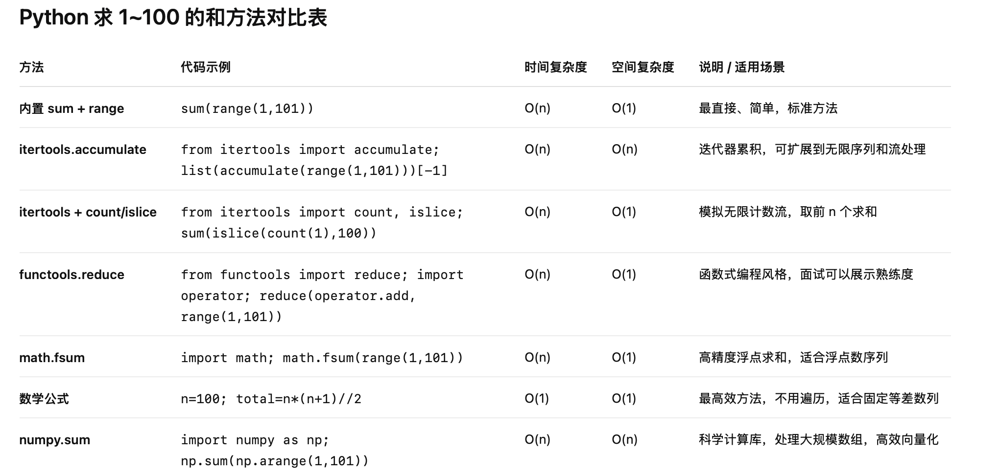

# Python 迷你计算器进阶指南

## Day 6 练习：基础计算器

### 1️⃣ 基础版 — 使用 if/elif

```python
print("1 -- for plus\n"
      "2 -- for minus\n"
      "3 -- for times\n"
      "4 -- for divided\n"
      "5 -- for power (a^b)\n"
      "6 -- for quit")

a = int(input("Please input a number: "))
b = int(input("Please input another number: "))

choose = int(input("Please choose operation: "))

if choose == 1:
    result = a + b
elif choose == 2:
    result = a - b
elif choose == 3:
    result = a * b
elif choose == 4:
    if b == 0:
        result = "Error: divisor cannot be 0"
    else:
        result = a / b
elif choose == 5:
    result = a ** b
else:
    result = "Invalid choice"

print("Result is:", result)
```

### ✅ 知识点

* `input()` 输入
* `print()` 输出
* 条件判断：`if / elif / else`
* 基本算术运算
* 错误处理（除零判断）

---

## 2️⃣ 增加异常处理和循环

```python
import math

def calculator(a, b, op):
    if op == "+":
        return a + b
    elif op == "-":
        return a - b
    elif op == "*":
        return a * b
    elif op == "/":
        if b == 0:
            return "错误：不能除以 0！"
        return a / b
    elif op == "^":
        return a ** b
    elif op == "sqrt":
        if a < 0:
            return "错误：不能对负数开方！"
        return math.sqrt(a)
    else:
        return "错误：不支持的运算符！"

print("欢迎使用迷你计算器！")
print("支持运算: +, -, *, /, ^, sqrt")

while True:
    op = input("请输入运算符（输入 q 退出）： ")

    if op == "q":
        print("再见！")
        break

    try:
        if op == "sqrt":
            a = float(input("请输入一个数字: "))
            result = calculator(a, None, op)
        else:
            a = float(input("请输入第一个数字: "))
            b = float(input("请输入第二个数字: "))
            result = calculator(a, b, op)

        print(f"结果是: {result}")
    except ValueError:
        print("输入无效，请输入数字！")
```

### ✅ 新增知识点

* 循环：`while True`
* 函数封装：`def calculator(...)`
* 异常处理：`try / except`
* 模块调用：`import math`
* 支持平方根运算

---

## 3️⃣ 使用字典和 lambda 简化 if/elif

```python
import math

ops = {
    "+": lambda a, b: a + b,
    "-": lambda a, b: a - b,
    "*": lambda a, b: a * b,
    "/": lambda a, b: "错误：不能除以 0！" if b == 0 else a / b,
    "^": lambda a, b: a ** b,
    "sqrt": lambda a, _: "错误：不能对负数开方！" if a < 0 else math.sqrt(a),
}

print("欢迎使用迷你计算器！")
print("支持运算: +, -, *, /, ^, sqrt")

while True:
    op = input("请输入运算符（输入 q 退出）： ").strip()

    if op == "q":
        print("再见！")
        break

    if op not in ops:
        print("错误：不支持的运算符！")
        continue

    try:
        if op == "sqrt":
            a = float(input("请输入一个数字: "))
            result = ops[op](a, None)
        else:
            a = float(input("请输入第一个数字: "))
            b = float(input("请输入第二个数字: "))
            result = ops[op](a, b)
        print(f"结果是: {result}")
    except ValueError:
        print("输入无效，请输入数字！")
```

### ✅ 新增知识点

* **字典映射**：运算符 -> 函数
* **lambda** 匿名函数
* 减少大量 if/elif，代码更简洁

---

## 4️⃣ OOP（面向对象）版本

```python
import math

class Calculator:
    def add(self, a, b): return a + b
    def sub(self, a, b): return a - b
    def mul(self, a, b): return a * b
    def div(self, a, b): return "错误：不能除以 0！" if b == 0 else a / b
    def power(self, a, b): return a ** b
    def sqrt(self, a): return "错误：不能对负数开方！" if a < 0 else math.sqrt(a)

calc = Calculator()

print("欢迎使用 OOP 版计算器！")
print("支持运算: +, -, *, /, ^, sqrt")

while True:
    op = input("请输入运算符（输入 q 退出）： ").strip()

    if op == "q":
        print("再见！")
        break

    try:
        if op == "sqrt":
            a = float(input("请输入一个数字: "))
            result = calc.sqrt(a)
        else:
            a = float(input("请输入第一个数字: "))
            b = float(input("请输入第二个数字: "))
            if op == "+":
                result = calc.add(a, b)
            elif op == "-":
                result = calc.sub(a, b)
            elif op == "*":
                result = calc.mul(a, b)
            elif op == "/":
                result = calc.div(a, b)
            elif op == "^":
                result = calc.power(a, b)
            else:
                result = "错误：不支持的运算符！"

        print(f"结果是: {result}")
    except ValueError:
        print("输入无效，请输入数字！")
```

### ✅ 新增知识点

* 类和对象
* 方法定义与调用
* 面向对象思维：每个运算都是对象的方法

---

## 5️⃣ 进阶 OOP + 字典映射方法（最终版）

```python
import math

class Calculator:
    def add(self, a, b): return a + b
    def sub(self, a, b): return a - b
    def mul(self, a, b): return a * b
    def div(self, a, b): return "错误：不能除以 0！" if b == 0 else a / b
    def power(self, a, b): return a ** b
    def sqrt(self, a): return "错误：不能对负数开方！" if a < 0 else math.sqrt(a)

    ops = {
        "+": "add",
        "-": "sub",
        "*": "mul",
        "/": "div",
        "^": "power",
        "sqrt": "sqrt"
    }

    def calculate(self, op, a, b=None):
        if op not in self.ops:
            return "错误：不支持的运算符！"
        method = getattr(self, self.ops[op])
        if op == "sqrt":
            return method(a)
        return method(a, b)

calc = Calculator()

print("欢迎使用进阶 OOP 版计算器！")
print("支持运算: +, -, *, /, ^, sqrt")

while True:
    op = input("请输入运算符（输入 q 退出）： ").strip()
    if op == "q":
        print("再见！")
        break
    try:
        if op == "sqrt":
            a = float(input("请输入一个数字: "))
            result = calc.calculate(op, a)
        else:
            a = float(input("请输入第一个数字: "))
            b = float(input("请输入第二个数字: "))
            result = calc.calculate(op, a, b)
        print(f"结果是: {result}")
    except ValueError:
        print("输入无效，请输入数字！")
```

### ✅ 新增知识
* 类 + 字典映射方法
* 动态调用方法：getattr(self, method_name)
* 进一步减少 if/elif 判断
* 易扩展，添加新运算只需新增方法和映射

