# 🐍 QiQi 和她爹的Python基地（丰富版）10周

- [🐍 QiQi 和她爹的Python基地（丰富版）](#-qiqi-和她爹的python基地丰富版10周)
	- [Week 1:Python 基础与环境](#week-1-python-基础与环境)
		- [📑 Day 1:环境搭建 \& IDE](#-day-1-环境搭建--ide)
		- [📑 Day 2:变量与数据类型](#-day-2-变量与数据类型)
			- [🔧练习:简单打印](#练习2)
		- [📑 Day 3:运算符](#-day-3-运算符)
			- [🔧练习:判断输出](#练习3)
		- [📑 Day 4:条件语句 if-else](#-day-4-条件语句-if-else)
			- [🔧练习:分类成绩](#练习4)
		- [📑 Day 5:循环 for \& while](#-day-5-循环-for--while)
			- [🔧练习: 9X9乘法表](#练习5)
		- [📑 Day 6:综合练习 — 迷你计算器](#-day-6-综合练习--迷你计算器)
			- [🔧🔧综合练习1: Mini Calculator(具体请看Week1子目录下)](#综合练习1-mini-calculator具体请看week1子目录下的calcluaterreadme)
		- [📑 Day 7 :面试模拟  小项目2— 股票最大收益:](#-day-7-面试模拟--小项目2-股票最大收益)
			- [🔧🔧综合练习2:最佳买卖股票,(具体请看Week1子目录下)](#综合练习2-best-time-to-buy-and-sell-stock具体请看week1子目录下的stock)
	- [Week 2:数据结构与文件操作](#week-2-数据结构与文件操作)
		- [📑 Day 8:list（列表）基础](#-day-8-list列表基础)
			- [🔧练习:创建一个 list，增加、插入、删除元素，并排序输出。](#练习8)
		- [📑 Day 9:tuple（元组）基础](#-day-9-tuple元组基础)
			- [🔧练习:创建一个 tuple，统计元素出现次数，并查找索引。](#练习9)
		- [📑 Day 10:set（集合）基础](#-day-10-set集合基础)
			- [🔧练习:创建两个 set，并进行集合运算。](#练习10)
		- [📑 Day 11:dict（字典）基础](#-day-11-dict字典基础)
			- [🔧练习:创建一个字典，访问、更新和遍历元素。](#练习11)
		- [📑 Day 12:切片与推导式](#-day-12-切片与推导式)
			- [🔧练习:使用切片和推导式创建新的 list。](#练习12)
		- [📑 Day 13:深拷贝 vs 浅拷贝](#-day-13-深拷贝-vs-浅拷贝)
			- [🔧练习:演示浅拷贝和深拷贝的不同。](#练习13)
		- [📑 Day 14:文件操作与异常处理](#-day-14-文件操作与异常处理)
			- [🔧练习:读取 txt 文件并捕获异常。](#练习14)
			- [🔧🔧综合练习3: 图书管理系统:](#综合练习3-library-management-system-with-json-persistence)
			- [🔧🔧综合练习4:（面试模拟）股票分析](#综合练习4-stock-data-analysis)
			- [🔧🔧综合练习5: 增强电影管理](#综合练习5-advanced-movie-collection-manager-with-json-persistence)
	- [Week 3:函数进阶与面向对象](#week-3-函数进阶与面向对象)
    	- [📑 Day 15: 函数基础](#-day-15-函数基础)
        	- [🔧练习 定义函数](#练习15-1)
    	- [📑 Day 16: 函数进阶与作用域](#-day-16-函数进阶与作用域)
        	- [🔧练习 全局和局部变量](#练习16)
    	- [📑 Day 17: 模块与包](#-day-17-模块与包)
        	- [🔧练习 模块导入](#练习17)
    	- [📑 Day 18: 文件操作](#-day-18-文件操作)
        	- [🔧练习 文件读写](#练习18)
    	- [📑 Day 19: 异常处理](#-day-19-异常处理)
        	- [🔧练习 tryexcept](#练习19)
    	- [📑 Day 20: OOP 基础](#-day-20-oop-基础)
        	- [🔧练习 OOP](#练习20)
    	- [📑 Day 21: OOP 进阶](#-day-21-1-oop-进阶)
        	- [🔧练习 继承多态](#练习21-1)
        	- [🔧🔧综合练习6: 银行账户管理](#综合练习6-银行账户管理)
        	- [🔧🔧综合练习7: 股票投资组合](#综合练习7-股票投资组合类面试模拟)
    - [week 4: 模块、库与工具](#week-4-模块库与工具)
    	- [📑 Day 22: os-sys-pathlib](#-day-22-os-sys-pathlib)
        	- [🔧练习 sys](#练习22)
    	- [📑 Day 23: datetime](#-day-23-datetime--金融应用)
			- [🔧练习 date](#练习23)
    	- [📑 Day 24: collections](#-day-24-collections)
        	- [🔧练习 TradeStats Portfolio Manager](#练习24)
    	- [📑 Day 25: itertools](#-day-25-itertools--functools)
        	- [🔧练习 itertools](#练习25)
    	- [📑 Day 26: 迭代器与生成器](#-day-26-迭代器与生成器)
        	- [🔧练习 迭代器与生成器](#练习26)
    	- [📑 Day 27: 正则表达式](#-day-27-正则表达式-regular-expressions)
        	- [🔧练习 正则表达式](#练习27)
    	- [📑 Day 28: 虚拟环境与依赖管理](#-day-28-虚拟环境与依赖管理)
	- [week 5: 数学分析基础](#week-5-pandas-数据分析基础)
	    - [📑 Day 29: 认识pandas](#day-29-认识-pandas-与-series--dataframe)
        	- [🔧练习 创建并操作简单数据](#练习29)
    	- [📑 Day 30: 数据导入与初步查看](#day-30-数据导入与初步查看)
			- [🔧练习 读取 CSV / Excel / JSON](#练习30)
    	- [📑 Day 31: 数据清洗缺失值与重复值](#day-31-数据清洗缺失值与重复值)
        	- [🔧练习 处理缺失与重复值](#练习31)
    	- [📑 Day 32: 统计分析与分组聚合](#day-32-统计分析与分组聚合)
        	- [🔧练习 groupby + pivot_table](#练习32)
    	- [📑 Day 33: 模拟项目](#day-33-股票收益分析面试模拟项目)
        	- [🔧练习 收益率、累计收益、波动率](#练习33)
		- [📑 Day 34: pandas进阶](#day-34-pandas-进阶技巧与性能优化)
        	- [🔧练习 多级索引、apply、自定义函数](#练习34)
    	- [📑 Day 35: 可视化](#day-34-pandas-进阶技巧与性能优化)
        	- [🔧练习 销售与收益可视化](#练习35-销售与收益可视化仪表板)
	- [week 6: 数据可视化](#week-6-数据可视化)
		- [📑 Day 36: matplotlib-基础](#day-36-matplotlib-基础)
        	- [🔧练习 绘制折线图](#练习36)
    	- [📑 Day 37: matplotlib-进阶](#day-37-matplotlib-进阶)
			- [🔧练习 绘制条形图](#练习37)
    	- [📑 Day 38: seaborn-基础](#day-38-seaborn-基础)
        	- [🔧练习 绘制箱型和散点图](#练习38)
    	- [📑 Day 39: seaborn-高级](#day-39-seaborn-高级)
        	- [🔧练习 绘制热力图](#练习39)
    	- [📑 Day 40: plotly-交互式可视化](#day-40-plotly-交互式可视化)
        	- [🔧练习 Plotly 练习](#练习40)
		- [📑 Day 41: altair-声明式可视化](#day-41-altair-声明式可视化)
        	- [🔧练习 Altair和pandas练习](#练习41)
    	- [📑 Day 42: 综合可视化项目](#day-42-综合可视化项目)
        	- [🔧练习 股票收益可视化](#练习42-示例项目)
	- [week 7: 爬虫与数据获取](#week-7-爬虫与数据获取)
		- [📑 Day 43: requests-基础与网页请求](#day-43-requests-基础与网页请求)
        	- [🔧练习 请求网页](#练习43)
    	- [📑 Day 44: html-解析与-beautifulsoup](#day-44-html-解析与-beautifulsoup)
			- [🔧练习 爬取网站标题](#练习44)
    	- [📑 Day 45: json-数据解析与保存](#day-45-json-数据解析与保存)
        	- [🔧练习 数据解析练习](#练习45)
    	- [📑 Day 46: 爬虫异常处理与重试机制](#day-46-爬虫异常处理与重试机制)
        	- [🔧练习 异常处理的爬取函数](#练习46)
    	- [📑 Day 47: api-调用](#day-47-api-调用--alpha-vantage--yahoo-finance)
        	- [🔧练习 API调用](#练习47)
		- [📑 Day 48: 新闻标题爬取](#day-48-小项目1--新闻标题爬取)
        - [📑 Day 49: api-实战](#day-49-小项目2--金融数据-api-实战)
	- [week 8: 算法与数据结构](#week-8-python-算法与数据结构)
		- [📑 Day 50: 算法与复杂度基础](#-day-50-算法与复杂度基础)
        	- [🔧练习 通用线性查找](#练习-501-通用线性查找)
			- [🔧练习 用二分查找有序](#练习-502-通用二分查找有序)
			- [🔧练习 效率对比](#练习-503-效率对比)
    	- [📑 Day 51: 排序算法基础1](#-day-51-排序算法基础1)
			- [🔧练习 冒泡排序](#练习-511-冒泡排序)
			- [🔧练习 选择排序](#练习-512-选择排序)
			- [🔧练习 插入排序](#练习-513-插入排序)
    	- [📑 Day 52: 排序算法进阶2](#-day-52-排序算法进阶2)
        	- [🔧练习 快速排序](#练习-521-快速排序)
			- [🔧练习 归并排序](#练习-522-归并排序)
			- [🔧练习 性能对比](#练习-523-性能对比)
    	- [📑 Day 53: 查找算法与二分法](#-day-53-查找算法与二分法)
        	- [🔧练习 手动二分查找](#练习-531-手动二分查找)
			- [🔧练习 查找插入位置](#练习-532-bisect-查找插入位置)
			- [🔧练习 面试扩展](#练习-533-面试扩展)
    	- [📑 Day 54: 常用数据结构](#-day-54-常用数据结构)
        	- [🔧练习 栈stack](#练习-541-栈stack)
			- [🔧练习 队列queue](#练习-542-队列queue)
			- [🔧练习 堆heap](#练习-543-堆heap)
			- [🔧练习 链表linked-list](#练习-544-链表linked-list)
		- [📑 Day 55: 动态规划dp入门](#-day-55-动态规划dp入门)
        	- [🔧练习 递归-fibonacci](#练习-551-递归-fibonacci)
			- [🔧练习 记忆化-fibonacci](#练习-552-记忆化-fibonacci)
			- [🔧练习 循环-fibonaccidp](#练习-553-循环-fibonaccidp)
			- [🔧练习 爬楼梯问题](#练习-554-爬楼梯问题)
    	- [📑 Day 56: 项目实战与综合应用](#-day-56-项目实战与综合应用)
			- [🔧练习 通用排序工具](#练习-561-通用排序工具)
			- [🔧练习 混合数据查找工具](#练习-562-混合数据查找工具)
			- [🔧练习 综合项目](#练习-563-综合项目)
	- [week 9: 模块化与性能优化](#week-9-模块化与性能优化)
		- [📑 Day 57: 项目模块化设计](#️-day-57-项目模块化设计)
        - [🔧练习 创建示例项目目录结构](#练习57)
    	- [📑 Day 58: 函数与类的模块化](#️-day-58-函数与类的模块化)
			- [🔧练习 封装函数](#练习58)
    	- [📑 Day 59: 单元测试基础)](#️-day-59-单元测试基础)
        	- [🔧练习 单元测试](#练习59)
    	- [📑 Day 60: 调试技巧](#️-day-60-调试技巧)
        	- [🔧练习 调试技巧](#练习60)
    	- [📑 Day 61: 性能分析](#️-day-61-性能分析)
        	- [🔧练习 性能分析](#练习61)
		- [📑 Day 62: 代码优化技巧](#️-day-62-代码优化技巧)
        	- [🔧练习 代码优化](#练习62)
    	- [📑 Day 63: 项目重构与总结](#️-day-63-项目重构与总结)

## Week 1: Python 基础与环境
📘 学习内容:
```
	•	Python 环境与 IDE（Anaconda / venv / pyenv）
	•	基础语法:变量、数据类型（int, float, str, bool）
	•	运算符:算术、逻辑、比较
	•	控制语句:if-else，循环（for、while）
	•	输入输出:input()、print() 格式化输出
	•	注释、代码风格（PEP 8）
```
### 📑 Day 1: 环境搭建 & IDE
	•	安装 Python（推荐 pyenv 或 Anaconda）。
	•	学会创建虚拟环境（venv / conda）。
	•	安装 IDE:Jupyter Notebook / VS Code。
	•	用 print("Hello, Python!") 输出第一行代码。
	•	在 VS Code + Jupyter 里跑通第一个 .py 文件和 .ipynb 文件。

### 📑 Day 2: 变量与数据类型
	•	学习 Python 的四种基本类型:int, float, str, bool。
	•	学会使用 type() 查看类型，str() int() float() 做类型转换。
	•	了解 Python 的动态类型特性。
#### 🔧练习2:
Write a small program that takes the user’s input for name and age, and prints a  sentence. Pay attention to converting to bool:
```python
# P2.1 Get user input
name = input("Enter your name: ")
age_input = input("Enter your age: ")
# Convert age to integer
age = int(age_input)
# Example of bool conversion: check if age is positive
is_age_valid = bool(age > 0)
# Print a sentence
print(f"Hello, {name}! You are {age} years old. Age valid? {is_age_valid}")
```
Convert age to integer
```python
age = int(age_input)
```
Example of bool conversion: check if age is positive
```python
is_age_valid = bool(age > 0)
```
bool() 的转换规则是这样的:
	1 数值:
	•	0 → False
	•	任何非零数（比如 -1, 3.14, 100）→ True
	2 字符串:
	•	空字符串 "" → False
	•	任何非空字符串（哪怕只是 " " 一个空格，或 "hello"）→ True
    总结一句话:Python 里只要字符串不是完全空的，就认为它是真 (True)

### 📑 Day 3: 运算符
	•	学习算术运算符（+ - * / // % **）。
	•	学习比较运算符（== != > < >= <=）。
	•	学习逻辑运算符（and or not）。
	•	学习赋值运算符（+=, -=, *=, /=）。
#### 🔧练习3:
Let the user enter a number, and output its square, whether it is greater than 10, and whether it is even.
```python
# P 3.1
a = int(input("Please input a number: "))
# 计算平方
square = a * a
# 判断是否大于 10
greater_than_10 = square > 10
# 判断是否偶数
is_even = square % 2 == 0
# 输出结果
print(f"The square of {a} is: {square}")
print(f"Is the square greater than 10? {greater_than_10}")
print(f"Is the square even? {is_even}")
```
### 📑 Day 4: 条件语句 if-else
	•	if-else 语句语法。
	•	多分支:if-elif-else。
#### 🔧练习4:
	•	输入一个分数，输出成绩等级:
	•	90+ 优秀
	•	70-89 良好
	•	60-69 及格
	•	<60 不及格
```python
# P 4.1
scope = int(input("please input scope:"))
if scope >= 90:
     grade = "Excellent"
elif scope > 70:
     grade = "Good"
elif scope > 60:
     grade = "Pass"
else:
     grade = "Fail"
print(f"your grade is: {grade}")
```

### 📑 Day 5: 循环 for & while
	•	for i in range(n)。
	•	while 循环。
	•	break & continue。
#### 🔧练习5:
1. 9x9 multiplication table,,,Write a program to print the multiplication table from 1×1 up to 9×9.
```python
# P 5.1
for i in range(1, 10): # rows 是外循环来控制
    for j in range(1, i+1): # clus 是内循环来控制
        print(f"{j}×{i}={i*j}", end="\t")
    print()  # New line after each row
```

2. Sum with while,,,Use a while loop to calculate the sum of numbers from 1 to 100.
```python
# P 5.2 Calculate sum from 1 to 100
total = 0
i = 1
while i <= 100:
    total += i
    i += 1

print(f"The sum of numbers from 1 to 100 is: {total}")
```

### 📑 Day 6: 综合练习 — 迷你计算器
	•	结合 if-else、输入输出、函数。
	•	实现加、减、乘、除、开方、幂运算。
	•	进阶: 加入异常处理:不能除以 0。
#### 🔧🔧综合练习1: Mini Calculator(具体请看Week1子目录下的CalcluaterREADME)
迷你计算器:加减乘除、平方、开方、百分比。
Comprehensive Exercise — Mini Calculator
	•	Combine if-else, input/output, and functions(注意这里有函数的表述).
	•	Implement addition, subtraction, multiplication, division, square root, and exponentiation.
	•	Advanced: Add exception handling to prevent division by zero.
```python
import math

def calculator(a, b, op):
    if op == "+":
        return a + b
    elif op == "-":
        return a - b
    elif op == "*":
        return a * b
    elif op == "/":
        if b == 0:
            return "错误:不能除以 0！"
        return a / b
    elif op == "^":
        return a ** b
    elif op == "sqrt":
        if a < 0:
            return "错误:不能对负数开方！"
        return math.sqrt(a)
    else:
        return "错误:不支持的运算符！"

print("欢迎使用迷你计算器！")
print("支持运算: +, -, *, /, ^, sqrt")

while True:
    op = input("请输入运算符（输入 q 退出）: ")

    if op == "q":
        print("再见！")
        break

    try:
        if op == "sqrt":
            a = float(input("请输入一个数字: "))
            result = calculator(a, None, op)
        else:
            a = float(input("请输入第一个数字: "))
            b = float(input("请输入第二个数字: "))
            result = calculator(a, b, op)

        print(f"结果是: {result}")
    except ValueError:
        print("输入无效，请输入数字！")
```
注意: 这里有导入包:math,它是python自带库文件,可以实现已经封装好的计算逻辑(函数)
### 📑 Day 7: 面试模拟  小项目2— 股票最大收益
股票价格数组，求 最大收益区间（买入/卖出）。
	•	问题:给定一个股票价格数组，找到最大利润（一次买入卖出）。
	•	训练点:
	•	遍历数组。
	•	变量存储最小买入价、最大利润。
#### 🔧🔧综合练习2: Best Time to Buy and Sell Stock,(具体请看Week1子目录下的Stock)
	•	You are given a list of stock prices where prices[i] is the price of a given stock on day i...prices = [7,1,5,3,6,4]
	•	You want to maximize your profit by choosing one day to buy and one later day to sell.
	•	Write a function that returns the maximum profit you can achieve. If no profit is possible, return 0.
训练点
	1.	遍历数组
	•	从头到尾遍历价格数组，每天判断是否能更新最小买入价或最大利润。
	2.	变量存储
	•	min_price:记录到当前为止的最低价格（潜在买入价）。
	•	max_profit:记录到当前为止能得到的最大利润。
	3.	思路总结
	•	对每一天的价格:
	1.	更新最小买入价:min_price = min(min_price, price)
	2.	计算今天卖出的利润:profit = price - min_price
	3.	更新最大利润:max_profit = max(max_profit, profit)

```python
# P 7.1
def max_profit(prices):
    if not prices:
        return 0

    min_price = prices[0]  # 初始化最低买入价
    max_profit = 0         # 初始化最大利润

    for price in prices:
        # 更新最低买入价
        if price < min_price:
            min_price = price
        
        # 更新最大利润
        profit = price - min_price
        if profit > max_profit:
            max_profit = profit

    return max_profit

# 测试
prices = [7,1,5,3,6,4]
print(max_profit(prices))  # 输出 5

```
## Week 2: 数据结构与文件操作
📘 学习内容:
```
	•	数据结构:list、tuple、set、dict
	•	切片、推导式（list/dict comprehension）
	•	深拷贝 vs 浅拷贝
	•	文件操作:读写 txt、CSV、JSON
	•	异常处理:try-except-finally
```python
list（列表）
	•	有序、可变的元素集合
	•	元素可以重复
	•	通过索引 (index) 访问
list 常用方法:
	•	append(x) → 末尾追加
	•	insert(i, x) → 指定位置插入
	•	pop(i) → 删除并返回元素
	•	remove(x) → 删除第一个值为 x 的元素
	•	sort() → 排序
	•	reverse() → 反转
tuple（元组）
	•	有序、不可变的元素集合
	•	元素可以重复
	•	通过索引 (index) 访问
	•	常用于存储固定的数据，比如函数返回多个值
tuple 常用操作/方法:
	•	count(x) → 统计元素 x 出现次数
	•	index(x) → 返回元素 x 第一次出现的位置
注意:元组不可变，不能使用 append(), remove() 等修改方法
set（集合）
	•	无序、可变的元素集合
	•	元素唯一，重复元素会自动去重
	•	支持集合运算:交集、并集、差集、对称差集
set 常用方法:
	•	add(x) → 添加元素 x
	•	remove(x) → 删除元素 x（不存在会报错）
	•	discard(x) → 删除元素 x（不存在不会报错）
	•	pop() → 随机删除并返回一个元素
	•	union(other_set) → 并集
	•	intersection(other_set) → 交集
	•	difference(other_set) → 差集
	•	symmetric_difference(other_set) → 对称差集
dict（字典）
	•	无序（Python 3.7+ 实际保持插入顺序）、可变的键值对集合
	•	键 (key) 唯一，值 (value) 可重复
	•	通过键 (key) 访问
dict 常用方法:
	•	keys() → 所有键
	•	values() → 所有值
	•	items() → 键值对 (tuple)
	•	get(key, default) → 获取值，找不到返回默认值
	•	update({...}) → 批量更新
类型对比表
类型	有序	可变	元素唯一	索引访问	 常用场景
list	✅		✅		❌		✅		 可变列表、栈/队列
tuple	✅		❌		❌		✅		 固定数据、函数返回值
set		❌		✅		✅		❌		 去重、集合运算
dict	❌		✅		键唯一	通过 key	键值映射
```
### 📑 Day 8: list（列表）基础
	•	学习 list 的有序性、可变性和重复元素特性。
	•	学会通过索引访问元素。
	•	掌握 append(), insert(), pop(), remove(), sort(), reverse() 方法。

#### 🔧练习8: 
创建一个 list，增加、插入、删除元素，并排序输出。
```python
# P8.1 List操作练习
fruits = ["apple", "banana", "cherry"]
# 追加
fruits.append("orange")
# 插入
fruits.insert(1, "grape")
# 删除
fruits.remove("banana")
# 弹出,注意这里是定义了popped,因此可以打印,但如果不定义的话可以直接用fruis.pop()
popped = fruits.pop(2)
# 排序
fruits.sort()
# 输出结果
print("Fruits:", fruits)
print("Popped element:", popped)
```
### 📑 Day 9: tuple（元组）基础
	•	学习 tuple 的有序性、不可变性和重复元素特性。
	•	通过索引访问元素。
	•	掌握 count(), index() 方法。
	•	了解 tuple 常用于固定数据或函数返回多个值。
#### 🔧练习9:
创建一个 tuple，统计元素出现次数，并查找索引。
```python
# P9.1 Tuple练习
numbers = (1, 2, 3, 2, 4, 2) # 注意tuple用(),而list用[],而且count() 和 index() 都可以用在 有序序列（list 或 tuple）上,他们是这两种序列的方法。count是计数,计算它出现的次数,而index是它索引的位置.
# tuple 之所以经常提到这些方法，是因为它 不可变，你无法用 append/remove 之类修改它，所以这些只读方法就显得尤为重要。
count_2 = numbers.count(2)
index_3 = numbers.index(3)
print("Tuple:", numbers)
print("Count of 2:", count_2)
print("Index of 3:", index_3)
```
### 📑 Day 10: set（集合）基础
	•	学习 set 的无序性、可变性和唯一性。
	•	掌握集合运算:交集、并集、差集、对称差集。
	•	学会使用 add(), remove(), discard(), pop() 方法。

#### 🔧练习10:
创建两个 set，并进行集合运算。
```python
# P10.1 Set操作练习,非空集合可以用 {},空集合必须用 set(),可以用 set() 将 list、tuple、字符串等可迭代对象转换为集合.
a = {1, 2, 3, 4}
b = {3, 4, 5, 6}
# 添加元素
a.add(5)
# 删除元素
a.remove(2)
# 并集
union_set = a.union(b)
# 交集
intersection_set = a.intersection(b)
# 差集
diff_set = a.difference(b)
print("Set a:", a)
print("Set b:", b)
print("Union:", union_set)
print("Intersection:", intersection_set)
print("Difference:", diff_set)
```
### 📑 Day 11: dict（字典）基础
	•	学习 dict 的键唯一、值可重复、可变特性。
	•	通过 key 访问元素。
	•	掌握 keys(), values(), items(), get(), update() 方法。

#### 🔧练习11:
创建一个字典，访问、更新和遍历元素。
```python
# P11.1 Dict操作练习
student = {"name": "Alice", "age": 20, "major": "CS"}
# 获取值
age = student.get("age")
# 更新
student.update({"age": 21, "grade": "A"})
# 遍历
for key, value in student.items(): # 注意这里定义的两个循环变量:key和value,这种写法就可以自动拆包,如果是for key in student呢?就是只用一个变量呢?结果会是什么样子?
    print(key, ":", value)
```
### 📑 Day 12: 切片与推导式
	•	学习 list、tuple 的切片方法。
	•	学习 list/dict comprehension。
	•	了解推导式在创建新集合中的优势。

#### 🔧练习12:
使用切片和推导式创建新的 list。
```python
# P12.1 切片与推导式
numbers = [0, 1, 2, 3, 4, 5, 6]
# 切片
slice_numbers = numbers[2:6]
# list comprehension
squares = [x*x for x in numbers if x%2==0]
print("Slice:", slice_numbers)
print("Squares of even numbers:", squares)
```
### 📑 Day 13: 深拷贝 vs 浅拷贝
	•	理解浅拷贝 (shallow copy) 与深拷贝 (deep copy) 的区别。
	•	学会使用 copy() 和 deepcopy()。
	•	了解嵌套列表复制的注意点。

#### 🔧练习13:
演示浅拷贝和深拷贝的不同。
```python
# P13.1
import copy

original = [[1, 2], [3, 4]]
shallow = copy.copy(original)
deep = copy.deepcopy(original)

original[0][0] = 99
print("Original:", original)
print("Shallow copy:", shallow) # 浅copy = 外层分家,内层同居,一旦改变b的内层将会影响a的内层
print("Deep copy:", deep)  # 深copy = 外层分家,内层也分家,一旦改变b的内层不会影响a的内层
# P13.2
import copy
a = [1,2 [3, 4]]
b = copy.copy(a) # shallow copy

print(a) #[1, 2, [3, 4]]
print(b) #[1, 2, [3, 4]]

b[0] = 99
print(a) #[1, 2, [3, 4]]
print(b) #[99, 2, [3, 4]] 外层数据分开了

b[2][0] = 77 # b的第二个元素(0,1,2)的第零个元素被新赋值为77
print(a) = #[1, 2, [77, 4]] 它的内层被修改了
print(b) = #99, 2, [77, 4]]

# P13.3
a = [1,2 [3, 4]]
c = copy.deepcopy(a) # deep copy

c[0] = 99
c[2][0] = 77

print(a) # [1, 2, [3, 4]] 外层完全不受影响
print(c) # [99,2, [77, 4]]
```
### 📑 Day 14: 文件操作与异常处理
	•	学习文件读写 txt、CSV、JSON。
	•	掌握异常处理 try-except-finally。
	•	了解文件操作中的常见错误及处理方法。

#### 🔧练习14:
读取 txt 文件并捕获异常。
```python
# P14.1 文件操作练习
try: # try表示“尝试执行下面的执行块, 如果出错,会转到except
    with open("example.txt", "r") as f: # 表示以只读模式(r) 打开example.txt, Ms.ariana 请注意:
		# 每个文件都分为很多种模式,对于系统文件,大部分都为只读文件,对于公开文件,都为可修改模式. r = read only
		# with...as f是上下文管理器:保证文件用完后自动关闭,即使中途出错也会执行f.close().
        content = f.read() # 读取整个文件内容,返回字符串,并保存到content变量里,
        print("File content:", content)
except FileNotFoundError: # 如果这个文件不存在,就会捕获这个错误并执行里面的代码,这样做的好处(此处的逻辑)是避免程序直接崩溃
    print("File not found!")
finally: # 无论是否出错,finally里的代码都会执行
    print("Execution finished.")
```

#### 🔧🔧综合练习3: Library Management System with JSON Persistence:
建立一个图书管理系统:能添加/删除/查询，并保存到 JSON 文件。
功能点:
	1.	添加书籍（书名、作者、年份）。
	2.	删除书籍（通过书名或索引）。
	3.	查询书籍（查看全部或按书名搜索）。
	4.	数据保存到 JSON 文件，下次打开仍能读取。
	
```python
import json
import os

FILE_NAME = "books.json"

# 初始化书籍列表
if os.path.exists(FILE_NAME):
    with open(FILE_NAME, "r") as f:
        books = json.load(f) # 把json文件的内容读出来,并转换成python对象(list或dict),放在内存里,下面定义的几个函数add,query和delete都是在内存里操作,只有调用save函数的时候,才会把内存里的列表写回文件.
		# 同时注意这个books是一个全局变量,定义在所有函数的外卖,所有函数都可以访问它(只要不在函数里用books=...重新赋值它)

else:
    books = [] # 空列表; 或空字典: books = {}; 或空集合: books = set(),这里先定义它为列表,它只是个容器,里面的元素可能是字典

def save_books():
    with open(FILE_NAME, "w") as f: # 这段代码中用“w”打开,会清除文件里的内容
        json.dump(books, f, indent=4) # 这段用dump,会把保存在内存里的内容都重新保存在文件里

def add_book():
    title = input("请输入书名: ") # 这个新增变量是局部变量,只在此函数内部有效,当此函数执行完毕,这个变量就不存在了(被销毁)
    author = input("请输入作者: ") # 同上
    year = input("请输入年份: ") # 同上
    books.append({"title": title, "author": author, "year": year}) # 用花括号{}代表写代码是考虑到用字典类型, 这样键值配对,可用键直接访问对象,直观和方便, 也就是说把字典放在列表里注意这段代码只是用append把它加入到字典里,这时候输入的内容都保存在内存里
    save_books()
    print("添加成功!")

def delete_book():
    title = input("请输入要删除的书名: ")
    for book in books: # 这时的book是新定义的局部变量,叫循环变量,用来表示列表books当前便利到的元素,这个元素只在循环体内有效,循环结束后它就不再被使用了
        if book["title"] == title: # 如果这个变量被找到,即和输入的书名一致的话,而且这里面的key,即title是字符串类型,因此需要加“”包起来,第二个title 本身是变量,它本身就是字符串,因此不用“”.
            books.remove(book) #调用列表的删除方法
            save_books()
            print("删除成功!")
            return # 注意这个return,它是立即结束此函数的意思,最有一句未找到该书就不会被打印(整个也可以换成if... break... else语句)
			#注意这个return的位置,当它在if缩进里的时候,条件成立会自动删除和保存文件;但当它不缩进在if(即和for并列时候)时相当于无条件退出函数了.
    print("未找到该书!") # 这个意思是if里面遍历完没找到,就会打印此句

def query_books():
    if not books: # 这里是没有书籍,即书籍列表为空的情况下
        print("没有书籍信息")
        return  
    print("当前书籍列表:")
    for i, book in enumerate(books, start=1): # enumerate为python的内置函数,它会把列表books 遍历,同时生成索引i, 并从1开始,这是典型的for后面跟多个变量,它遍历的每个元素是序列,自动拆包,这是python中常用的元组/列表解包技巧.
        print(f"{i}. {book['title']} - {book['author']} ({book['year']})")

# 主循环
while True:
    print("\n1-添加书籍  2-删除书籍  3-查看书籍  4-退出")
    choice = input("请选择操作: ")
    if choice == "1":
        add_book()
    elif choice == "2":
        delete_book()
    elif choice == "3":
        query_books()
    elif choice == "4":
        break
    else:
        print("无效输入")
```
注意: 运行此程序的时候,会提示你添加docstring,要分清注释(#)和文档字符串(docstring)之间的区别:
docstring是同时给人和机器看的,可通过help()或.__doc__获取;# 只是给人看的.

#### 🔧🔧综合练习4: Stock Data Analysis
CSV Reader with Statistics and Volatility
build a small program that reads historical stock data from a CSV file and computer basic statistics and Volatility
读取股票历史数据 CSV，输出:
	•	最高/最低价
	•	平均收盘价
	•	波动率
功能点:
	1.	读取 CSV（包含 Date、Open、High、Low、Close）。
	2.	输出最高价、最低价、平均收盘价。
	3.	计算波动率（通常用收盘价的标准差 / 平均值）。

示例代码:
```python
import pandas as pd

# 读取 CSV 文件
file_name = "stock_data.csv"  # CSV 文件应包含 Date, Open, High, Low, Close
df = pd.read_csv(file_name)

# 输出最高价和最低价
highest = df['High'].max()
lowest = df['Low'].min()
print(f"最高价: {highest}, 最低价: {lowest}")

# 平均收盘价
avg_close = df['Close'].mean()
print(f"平均收盘价: {avg_close:.2f}")

# 波动率: 收盘价标准差 / 平均值
volatility = df['Close'].std() / avg_close
print(f"波动率: {volatility:.2%}")
```
⸻
#### 🔧🔧综合练习5: Advanced Movie Collection Manager with JSON Persistence
Objective:
Build a movie collection management system that allows users to add, delete, view, and search movies, with data stored persistently in a JSON file. The system should include input validation and prevent duplicate entries.
Functional Requirements:
Add a movie
Fields: Title, Director, Release Year, Genre
Validation:
Title and Director cannot be empty
Release Year must be a number between 1888 and the current year
Prevent duplicate titles (case-insensitive)
Genre is optional; default to "Unknown" if left blank
Delete a movie
Users can delete by title (case-insensitive) or index number in the list
Print a message if the movie is not found
View movies
Display all movies in a readable JSON-like format
Sort movies by Release Year
Search movies (optional challenge)
Allow filtering by title, director, or year
Data persistence
All movie data must be saved in a JSON file
On program start, load existing data so the collection persists between sessions
Extra Challenge (Optional)
Improve user experience with pretty-printing
Allow partial search (e.g., searching for "Star" finds "Star Wars")
Prevent invalid input for all fields
Starter Hints
Use the json module to read/write JSON files
Use os.path.exists() to check if the JSON file exists
Validate user input before saving
Use json.dumps(..., indent=4) to display movies neatly
```python
import json
import os
from datetime import datetime

FILE_NAME = "movies.json"

# Load existing movie data or create empty list
if os.path.exists(FILE_NAME):
	with open(FILE_NAME, "r") as f: # 以只读模式打开指定文件，并把文件对象命名为 f，在代码块结束时会自动关闭文件。
		movies = json.load(f) # 从文件 f 里读取 JSON 格式的数据，把它转换成 Python 的对象（比如列表或字典），并赋值给变量 movies。
else:
	movies = []

# Save movies to JSON
def save_movies():
	with open(FILE_NAME, "w") as f: # 以写入模式打开指定文件，并把文件对象命名为 f，在代码块结束时会自动关闭文件。
		json.dump(movies, f, indent=4, ensure_ascii=False) # 把 movies 这个 Python 数据（列表/字典）转成 JSON 格式，并写进文件 f 里，还排版好缩进，保证能显示中文而不是乱码。

# Validate year
def validate_year(year_str): # 这里的函数就加了参数(argu,year_str),表明要调用(callable)它的时候需要提供输入值,它是函数的行参,validate_year("2020"),这个时候2020会传递给year_str,函数内部就可以直接使用year_str了,这时2020是实参.
	current_year = datetime.now().year # 获取当前年份的数值
	if not year_str.isdigit():# 检查它是否全部由数字组成,注意这句if not，它在python就是:如果失败 / 不存在 / 无效的意思
		return False, "Year must be a number!"# 
	year = int(year_str)
	if year < 1888 or year > current_year:  # First movie: 1888,等价于if 1888<= year <= current_year，但如果写:如果在范围内，就需要加上else:
		return False, f"Year must be between 1888 and {current_year}!"
	return True, year # 注意,这个函数里有三条return!!! 第一种是数字合法,第二种是数字范围,第三种是正确.

# Check for duplicate title
def is_duplicate(title): #
	for movie in movies:
		if movie["title"].lower() == title.lower():
			return True
	return False


# Add a movie
def add_movie():
	title = input("Enter movie title: ").strip()
	if not title:
		print("Title cannot be empty!")
		return
	if is_duplicate(title):
		print("This movie already exists in the collection!")
		return
	
	director = input("Enter director name: ").strip()
	if not director:
		print("Director cannot be empty!")
		return
	
	year_input = input("Enter release year: ").strip()
	valid, year_or_msg = validate_year(year_input)
	if not valid:
		print(year_or_msg)
		return
	year = year_or_msg
	
	genre = input("Enter genre: ").strip()
	if not genre:
		genre = "Unknown"
	
	movies.append({
		"title": title,
		"director": director,
		"year": year,
		"genre": genre
	})
	save_movies()
	print("Movie added successfully!")

# Delete a movie
def delete_movie():
	if not movies:
		print("No movies to delete.")
		return

	print("Current movies:")
	for i, m in enumerate(movies):
		print(f"{i+1}. {m['title']} ({m['year']})")
	
	choice = input("Enter movie title or index to delete: ").strip()
	if choice.isdigit():
		index = int(choice) - 1
		if 0 <= index < len(movies):
			removed = movies.pop(index)
			save_movies()
			print(f"Removed movie: {removed['title']}")
			return
		else:
			print("Invalid index!")
			return
	
	# Delete by title
	for movie in movies:
		if movie["title"].lower() == choice.lower():
			movies.remove(movie)
			save_movies()
			print(f"Removed movie: {movie['title']}")
			return
	
	print("Movie not found!")

# Query movies
def query_movies():
	if not movies:
		print("No movies in the collection.")
		return
	# Sort by year before displaying
	sorted_movies = sorted(movies, key=lambda x: x["year"])
	print(json.dumps(sorted_movies, indent=4, ensure_ascii=False))

# Main loop
while True:
	print("\n1 - Add movie, 2 - Delete movie, 3 - View movies, 4 - Exit")
	choice = input("Enter your choice: ").strip()
	
	if choice == "1":
		add_movie()
	elif choice == "2":
		delete_movie()
	elif choice == "3":
		query_movies()
	elif choice == "4":
		print("Exiting program. Bye!")
		break
	else:
		print("Invalid choice, try again!")
```
## Week 3: 函数进阶与面向对象
📘 学习内容:
```
	•	函数参数（默认参数、可变参数 *args/**kwargs）
	•	Lambda、map、filter、reduce
	•	面向对象 OOP:类、对象、封装、继承、多态
	•	魔法方法（__init__, __repr__, __len__）
	•	装饰器 @decorator
```
### 📑 Day 15: 函数基础
	•	定义函数
	    为什么需要函数？函数是 把代码组织成可重用模块 的方式。避免重复代码，提高可读性和可维护性。
		可以像“黑箱”一样调用函数，而不用关心内部实现。
	•	返回值:
	•	函数参数类型:位置参数,关键字参数,默认参数,可变阐述 *args/**kwargs
1 位置参数（positional arguments）按照顺序传入
```python
	def add(a, b):
		return a + b

	print(add(3, 5))  # 8
```
2 关键字参数（keyword arguments）通过“参数名=值”方式传入，不依赖顺序。
```python
	def student_info(name, age):
		return f"{name} is {age} years old."

	print(student_info(age=20, name="QiQi"))

```
3 默认参数（default arguments）参数有默认值，不传参时使用默认值。
```python
	def greet(name, msg="Hello"):
		return f"{msg}, {name}!"

	print(greet("Shaoxian"))        # Hello, Shaoxian!
	print(greet("Shaoxian", "Hi"))  # Hi, Shaoxian!

```	
	⚠️ 注意:默认参数 必须放在非默认参数之后，否则报错
4 可变参数: * 和 ** 才是 Python 语法的一部分
*args:接收任意数量的 位置参数(positional arguments)，打包成元组,也就是说:* 用来“打散”位置参数（tuple 解包）。
** kwargs:接收任意数量的 关键字参数(keyword arguments)，参数名=值，打包成字典，也就是说:** 用来“打散”关键字参数（dict 解包）。
args 和 kwargs 只是变量名，换成别的名字也能用,常用它们只不过是约定成俗的写法，但* 和**是固定语法。
```python
	def show_args(*args, **kwargs):
		print("args:", args)
		print("kwargs:", kwargs)

	show_args(1, 2, 3, name="QiQi", age=5)
	# args: (1, 2, 3)
	# kwargs: {'name': 'QiQi', 'age': 5}

```
	返回值:return 可以返回 单个值，也可以返回 多个值（实际上是元组），如果没有写 return，函数默认返回 None

#### 🔧练习15-1: 
定义函数示例
```python
def greet(name):# name是参数，形参（placeholder）调用函数时传入的 "Shaoxian" 是 实参。
	return f"Hello, {name}!" 。# return 表达式会把结果返回给调用者

if __name__ == "__main__":
    print(greet("Shaoxian"))
```
#### 🔧练习15-2: 
返回统计信息
输入一组分数，返回最高分、最低分、平均分。
```python
def stats(scores):
    return max(scores), min(scores), sum(scores) / len(scores)

print(stats([89, 95, 72, 100, 85]))
```
#### 🔧练习15-3:
购物小票
写一个函数，接收商品和价格（关键字参数形式），计算总价。
```python
def checkout(**items): ## **是解包， .values()和.keys()是两个方法
    total = sum(items.values())
    return f"Items: {list(items.keys())}, Total: {total}"

print(checkout(apple=3, banana=2, milk=5))

```
### 📑 Day 16: 函数进阶与作用域
	•	局部变量 VS 全局变量: 局部:在函数内部定义，只能在函数内部使用； 全局:在函数外部定义，整个文件都可以访问。
	•	global 与 nonlocal:如果想在函数内部修改全局变量，需要用 global 关键字。

```python
count = 0  # 全局变量

def increment():
	global count
	count += 1
	return count

print(increment())  # 1
print(increment())  # 2

```
nonlocal:如果函数内部嵌套了一个函数，nonlocal 可以让内层函数修改外层函数的局部变量。
```python
def outer():
x = 10
def inner():
	nonlocal x
	x += 5
	return x
return inner()

print(outer())  # 15

```
•	匿名函数: lambda:  用于定义 简短的匿名函数，常和高阶函数配合使用。
		语法:lambda 参数: 表达式
```python
square = lambda x: x * x
print(square(5))  # 25
```
📌 与普通函数对比:
```python
def square_func(x):
return x * x
```
•	高阶函数: map(),filter(),reduce(),sorted(),zip()
map():对序列中的每个元素应用一个函数，返回迭代器。
```python
nums = [1, 2, 3, 4]
squares = list(map(lambda x: x**2, nums))
print(squares)  # [1, 4, 9, 16]
```
filter():过滤序列，返回符合条件的元素。
```python
nums = [1, 2, 3, 4, 5, 6]
evens = list(filter(lambda x: x % 2 == 0, nums))
print(evens)  # [2, 4, 6]
```
reduce():累积运算，需要从 functools 导入。
```python
from functools import reduce
nums = [1, 2, 3, 4]
product = reduce(lambda x, y: x * y, nums)
print(product)  # 24
```

sorted():支持自定义排序规则。
```python
words = ["banana", "apple", "pear", "watermelon"]
sorted_words = sorted(words, key=lambda w: len(w))
print(sorted_words)  # ['pear', 'apple', 'banana', 'watermelon']
```

zip():把多个可迭代对象打包成元组。
```python
names = ["Alice", "Bob", "Cathy"]
scores = [85, 90, 95]
zipped = list(zip(names, scores))
print(zipped)  # [('Alice', 85), ('Bob', 90), ('Cathy', 95)]
```
#### 🔧练习16:
局部变量、全局变量示例
```python
count = 0  # 全局变量
def increment():
    global count
    count += 1
    return count

if __name__ == "__main__":
    print(increment())
```
### 📑 Day 17: 模块与包
	•	模块导入: import module/from module import func
		**模块**:就是一个 `.py` 文件，里面包含了函数、类、变量等。  
		好处:  
  		   代码复用（写一次，多处调用）  
  		   代码组织更清晰  
  		   避免文件过大、难以维护
		**模块导入**
		普通导入  		 :import math
		选择性导入		 :from math import sqrt, pi
		导入并起别名	 :import datetime as dt
		导入所有（不推荐）:from math import * #⚠️ 缺点:容易和已有变量冲突。

	•	常用标准库: math,random,datetime,os,sys
	•	自定义模块: 创建.py文件并导入
	    例子:创建文件 mymath.py:
```python
def add(a, b):
return a + b

def subtract(a, b):
return a - b
```
导入自定义模块:
```python
import mymath

print(mymath.add(3, 5))       # 8
print(mymath.subtract(10, 4)) # 6
```
•	包/package:
	    包:一个文件夹，里面有多个模块，并包含 __init__.py 文件。用于更大规模的项目组织。
		结构示例:
mypackage/
	__init__.py
	utils.py
	calculator.py
使用:
	from mypackage import utils
	from mypackage.calculator import add

#### 🔧练习17:
模块导入与自定义模块示例
```python
import math

def circle_area(r):
    return math.pi * r ** 2

if __name__ == "__main__":
    print(circle_area(5))
```
### 📑 Day 18: 文件操作
	•	打开文件: open(‘file.txt’,mode)
	•	文件模式: r,w,a,rb,wb
	•	读取方法: read(),deadline(),readlines()
	•	写入方法: write(),writelines()
	•	使用 with 自动关闭文件: 
#### 🔧练习18:
文件读写示例
```python
with open("movies.txt", "w") as f:
    f.write("Inception, Nolan, 2010\n")

with open("movies.txt", "r") as f:
    print(f.read())
```
### 📑 Day 19: 异常处理
	•	try...except...finally
	•	捕获特定异常
	•	自定义异常
#### 🔧练习19:
try/except示例
```python
try:
    x = int(input("Enter a number: "))
    y = int(input("Enter another number: "))
    print(x / y)
except ZeroDivisionError:
    print("Cannot divide by zero!")
except ValueError:
    print("Invalid input!")
```
### 📑 Day 20: OOP 基础
	•	类和对象:class and object, 类 (Class):描述一类事物的模板，比如“电影”;对象 (Object):类的具体实例，比如《指环王》。
	•	属性与方法:学会定义 属性 (Attributes) 和 方法 (Methods)
	•	构造方法: __init__:用来在对象创建时初始化属性。self 代表当前对象实例。
```python
class Movie:
	def __init__(self, title, director, year): # 在 Python 中，self 不是关键字，但是在定义类的方法时，它是一个 约定俗成的名字，必须作为实例方法的第一个参数。
		"""这个类的初始化方法种，它有四个个形参，但self是它本身而已self 是 类实例自身的引用，真正有用的是下面三个形参"""
		self.title = title        # 实例属性
		self.director = director
		self.year = year
```
•   创建对象
```python
m = Movie("Inception", "Nolan", 2010) #这里是创建对象和真正的初始化
print(m.title)       # Inception
print(m.director)    # Nolan
print(m.year)        # 2010
```
•	实例化对象: 类里面定义的函数，必须带上 self。
```python
class Movie:
	def __init__(self, title, director, year):
		self.title = title
		self.director = director
		self.year = year
	
	def info(self):  # 实例方法
		return f"{self.title} ({self.year}), directed by {self.director}"

m = Movie("Inception", "Nolan", 2010)
print(m.info())   # Inception (2010), directed by Nolan
```
#### 🔧练习20:
类和对象示例
```python
class Movie:
    def __init__(self, title, director, year, genre="Unknown"):
		"""=unknown是展示如何给属性设置默认值"""
        self.title = title
        self.director = director
        self.year = year
        self.genre = genre
        self.rating = None  # rating 不是构造函数的参数，而是直接在对象里创建一个属性，无论调用时是否传参，rating 都会被创建，只是初始值为空

    def info(self):
        """返回电影的完整信息"""
        return f"{self.title} ({self.year}), directed by {self.director}, Genre: {self.genre}, Rating: {self.rating or 'N/A'}"

    def set_rating(self, rating):
        """给电影评分"""
        if 0 <= rating <= 10:
            self.rating = rating
        else:
            print("Rating must be between 0 and 10")

# 模拟电影收藏
if __name__ == "__main__":
    # 创建多个电影对象
    m1 = Movie("Inception", "Nolan", 2010, "Sci-Fi")
    m2 = Movie("The Matrix", "Wachowski", 1999, "Action")
    m3 = Movie("Interstellar", "Nolan", 2014, "Sci-Fi")

    # 设置评分
    m1.set_rating(9)
    m2.set_rating(8.5)

    # 打印电影信息
    for movie in [m1, m2, m3]:
        print(movie.info())

```
### 📑 Day 21-1: OOP 进阶
	•	继承与多态:Inheritance and Polymorphism
	    - 继承:子类继承父类的属性和方法。
```python
class Animal:
	def speak(self):
		return "Some sound"

class Dog(Animal):
	def speak(self):
		return "Woof!"  # 方法重写

```
• 多态:不同对象调用相同方法，表现不同结果。
```python
		animals = [Dog(), Animal()]
		for a in animals:
    		print(a.speak())  # Woof! / Some sound
```
• 方法重写:Override
• super():学会使用super（）调用父类方法
```python
class Person:
	def __init__(self, name):
		self.name = name

class Student(Person):
	def __init__(self, name, student_id):
		super().__init__(name)   # 调用父类构造方法
		self.student_id = student_id
```
• 类属性与实例属性的区分
  类属性:所有对象共享的。实例属性:每个对象单独的。
```python
class Circle:
    pi = 3.14159   # 类属性
    
def __init__(self, r):
    self.r = r   # 实例属性
	c1 = Circle(5)
	c2 = Circle(10)
print(c1.pi, c2.pi)   # 3.14159 3.14159
print(c1.r, c2.r)     # 5 10
```
#### 🔧练习21-1:
继承、多态示例
```python

class Book:
    def __init__(self, title):
        self.title = title
    def info(self):
        print("Book title:", self.title)

class EBook(Book):
    def __init__(self, title, size):
        super().__init__(title) # 调用父类，初始化title
        self.size = size # 增加子类的一个属性
    def info(self):
        print("EBook title:", self.title, "Size:", self.size)

if __name__ == "__main__":
    ebook = EBook("Python 101", 5) # 创建并执行对象，先用父类初始化title，传进去title名，再设置size=5
    ebook.info() #调用子类的info方法
```
### 📑 Day 21-2: OOP 高级 
学习目标
理解 类方法 (classmethod) 与 静态方法 (staticmethod) 的区别与应用
学习 封装 (Encapsulation) 与 @property 装饰器
掌握常见 魔法方法 (dunder methods)
提升对 OOP 的实用性和 Python 风格的理解

• 类方法 (@classmethod)
第一个参数是 cls（类本身），而不是 self（对象实例）。
常用于定义 工厂方法（创建对象的另一种方式）。
```python
class Student:
    def __init__(self, name, grade):
        self.name = name
        self.grade = grade
    
    @classmethod 
	# 类方法 @classmethod 是类内部定义的一个方法，所以它的缩进必须 
	# 在类的作用域里，不能和类定义平齐
	
    def from_string(cls, info_str): # 只是定义了一个方法，不执行也不创建，在类方法 (@classmethod) 中，第一个参数通常写作 cls，代表类本身，而不是实例
        name, grade = info_str.split("-") # 用split()来进行序列解包，把传入的字符串拆分成两个部分，并赋值给变量 name 和 grade
        return cls(name, int(grade)) # 创建并返回一个 Student 对象:创建并返回一个 Student 对象；return 将这个实例返回给调用者

s = Student.from_string("Alice-90")
	"""
	注意这个知识点:工厂函数方法，原本类直接可以实例化，但用工厂方法的话，可以从不同来源生成对象，隐藏对象初始化的细节
	拆分和类型转换逻辑 都在类方法里，调用者只关心“给我一个字符串，我得到对象”，无需知道内部实现，如果输入格式改了，
	只要改 from_string 方法就行
	"""
print(s.name, s.grade)   # Alice 90

```
• 静态方法 (@staticmethod)
不需要 self 或 cls 参数。
类似于普通函数，只是逻辑上放在类里面。
```python
class MathHelper:
	"""
	静态方法 更多是组织代码的一种风格，让函数与类关联，而不是放在全局，增强可读性和可维护性。
	表示这个方法 属于类，但 不依赖实例 (self) 或类对象 (cls)
    可以用类直接调用，也可以用实例调用，但它内部 不能访问实例属性或类属性
	"""
    @staticmethod 
    def add(a, b):
        return a + b

print(MathHelper.add(3, 5))  # 8
    """
	静态方法 (@staticmethod)
    属于类，但 不接收 self 或 cls
	可以用类名直接调用
	不能访问实例或类属性
	不是“类函数”严格意义上的概念，官方叫 Static Method
	"""
```
• 封装与属性控制
Python 没有严格的 private，但约定以下划线 _ 开头表示 受保护属性。
使用 @property 装饰器来优雅地 控制属性访问。
```python
class Account:
    def __init__(self, balance):
        self._balance = balance   # 以单下划线 _ 开头的变量是 Python 的约定:是受保护属性，提示程序员不要在类外直接访问。
    
    @property
	"""让 _balance 变成“可读属性” balance,调用时像访问普通属性一样，不需要加括号"""
    def balance(self):
        return self._balance
    
    @balance.setter
    def balance(self, amount):
        if amount >= 0:
            self._balance = amount
        else:
            raise ValueError("余额不能为负数")
	"""封装的作用
	隐藏内部实现:外部只看到 balance 属性，而不是 _balance,
	控制访问逻辑:可以在 setter 中加入合法性检查
	保持接口不变:以后内部实现改变，外部代码无需修改，只要接口一致即可"""
```
• 魔法方法 (Dunder Methods)
Python 内置以 __xxx__ 命名的方法，控制对象行为。

常用的魔法方法:
__str__: 控制 print(obj) 的显示
__len__: 定义 len(obj) 行为
__eq__: 定义 == 行为
__add__: 定义 + 运算符行为
```python
class Vector:
    def __init__(self, x, y):
        self.x = x
        self.y = y
    
    def __str__(self):
        return f"Vector({self.x}, {self.y})"
    
    def __add__(self, other):
        return Vector(self.x + other.x, self.y + other.y)

v1 = Vector(1, 2)
v2 = Vector(3, 4)
print(v1)          # Vector(1, 2)
print(v1 + v2)     # Vector(4, 6)
```
#### 🔧 练习:21-2:
综合 OOP 高级特性
```python
import datetime


class Employee:
    raise_rate = 1.05  # 类属性

    def __init__(self, name, salary):
        self.name = name
        self._salary = salary

    @property  # 属性方法
    def salary(self):
        return self._salary

    @salary.setter  # 属性方法（带setter）
    def salary(self, value):
        if value >= 0:
            self._salary = value
        else:
            raise ValueError("Salary cannot be negative")

    def apply_raise(self):  # 实例方法
        self._salary *= self.raise_rate

    @classmethod  # 类方法
    def set_raise_rate(cls, rate):
        cls.raise_rate = rate

    @staticmethod  # 静态方法
    def is_workday(day):
        return day.weekday() < 5  # 0-4 是工作日；如果用isoweekday（）的话是1-7

    def __str__(self):  # 魔法方法
        return f"{self.name} earns {self._salary}"


# 使用示例
e = Employee("Bob", 5000)
print(e)   # Bob earns 5000
e.apply_raise()
print(e)   # Bob earns 5250
Employee.set_raise_rate(1.1)
e.apply_raise()
print(e)   # Bob earns 5775
print(Employee.is_workday(datetime.date(2025, 9, 19)))  # True / False
```

#### 🔧🔧综合练习6:📝 银行账户管理:
银行账户管理系统（支持开户、存款、取款、利息计算）。

```python
见week3子目录
```
#### 🔧🔧综合练习7:📝 股票投资组合类（面试模拟）:
股票投资组合类（添加/删除股票、计算总市值/收益率、支持多种货币）。设计一个 股票投资组合类:
	•	添加/删除股票
	•	计算总市值、收益率
	•	支持多种货币（汇率转换）
```python

```

⸻

## Week 4: 模块、库与工具
📘 学习内容:
```
    • 	Python 内置模块:os, sys, datetime, collections, itertools, functools
	• 	collections（Counter, defaultdict, deque）
  	• 	itertools（组合、排列、笛卡尔积）
	• 	functools（partial, lru_cache）
	• 	虚拟环境与依赖管理（pip, requirements.txt, poetry）
	• 	学习正则表达式与迭代器/生成器（增强数据处理能力）
	• 	通过小项目练习工程化思维
```
### 📑 Day 22: os, sys, pathlib
	•	os.getcwd()  👉 就是 获取当前工作目录（Current Working Directory, CWD） 的函数。
	•	os.listdir() 👉 用来 列出指定目录下的所有文件和文件夹名称（不递归子目录）。
	•	sys.argv 	 👉 获取命令行参数
	•	pathlib.Path 👉 操作文件路径

#### 🔧练习22:
os,sys
写一个脚本，遍历某文件夹，统计 .py 文件数量。
```
import os
import sys
from pathlib import Path

def count_py_files(folder_path: str) -> int:
    """统计指定文件夹下的 .py 文件数量"""
    folder = Path(folder_path)
    if not folder.exists() or not folder.is_dir():
        print(f"❌ 错误: {folder_path} 不是有效的文件夹路径")
        return 0
    
    count = sum(1 for f in folder.iterdir() if f.is_file() and f.suffix == ".py")
    return count

if __name__ == "__main__":
    # sys.argv[0] 是脚本本身的名字，参数从 sys.argv[1] 开始
    if len(sys.argv) < 2: 
        print("用法: python count_py_files.py <folder_path>")
        sys.exit(1)
    
    folder_path = sys.argv[1]
    num_files = count_py_files(folder_path)
    print(f"📂 文件夹: {folder_path}")
    print(f"共有 {num_files} 个 .py 文件")

```
💻 使用方法
假设你把脚本保存为 count_py_files.py，然后在命令行执行:
```
python count_py_files.py ./myproject
```
📝 说明
1. 用 sys.argv 获取命令行参数 → 这是 Day 22 的重点
2. 用 pathlib.Path 遍历文件夹 → 更现代，推荐替代 os.listdir()
3. 如果不给参数，会提示用法

### 📑 Day 23: datetime + 金融应用
	•	datetime.date, datetime.timedelta
	•	判断周末，跳到下一个工作日


1️⃣ datetime 基础
1.1 datetime.date
```
from datetime import date, timedelta

today = date.today()
print("今天:", today)

# 加 5 天
future = today + timedelta(days=5)
print("5天后:", future)

# 减 3 天
past = today - timedelta(days=3)
print("3天前:", past)
```
1.2 datetime.timedelta
timedelta 表示 两个日期/时间之间的差值，也可以用来做日期运算。
```
from datetime import date, timedelta

today = date.today()
print("今天:", today)

# 加 5 天
future = today + timedelta(days=5)
print("5天后:", future)

# 减 3 天
past = today - timedelta(days=3)
print("3天前:", past)
```
2️⃣ 判断周末
date.weekday() 返回 周几（0=周一, 6=周日）
周末 = 5 或 6(周六或周日)
```
from datetime import date

def is_weekend(d: date) -> bool:
    return d.weekday() >= 5  # True 表示周六/周日

d1 = date(2025, 10, 4)  # 周六
d2 = date(2025, 10, 6)  # 周一

print(is_weekend(d1))  # True
print(is_weekend(d2))  # False
```
3️⃣ 跳到下一个工作日（金融应用）
金融应用中，如果交易日遇到周末或节假日，需要跳到下一个交易日。
```
from datetime import date, timedelta

def next_working_day(d: date, holidays=None) -> date:
    """
    输入日期 d，返回下一个工作日
    holidays: 可选节假日列表（date对象）
    """
    if holidays is None:
        holidays = []

    next_day = d + timedelta(days=1)
    # 循环跳过周末和节假日
    while next_day.weekday() >= 5 or next_day in holidays:
        next_day += timedelta(days=1)
    return next_day

# 示例
holidays = [date(2025, 10, 7)]  # 假设 10/7 是节假日
d = date(2025, 10, 4)  # 周六
next_day = next_working_day(d, holidays)
print("下一个交易日:", next_day)

```
4️⃣ 扩展应用（可选）
如果你有完整 节假日表，可以传入 holidays，函数会自动跳过节假日，非常适合股票或期货交易日计算。
```
trading_days = []
start_date = date(2025, 10, 1)
for _ in range(5):
    next_day = next_working_day(start_date, holidays=[date(2025, 10, 7)])
    trading_days.append(next_day)
    start_date = next_day
print(trading_days)

```
#### 🔧练习23:
date
实现函数 next_trading_day(date_str)，输入日期（含节假日列表），返回下一个交易日
```
from datetime import datetime, timedelta

def next_trading_day(date_str: str, holidays=None) -> str:
    """
    输入:
        date_str: 日期字符串，格式 "YYYY-MM-DD"
        holidays: 节假日列表，元素为 "YYYY-MM-DD" 字符串
    返回:
        下一个交易日的日期字符串 "YYYY-MM-DD"
    """
    if holidays is None:
        holidays = []

    # 转换日期字符串为 date 对象
    current = datetime.strptime(date_str, "%Y-%m-%d").date()
    # 转换节假日为 date 对象
    holidays_dates = [datetime.strptime(h, "%Y-%m-%d").date() for h in holidays]

    # 循环找到下一个交易日
    next_day = current + timedelta(days=1)
    while next_day.weekday() >= 5 or next_day in holidays_dates:  # 周末或节假日
        next_day += timedelta(days=1)
    
    return next_day.strftime("%Y-%m-%d")

# 🔹 示例
holidays = ["2025-10-07", "2025-10-08"]  # 节假日列表
print(next_trading_day("2025-10-04", holidays))  # 周六 → 输出 2025-10-06
print(next_trading_day("2025-10-06", holidays))  # 工作日 → 输出 2025-10-09

```
✅ 说明
1. 周末判断:weekday() >= 5 → 周六或周日
2. 节假日判断:通过 holidays_dates 列表判断
3. 输入/输出:都使用 "YYYY-MM-DD" 字符串格式，方便在金融系统或 CSV/数据库中使用

### 📑 Day 24: collections
	•	Counter → 词频统计
	•	defaultdict → 避免 KeyError
	•	deque → 双端队列（股票价格滑动窗口常用）
Python 内置的 collections 模块提供了一些高级容器，比普通的 list/dict/set 功能更强大、更高效。
常用容器:
1. Counter → 计数器，常用于词频统计或事件计数
2. defaultdict → 自动初始化字典值，避免 KeyError
3. deque → 双端队列，快速头尾操作，常用于滑动窗口、缓存

1️⃣ Counter（计数器）: Counter 是 字典的子类，用来统计元素出现次数，非常方便。
```
from collections import Counter

# 示例 1:列表计数
data = ['apple', 'banana', 'apple', 'orange', 'banana', 'apple']
c = Counter(data)
print(c)
# 输出:Counter({'apple': 3, 'banana': 2, 'orange': 1})

# 获取最常见的元素
print(c.most_common(2))  # [('apple', 3), ('banana', 2)]

# 示例 2:字符串计数（词频统计）
text = "apple apple banana apple orange banana"
words = text.split()
word_count = Counter(words)
print(word_count)
# 输出:Counter({'apple': 3, 'banana': 2, 'orange': 1})

```
💡 金融场景应用:
1. 统计交易品种成交次数
2. 统计股票涨跌事件频率
3. 高频新闻关键词统计

2️⃣ defaultdict（避免 KeyError）
defaultdict 是字典的子类，可以为 不存在的 key 自动设置默认值。
```
from collections import defaultdict

# 默认值为 int（即 0）
dd = defaultdict(int)
dd['apple'] += 1
dd['banana'] += 2
print(dd)
# 输出:defaultdict(<class 'int'>, {'apple': 1, 'banana': 2})

# 默认值为 list
dd_list = defaultdict(list)
dd_list['fruits'].append('apple')
dd_list['fruits'].append('banana')
print(dd_list)
# 输出:defaultdict(<class 'list'>, {'fruits': ['apple', 'banana']})

```
💡 金融场景应用:
1. 按股票代码分组存储交易数据
2. 构建多维字典存储时间序列数据
3. 聚合事件、新闻或信号

3️⃣ deque（双端队列）
deque（double-ended queue）是 双端队列，支持快速 头尾添加或删除，效率比 list 高。
```
from collections import deque

# 创建 deque
dq = deque([1, 2, 3])
print(dq)  # deque([1, 2, 3])

# 末尾添加
dq.append(4)
# 开头添加
dq.appendleft(0)
print(dq)  # deque([0, 1, 2, 3, 4])

# 删除元素
dq.pop()        # 删除尾部
dq.popleft()    # 删除头部
print(dq)       # deque([1, 2, 3])

```
💡 滑动窗口应用（股票/金融时间序列）:
假设我们需要计算 过去 3 天的平均股价，可以用 deque 来实现:
```
from collections import deque

prices = [100, 102, 101, 105, 107]
window_size = 3
window = deque(maxlen=window_size)  # 限制长度

for price in prices:
    window.append(price)
    avg = sum(window) / len(window)
    print(f"窗口内价格: {list(window)}, 平均价: {avg}")

```
输出:
```
窗口内价格: [100], 平均价: 100.0
窗口内价格: [100, 102], 平均价: 101.0
窗口内价格: [100, 102, 101], 平均价: 101.0
窗口内价格: [102, 101, 105], 平均价: 102.66666666666667
窗口内价格: [101, 105, 107], 平均价: 104.33333333333333
```
✅ 特点:
1. deque(maxlen=N) 自动丢弃最旧元素
2. O(1) 时间复杂度的头尾操作，比 list 高效


#### 🔧练习24:
TradeStats Portfolio Manager:最小可用版 Gradio 股票账户展示工具

对交易数据进行多维统计和分析.

1️⃣ 项目结构
```
GradioTrade/
├─ trade_portfolio.py   # 核心逻辑
├─ app.py               # Gradio 前端+图表
├─ data/
│   └─ trades.csv       # 示例买卖记录
├─ requirements.txt
└─ README.md
```
2️⃣ 核心持仓逻辑 trade_portfolio.py
```
# trade_portfolio.py
import pandas as pd
import os

DATA_DIR = "data"  # 指向 data 目录
TRADES_FILE = os.path.join(DATA_DIR, "trades.csv")


def load_trades(file_path=TRADES_FILE):
    df = pd.read_csv(file_path)
    return df


def calculate_portfolio(trades):
    portfolio = {}
    for _, row in trades.iterrows():
        stock = row['stock']
        action = row['action']
        qty = row['quantity']
        price = row['price']

        if stock not in portfolio:
            portfolio[stock] = {'quantity': 0, 'book_cost': 0}

        if action == 'buy':
            portfolio[stock]['quantity'] += qty
            portfolio[stock]['book_cost'] += qty * price
        elif action == 'sell':
            # 卖出时减少数量和账面成本（简单处理）
            portfolio[stock]['quantity'] -= qty
            portfolio[stock]['book_cost'] -= min(qty,
                                                 portfolio[stock]['quantity'] + qty) * price

    # 计算平均成本
    for stock in portfolio:
        q = portfolio[stock]['quantity']
        portfolio[stock]['average_cost'] = round(
            portfolio[stock]['book_cost']/q, 2) if q else 0
    return portfolio


def get_portfolio_summary(portfolio, market_prices):
    summary = []
    total_market_value = sum(
        portfolio[s]['quantity']*market_prices.get(s, 0) for s in portfolio)
    for stock, data in portfolio.items():
        qty = data['quantity']
        book_cost = data['book_cost']
        avg_cost = data['average_cost']
        market_value = qty * market_prices.get(stock, 0)
        gain_loss = market_value - book_cost
        pct = round(market_value/total_market_value *
                    100, 2) if total_market_value else 0
        summary.append({
            "Stock": stock,
            "Quantity": qty,
            "Market Value": round(market_value, 2),
            "Gain/Loss": round(gain_loss, 2),
            "Average Cost": avg_cost,
            "Book Cost": round(book_cost, 2),
            "Portfolio %": pct
        })
    return summary
```
3️⃣ Gradio 前端 app.py
```
import gradio as gr
import pandas as pd
import yfinance as yf
from trade_portfolio import load_trades, calculate_portfolio, get_portfolio_summary
import plotly.express as px

# 加载交易记录
trades = load_trades()

# 获取所有股票代码
stocks = sorted(trades['stock'].unique())

# 获取实时市场价格


def get_market_prices(stocks):
    prices = {}
    for s in stocks:
        try:
            ticker = yf.Ticker(s)
            prices[s] = ticker.history(period="1d")['Close'].iloc[-1]
        except Exception as e:
            prices[s] = 0  # 出错时默认价格为0
    return prices

# 更新投资组合


def update_portfolio():
    market_price = get_market_prices(stocks)
    portfolio = calculate_portfolio(trades)
    summary = get_portfolio_summary(portfolio, market_price)
    df = pd.DataFrame(summary)

    # 饼图:持仓占比
    pie_fig = px.pie(df, names='Stock', values='Portfolio %',
                     title='Portfolio %')

    # 条形图:盈亏
    bar_fig = px.bar(df, x='Stock', y='Gain/Loss', title='Gain/Loss per Stock')

    return df, pie_fig, bar_fig


# Gradio 界面
with gr.Blocks() as demo:
    gr.Markdown("## 📊 Real-Time Stock Portfolio Dashboard")

    update_btn = gr.Button("Refresh Portfolio")

    portfolio_table = gr.Dataframe(
        headers=["Stock", "Quantity", "Market Value", "Gain/Loss",
                 "Average Cost", "Book Cost", "Portfolio %"],
        datatype=["str", "number", "number",
                  "number", "number", "number", "number"]
    )
    pie_chart = gr.Plot()
    bar_chart = gr.Plot()

    update_btn.click(
        fn=update_portfolio,
        inputs=[],
        outputs=[portfolio_table, pie_chart, bar_chart]
    )

demo.launch()
```
4️⃣ requirements.txt
```
gradio
pandas
plotly
```
### 📑 Day 25: itertools + functools
用 itertools 生成所有可能.
	•	itertools:product、permutations、combinations、groupby
	•	functools:partial、lru_cache

1️⃣ itertools 模块（iterator + tools,迭代器工具）
itertools 用于生成复杂迭代序列，尤其适合组合、排列、笛卡尔积、分组等任务。


应用场景
1. 股票策略测试:所有买卖组合 (product，笛卡尔积)
2. 组合分析:从一篮子股票挑选组合 (combinations)
3. 排列测试:交易顺序敏感策略 (permutations)
4. 数据分组:按行业、日期分组统计收益 (groupby)
5. 未来策略模拟 / 风险测试 / what-if 分析 → 笛卡尔积非常有用. 核心价值在于:系统化枚举可能操作组合，帮助做量化决策

2️⃣ functools 模块（函数工具）
functools 用于高阶函数操作，如部分参数固定、函数缓存、函数包装等。


应用场景
1. 高频计算:缓存重复计算的函数，节省性能
2. 策略回测:同一参数组合下结果缓存
3. 函数定制:快速生成带固定参数的函数，简化代码

#### 🔧练习25:
itertools
写一个函数，生成扑克牌所有可能的 5 张牌组合（52 choose 5）。
```
import itertools
import math

# 定义牌面
SUITS = ['♠', '♥', '♦', '♣']           # 黑红方块梅花
RANKS = ['A', '2', '3', '4', '5', '6', '7', '8', '9', '10', 'J', 'Q', 'K']

def make_deck():
    """返回 52 张牌的列表，格式如 'A♠', '10♦', 'K♣'"""
    return [f"{r}{s}" for s in SUITS for r in RANKS]

def five_card_combinations(deck=None):
    """
    返回一个迭代器，生成从 deck 中选出的所有 5 张牌组合（无序、不重复）。
    deck 为 None 时使用标准 52 张牌。
    使用 itertools.combinations，返回的是 tuples，例如 ('A♠','2♠','3♠','4♠','5♠')
    """
    if deck is None:
        deck = make_deck()
    return itertools.combinations(deck, 5)

# ---------- 常用示例 ----------
if __name__ == "__main__":
    # 牌堆与组合总数验证
    deck = make_deck()
    print("牌数:", len(deck))
    print("理论组合数 C(52,5):", math.comb(len(deck), 5))

    # 得到一个迭代器
    combos = five_card_combinations(deck)

    # 打印前 5 个组合（示例）
    for i, combo in enumerate(itertools.islice(combos, 5), 1):
        print(f"{i:2d}:", combo)

    # 如果想统计总数（注意会遍历整个迭代器，耗时较久）
    # 重新创建迭代器再计数，或者直接使用 math.comb
    total = math.comb(len(deck), 5)
    print("总组合数（用 math.comb）:", total)

    # 如果需要把所有组合写到文件（注意文件会很大 ~ 数百万行）
    # with open("5card_combinations.txt", "w", encoding="utf-8") as f:
    #     for combo in five_card_combinations(deck):
    #         f.write(",".join(combo) + "\n")

```

### 📑 Day 26: 迭代器与生成器
用生成器懒惰地产出数据。yield 是 Python 里一个关键字,yield 把函数变成一个“生成器”（generator）
——函数不会一次性返回全部结果，而是“一个一个产出”数据。
	•	自定义迭代器:实现 __iter__ 和 __next__
	•	生成器 yield 与惰性计算
	•	yield from 简化嵌套生成器

1️⃣ 普通函数 return

一个普通函数执行完之后，会 立刻返回一个结果并退出:
```

def normal_func():
    return 1

print(normal_func())  # 输出 1
```
一旦 return 被执行，函数就结束了；
再也不能继续“从上次停下的地方接着来”。

2️⃣ 生成器函数 yield
当你在函数里用 yield 替代 return 时:
```
def my_generator():
    yield 1
    yield 2
    yield 3
```
这时函数不会直接执行完，而是返回一个 生成器对象（generator）:
```
gen = my_generator()
print(gen)  # <generator object my_generator at 0x...>
```
要获取值，你可以一条条“取出来”:
```
for value in gen:
    print(value)
```
输出:
```
1
2
3
```
💡 原理:

第一次执行到第一个 yield 时暂停；
下次再取值时，从上次暂停处继续执行；
直到函数结束。
3️⃣ 为什么量化研究喜欢用 yield
在金融、量化分析中，我们经常处理“流式数据”，比如:

实时行情（每秒上千条 tick）
巨大的日志文件
分批训练数据（batch）

这时不可能一次性把所有数据都加载进内存。
👉 所以我们用 yield 逐条产出、按需取用。

例子:模拟行情流
```
import time

def price_stream():
    for price in [100.1, 100.3, 100.2, 100.5]:
        yield price
        time.sleep(1)  # 模拟每秒一条行情

for p in price_stream():
    print(f"📈 当前价格: {p}")
```
输出:
```
📈 当前价格: 100.1
📈 当前价格: 100.3
📈 当前价格: 100.2
📈 当前价格: 100.5
```
yield from 简化嵌套生成器
yield from 是 Python 3 引入的语法，用来简化嵌套生成器的迭代。
🔹 问题场景

假设你有一个生成器 sub_generator()，它生成一些值:
```
def sub_generator():
    for i in range(3):
        yield i
```

然后你想在另一个生成器里返回它的所有值:
```
def main_generator():
    for val in sub_generator():
        yield val
```

你会发现写起来有点啰嗦——每次都要循环再 yield 一次。

🔹 使用 yield from

yield from 可以直接“桥接”另一个生成器，把它产生的值直接传递出去:
```
def main_generator():
    yield from sub_generator()
```

效果完全一样:
```
for x in main_generator():
    print(x)
```

输出:
```
0
1
2
```
🔹 应用在量化/实时回测中

假设你有多个 CSV，每个 CSV 都是某只股票的日价格，你写了一个生成器读取单个 CSV:
```
def read_stock(file_path):
    for row in pd.read_csv(file_path).itertuples(index=False):
        yield row.Date, row.Price
```
现在你想遍历多只股票的价格生成器:
```
def read_all_stocks(files):
    for f in files:
        yield from read_stock(f)
```
不用手动嵌套循环
自动顺序迭代所有生成器的元素
保持惰性计算，大文件也不会一次性加载到内存

#### 🔧练习26:
迭代器与生成器
写一个生成器，逐行读取大文件（模拟日志流）。
```
# generator_log_reader.py

def read_large_file(file_path):
    """
    生成器函数，逐行读取大文件。
    每次调用 yield 返回一行，不会一次性把整个文件加载到内存。
    """
    with open(file_path, "r", encoding="utf-8") as f:
        for line in f:
            yield line.strip()  # 去掉行尾换行符

# ------------------- 使用示例 -------------------
if __name__ == "__main__":
    log_file = "data/large_log.txt"  # 替换成你的大文件路径

    # 创建生成器
    log_gen = read_large_file(log_file)

    # 逐行处理（模拟日志流）
    for i, log_line in enumerate(log_gen, 1):
        print(f"{i}: {log_line}")

        # 示例:只读取前10行
        if i >= 10:
            break

```

### 📑 Day 27: 正则表达式 （regular expressions）
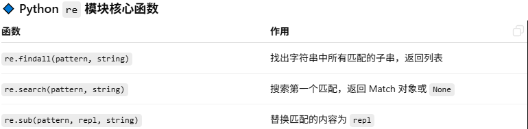
	•	常见模式:邮箱、手机号、日期、URL
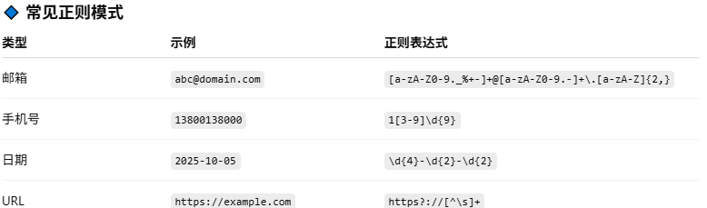

🔹 练习示例
```
import re

text = "Contact me: john.doe@example.com or 13800138000. Website: https://example.com. Date: 2025-10-05"

# 找出所有邮箱
emails = re.findall(r"[a-zA-Z0-9._%+-]+@[a-zA-Z0-9.-]+\.[a-zA-Z]{2,}", text)

# 找出手机号
phones = re.findall(r"1[3-9]\d{9}", text)

# 找出日期
dates = re.findall(r"\d{4}-\d{2}-\d{2}", text)

# 替换 URL 为 <URL>
new_text = re.sub(r"https?://[^\s]+", "<URL>", text) # 注意这里的替换只是替换了原句子中的一部分 

print("Emails:", emails)
print("Phones:", phones)
print("Dates:", dates)
print("New Text:", new_text) 
```
💡 应用场景:

数据清洗:提取邮箱、手机号、URL、日期
日志分析:解析日志中的时间、IP、状态码
金融文本:识别交易指令、股票代码、金额
北美手机号正则:
r'(\+1[- ]?)?(\(?[2-9][0-9]{2}\)?[- ]?[2-9][0-9]{2}[- ]?[0-9]{4})'
+1 202-555-0123
其中:
(\+1[- ]?)? → 可选的国家码 +1，后面可以跟空格或 -
\(?[2-9][0-9]{2}\)? → 区号，可带括号，比如 (202) 或 202，首位数字 2-9
[- ]? → 区号和中间三位之间可选分隔符
[2-9][0-9]{2} → 中间三位，首位 2-9
[- ]? → 分隔符
[0-9]{4} → 后四位

emails = re.findall(r"[a-zA-Z0-9._%+-]+@[a-zA-Z0-9.-]+\.[a-zA-Z]{2,}", text)
其中:
[a-zA-Z0-9._%+-]+      # 1. 用户名部分:允许字母、数字、点、下划线、百分号、加号、减号，至少出现一次
@                      # 2. @ 符号
[a-zA-Z0-9.-]+         # 3. 域名部分:允许字母、数字、点、减号，至少出现一次
\.                     # 4. 点号（分隔主域名和顶级域名，需要转义）
[a-zA-Z]{2,}           # 5. 顶级域名:只允许字母，长度至少为2

通用日期正则（支持 YYYY-MM-DD, YYYY/MM/DD, MM/DD/YYYY, DD-MM-YYYY）
date_pattern = r"(?:(?:\d{4}[-/]\d{2}[-/]\d{2})|(?:\d{2}[-/]\d{2}[-/]\d{4}))"
其中:
\d{4}[-/]\d{2}[-/]\d{2} → 匹配 YYYY-MM-DD 或 YYYY/MM/DD
\d{2}[-/]\d{2}[-/]\d{4} → 匹配 MM/DD/YYYY 或 DD-MM-YYYY
外层 (?: ... | ... ) → 非捕获组，用于“或”的关系
举例:
```
date_pattern = (
    r"(?:"
    r"(?:[0-9]{4}[-/](?:0[1-9]|1[0-2])[-/](?:0[1-9]|[12][0-9]|3[01]))"  # YYYY-MM-DD or YYYY/MM/DD
    r"|"
    r"(?:0[1-9]|1[0-2])[-/](?:0[1-9]|[12][0-9]|3[01])[-/][0-9]{4}"       # MM/DD/YYYY
    r"|"
    r"(?:0[1-9]|[12][0-9]|3[01])[-/](?:0[1-9]|1[0-2])[-/][0-9]{4}"       # DD-MM-YYYY
    r")"
)
```
其中:
月份范围限定 01~12
日范围限定 01~31
支持三种常见格式:YYYY-MM-DD、MM/DD/YYYY、DD-MM-YYYY
不匹配不合理的日期，如 00-01-2020 或 13/32/2025
日期简单记忆方法:
0[1-9] → 01~09
[12][0-9] → 10~29
3[01] → 30,31

#### 🔧练习27:
正则表达式
写一个函数，判断用户输入是否是合法邮箱。

### 📑 Day 28: 虚拟环境与依赖管理
Python 项目开发中，为了避免不同项目间的包冲突，通常会使用 虚拟环境 来隔离依赖，同时记录依赖版本方便复现。
	•	venv 基础操作
	•	pip freeze > requirements.txt
	•	poetry 初体验:创建虚拟环境、安装依赖

1️⃣ venv 基础操作
Python 内置模块 venv 用于创建虚拟环境:
1,1 创建虚拟环境（Windows）
```
python -m venv venv
```
1.2 激活虚拟环境
for Windows
```
venv\Scripts\activate
```
for macOS/Linux
```
source venv/bin/activate

```
1.3 退出虚拟环境
```
deactivate
```
激活后，安装的所有包都会在该环境内，不会影响全局 Python。

2️⃣ 依赖管理与复现

安装依赖:
```
pip install pandas matplotlib
```
查看当前环境安装的包及版本:
```
pip freeze
```
导出依赖文件:
```
pip freeze > requirements.txt
```
通过 requirements.txt 安装同样环境:
```
pip install -r requirements.txt
```

⚡ 用法场景:团队协作、项目部署、CI/CD、复现历史实验环境。

3️⃣ Poetry 初体验

Poetry 是现代 Python 包管理和虚拟环境工具，集成了依赖管理与发布功能。

安装 poetry（如果没安装）
```
pip install poetry
```
创建新项目
```
poetry new myproject
cd myproject
```
初始化虚拟环境并安装依赖
```
poetry install
```
添加依赖
```
poetry add pandas matplotlib
```
运行脚本（在虚拟环境中）
```
poetry run python main.py
```
poetry.lock:锁定依赖版本，确保不同机器安装一致
pyproject.toml:项目配置文件，包括依赖信息

💡 总结:

venv 轻量、简单，适合单项目环境隔离
pip + requirements.txt 适合依赖复现
poetry 更现代化，支持依赖锁定、版本管理和发布

✅ 项目收益:
团队可共享同一套依赖环境
CI/CD、部署、实验复现无缝衔接
简化复杂项目管理，提高开发效率

week4 大项目:全功能量化回测（见week4目录）

📝 小项目2（面试模拟）:
写函数:输入交易日日期（含节假日），返回 下一个交易日（考察 datetime & 金融应用）。

⸻

## Week 5: Pandas 数据分析基础
📘 学习内容:
```
	•	Pandas 数据结构:Series, DataFrame
	•	导入数据（CSV, Excel, JSON, SQL）
	•	数据清洗:缺失值处理、重复值去除
	•	统计分析:均值、中位数、方差、相关性
	•	分组聚合:groupby, pivot_table
```
### 📑Day 29: 认识 Pandas 与 Series / DataFrame
**学习重点:**
- 导入 Pandas:`import pandas as pd`
- Pandas 的两个核心数据结构:  
  - `Series`:一维数组，带标签索引  
  - `DataFrame`:二维表格，带行列标签  
  
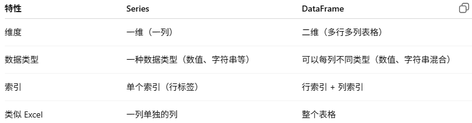

使用场景区别:

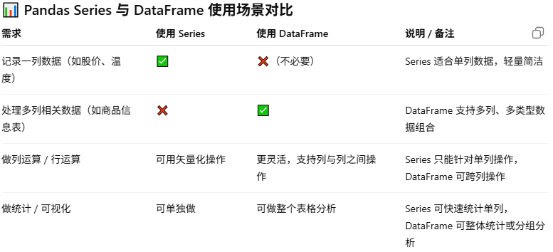

小结:
Series = DataFrame 的一列
DataFrame = 多个 Series 组成的二维表
DataFrame 更复杂，更灵活；Series 更简单，轻量。

1️⃣ 高效处理表格数据
Pandas 提供了 Series（一维） 和 DataFrame（二维），能像 Excel 或 SQL 表格一样处理数据。
支持混合数据类型（数值、字符串、时间序列等），而 Numpy 只能处理纯数值数组。
能轻松完成:

1. 行列筛选、切片
2. 按条
3. 列运算、批量计算
4. 缺失值处理

例子:
```
df = pd.DataFrame({'Name': ['A','B'], 'Sales':[200,300]})
df[df['Sales'] > 200]
```
输出:
```
	Name  Sales
1    B    300
```
2️⃣ 数据清洗与预处理的利器
现实数据通常 不整洁（缺失值、重复值、格式不统一）

Pandas 提供:

1. dropna(), fillna()
2. duplicated(), drop_duplicates()
3. 类型转换 astype()
4. 字符串处理 .str 方法

例子:
```
df['Name'] = df['Name'].str.upper()
```
3️⃣ 强大的数据聚合与分组能力
通过 groupby() 可以快速统计和聚合数据
支持多层分组、透视表（pivot_table）

例子:
```
df.groupby('Region')['Sales'].sum()
```
相当于 SQL 的 GROUP BY 功能，方便分析和报表生成

4️⃣ 与 Python 数据生态无缝集成
可以直接与 NumPy, Matplotlib, Seaborn, Scikit-learn 等库配合
导入导出方便:CSV、Excel、SQL、JSON 等多种格式
方便做数据分析、可视化、机器学习建模

5️⃣ 高效、矢量化计算
Pandas 内部大量使用 NumPy 向量化运算，避免 Python 原生循环
对大规模数据（几十万行以上）处理速度远快于 Python 原生列表或字典

例子:
```
df['Sales'] = df['Sales'] * 1.1  # 所有行一次性加 10%
```
6️⃣ 总结

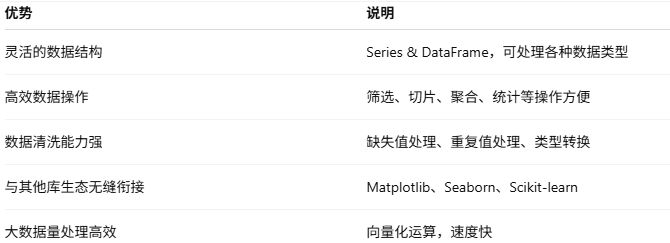

#### 🔧练习29:
- 创建自己的 `Series` 和 `DataFrame`
- 练习 `.head()`, `.tail()`, `.info()`, `.describe()` 等常用方法
```
import pandas as pd

# 1️⃣ 创建 Series: 单只股票的历史收盘价
apple_prices = pd.Series(
    [150, 152, 149, 155, 157, 160, 158],
    index=pd.date_range(start='2025-10-01', periods=7, freq='D')
)
print("Apple 收盘价 Series:")
print(apple_prices)

# 2️⃣ 创建 DataFrame: 多只股票的价格与交易量
stock_data = pd.DataFrame({
    'Ticker': ['AAPL', 'MSFT', 'TSLA', 'GOOG', 'AMZN'],
    'Price': [160, 310, 720, 2900, 3500],
    'Volume': [5000000, 3000000, 4000000, 1500000, 2000000]
})
print("\n股票 DataFrame:")
print(stock_data)

# 3️⃣ 使用常用方法查看数据
print("\n--- 前几行 head() ---")
print(stock_data.head(3))   # 查看前3行

print("\n--- 后几行 tail() ---")
print(stock_data.tail(2))   # 查看后2行

print("\n--- info() ---")
print(stock_data.info())    # 查看数据类型和非空信息

print("\n--- describe() ---")
print(stock_data.describe()) # 数值列统计信息
```
---

### 📑Day 30: 数据导入与初步查看
**学习重点:**
- 导入多种格式:
```python
import pandas as pd
import sqlite3  # 如果需要从数据库读取

# CSV 文件
df_csv = pd.read_csv('data.csv')

# Excel 文件
df_excel = pd.read_excel('data.xlsx', sheet_name=0)

# JSON 文件
df_json = pd.read_json('data.json')

# SQL 数据库
conn = sqlite3.connect('data.db')
df_sql = pd.read_sql('SELECT * FROM sales', conn)
conn.close()
```
- 基本查看与筛选:

查看列名
print(df_csv.columns)

查看行列数
print(df_csv.shape)

查看每列的数据类型
print(df_csv.dtypes)

查看前几行和后几行
print(df_csv.head())
print(df_csv.tail())

筛选满足条件的行，例如销售额 > 1000
high_sales = df_csv[df_csv['Sales'] > 1000]

选择特定列
sales_only = df_csv[['Date', 'Sales']]

重命名列
df_csv.rename(columns={'Sales':'Revenue'}, inplace=True)

#### 🔧练习30:
```python
import pandas as pd

# 1️⃣ 导入 CSV
df = pd.read_csv('stocks.csv', parse_dates=['Date'])
print("数据预览:")
print(df.head())

# 2️⃣ 查看基本信息
print("\n列名:", df.columns)
print("行列数:", df.shape)
print("数据类型:\n", df.dtypes)

# 3️⃣ 筛选价格大于 500 的股票
high_price = df[df['Price'] > 500]
print("\n价格大于 500 的股票:")
print(high_price)

# 4️⃣ 选择 Ticker 和 Price 列
ticker_price = df[['Ticker', 'Price']]
print("\n只看股票和价格列:")
print(ticker_price)

# 5️⃣ 重命名列
df.rename(columns={'Price':'Close Price', 'Volume':'Trading Volume'}, inplace=True)
print("\n重命名后的 DataFrame:")
print(df.head())
```
---
### 📑Day 31: 数据清洗（缺失值与重复值）
**学习重点:**
1️⃣ 缺失值处理（Missing Values）
检查每列缺失值数量
```
df.isnull().sum()
```
用指定值填充缺失值
```
df.fillna(0, inplace=True)
```
删除某列缺失值的行，例如 Price 列为空
```
df.dropna(subset=['Price'], inplace=True)
```
说明:

1. isnull() → 判断每个元素是否为空（NaN）
2. sum() → 汇总每列缺失值数量
3. fillna() → 填充缺失值
4. dropna(subset=[…]) → 删除特定列为空的行

2️⃣ 重复值处理（Duplicates）
删除完全重复的行
```
df.drop_duplicates(inplace=True)
```
drop_duplicates() 会检查整行是否重复
inplace=True 直接修改原 DataFrame

3️⃣ 数据类型转换
将日期列转换为 datetime 类型
```
df['Date'] = pd.to_datetime(df['Date'])
```
便于时间排序、时间序列分析
可以直接使用 .sort_values('Date') 排序

#### 🔧练习31:
- 检查数据中的空值、重复行并清洗
- 转换日期列格式并排序
假设有 CSV 文件 stocks_dirty.csv 内容如下（有缺失值、重复行、日期为字符串）:
```
Date,Ticker,Price,Volume
2025-10-01,AAPL,160,5000000
2025-10-01,AAPL,160,5000000
2025-10-02,MSFT,310,3000000
2025-10-03,TSLA,,4000000
2025-10-04,GOOG,2900,
2025-10-05,AMZN,3500,2000000
```
示例代码
```
import pandas as pd

# 1️⃣ 导入 CSV
df = pd.read_csv('stocks_dirty.csv')
print("原始数据:")
print(df)

# 2️⃣ 检查缺失值
print("\n每列缺失值数量:")
print(df.isnull().sum())

# 3️⃣ 删除完全重复的行
df.drop_duplicates(inplace=True)
print("\n删除重复行后:")
print(df)

# 4️⃣ 填充缺失值或删除特定列缺失行
# 例:Volume 缺失用 0 填充
df['Volume'].fillna(0, inplace=True)

# Price 列缺失直接删除
df.dropna(subset=['Price'], inplace=True)
print("\n缺失值处理后:")
print(df)

# 5️⃣ 转换日期列类型并排序
df['Date'] = pd.to_datetime(df['Date'])
df.sort_values('Date', inplace=True)
print("\n转换日期并排序后:")
print(df)
```

详细讲解

检查缺失值
```
df.isnull().sum()
```
返回每列缺失值数量
便于判断哪些列需要清洗

删除重复行
```
df.drop_duplicates(inplace=True)
```
避免重复记录影响统计和分析

处理缺失值
```
fillna(0) → 用 0 填充（如交易量缺失）
dropna(subset=['Price']) → 删除关键列缺失的行（价格是分析关键数据）
```
数据类型转换与排序
```
df['Date'] = pd.to_datetime(df['Date'])
df.sort_values('Date', inplace=True)
```
转换成 datetime 类型，才能做时间序列分析
排序便于后续绘图和收益率计算

💡 小技巧

如果只是想看缺失行而不是删除，可以用:
```
df[df['Price'].isnull()]
```
如果要对某列缺失值填充均值:
```
df['Price'].fillna(df['Price'].mean(), inplace=True)
```
---

### 📑Day 32: 统计分析与分组聚合**
**学习重点:**
1️⃣ 基本统计
平均值
```
df['Sales'].mean()
```
标准差
```
df['Sales'].std()
```
相关性矩阵
```
df.corr()
```
1. .mean() → 平均销售额
2. .std()  → 波动程度
3. .corr() → 数值列间相关性

2️⃣ 分组聚合
按月份分组求销售总额
```
df.groupby('Month')['Sales'].sum()
```
透视表:按月份和地区统计销售额
```
df.pivot_table(values='Sales', index='Month', columns='Region', aggfunc='sum')
```
1. groupby()     → 类似 SQL GROUP BY
2. pivot_table() → 类似 Excel 透视表
3. aggfunc       → 可以是 sum, mean, max, count 等

#### 🔧练习32:
使用销售数据（或模拟数据），完成:
1. 每月总销售额  
2. 最畅销商品  
3. 客户购买频率  
假设有销售 CSV 文件 sales.csv:
```
Date,Customer,Product,Region,Sales
2025-01-03,Alice,Pen,East,200
2025-01-05,Bob,Book,West,150
2025-02-02,Alice,Notebook,East,300
2025-02-10,Charlie,Pen,North,250
2025-03-15,Bob,Book,West,400
```
示例代码
```
import pandas as pd

# 1️⃣ 导入 CSV 并添加 Month 列
df = pd.read_csv('sales.csv', parse_dates=['Date'])
df['Month'] = df['Date'].dt.month

# 查看数据
print("原始数据预览:")
print(df.head())

# 2️⃣ 每月总销售额
monthly_sales = df.groupby('Month')['Sales'].sum()
print("\n每月总销售额:")
print(monthly_sales)

# 3️⃣ 最畅销商品（按销售额总和）
top_product = df.groupby('Product')['Sales'].sum().sort_values(ascending=False)
print("\n最畅销商品:")
print(top_product.head(1))  # 销售额最高的商品

# 4️⃣ 客户购买频率（订单数量）
customer_freq = df.groupby('Customer')['Sales'].count()
print("\n客户购买频率（订单数量）:")
print(customer_freq)

# 5️⃣ 可选:按月份和地区统计销售额（透视表）
pivot = df.pivot_table(values='Sales', index='Month', columns='Region', aggfunc='sum', fill_value=0)
print("\n按月份和地区统计销售额:")
print(pivot)
```
---

### 📑Day 33: 股票收益分析（面试模拟项目）
**学习重点:**


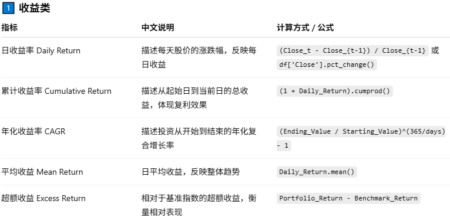
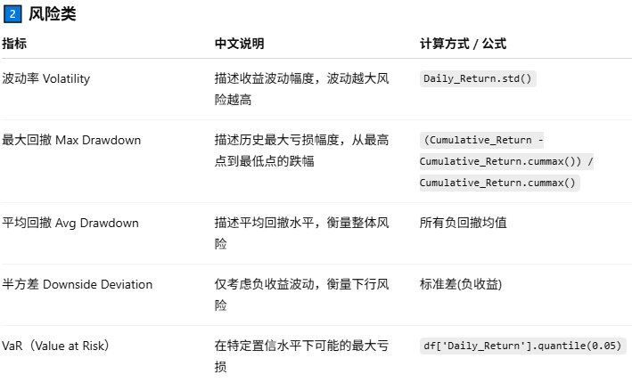
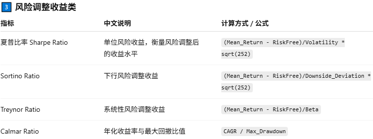

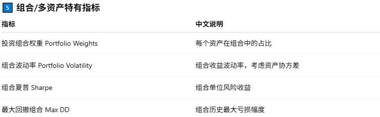

#### 🔧练习33
导入某只股票的 CSV 数据，完成以下计算并画图:
1. 日收益率  
2. 累计收益率曲线（`matplotlib` 可视化）  
3. 波动率数值输出  
```
import pandas as pd
import matplotlib.pyplot as plt
import numpy as np

# 1️⃣ 导入股票数据 CSV（假设有 Date, Close 列）
df = pd.read_csv('AAPL.csv', parse_dates=['Date'])

# 2️⃣ 数据初步查看
print("数据形状:", df.shape)
print("前5行:\n", df.head())
print("列名:", df.columns.tolist())
print("数据类型:\n", df.dtypes)
print("缺失值统计:\n", df.isnull().sum())

# 3️⃣ 排序日期并重置索引
df.sort_values('Date', inplace=True)
df.reset_index(drop=True, inplace=True)

# 4️⃣ 计算日收益率
df['Daily_Return'] = df['Close'].pct_change()

# 5️⃣ 计算累计收益率
df['Cumulative_Return'] = (1 + df['Daily_Return']).cumprod()

# 6️⃣ 计算波动率（年化）
daily_vol = df['Daily_Return'].std()
annual_vol = daily_vol * np.sqrt(252)
print(f"日波动率: {daily_vol:.4f}, 年化波动率: {annual_vol:.4f}")

# 7️⃣ 计算夏普比率（年化，假设无风险利率为0）
sharpe_ratio = df['Daily_Return'].mean() / daily_vol * np.sqrt(252)
print(f"年化夏普比率: {sharpe_ratio:.4f}")

# 8️⃣ 计算回撤和最大回撤
cum_max = df['Cumulative_Return'].cummax()
df['Drawdown'] = (df['Cumulative_Return'] - cum_max) / cum_max
max_drawdown = df['Drawdown'].min()
print(f"最大回撤: {max_drawdown:.4f}")

# 9️⃣ 计算年化收益率 CAGR
days = (df['Date'].iloc[-1] - df['Date'].iloc[0]).days
cagr = (df['Cumulative_Return'].iloc[-1]) ** (365 / days) - 1
print(f"CAGR（年化收益率）: {cagr:.4f}")

# 🔟 可视化累计收益率和回撤
plt.figure(figsize=(12,5))
plt.plot(df['Date'], df['Cumulative_Return'], label='Cumulative Return')
plt.fill_between(df['Date'], df['Cumulative_Return'], cum_max, color='red', alpha=0.3, label='Drawdown')
plt.title("AAPL 累计收益率 & 回撤")
plt.xlabel("Date")
plt.ylabel("Cumulative Return")
plt.legend()
plt.grid(True)
plt.show()

# 1️⃣1️⃣ 可视化日收益率分布
plt.figure(figsize=(8,4))
df['Daily_Return'].hist(bins=50)
plt.title("AAPL 日收益率分布")
plt.xlabel("Daily Return")
plt.ylabel("Frequency")
plt.grid(False)
plt.show()
```
---
### 📑Day 34: Pandas 进阶技巧与性能优化

📘 学习重点:
1️⃣ 多重索引（MultiIndex）

作用:处理分层数据，便于按多级条件筛选和聚合。

示例:
```
# 假设有销售数据
df = pd.DataFrame({
    'Region': ['North','North','South','South'],
    'Month': ['Jan','Feb','Jan','Feb'],
    'Sales': [200, 210, 150, 180]
})

# 设置多级索引
df = df.set_index(['Region', 'Month'])

# 按 Region 筛选
print(df.loc['North'])
```
说明:
可以快速按一级或多级索引定位数据
常用于股票数据:股票代码 + 日期，或者行业 + 股票

2️⃣ apply / lambda 自定义函数
作用:按行或按列自定义计算逻辑。
示例:
```
df['Profit_Rate'] = df.apply(lambda x: x['Profit'] / x['Sales'], axis=1)
```
说明:
axis=1 → 按行
axis=0 → 按列
面试提示:apply 方便灵活，但性能不如矢量化

3️⃣ 矢量化运算 vs 循环性能差异
示例数据:
```
import numpy as np
arr = np.random.rand(1000000)
```

循环计算平方（慢）:
```
%%timeit
result = []
for x in arr:
    result.append(x**2)
```
矢量化（快）:
```
%%timeit
result = arr**2
```
说明:
Pandas / NumPy 优势在于矢量化，避免 Python 层循环
面试中常考性能优化方法

4️⃣ 内存优化与类型转换

示例:
```
df['Category'] = df['Category'].astype('category')
```
说明:
分类类型比字符串节省内存
对大数据集很重要

其他优化:
数值列可以用 float32 / int32
读 CSV 时指定 dtype

#### 🔧练习34:

给销售或股票数据加多级索引（如 Region + Month）
比较 for 循环与 apply、vectorized 的速度差异（可用 %timeit）
```
import pandas as pd
import numpy as np
import time

# 1️⃣ 生成模拟股票数据（多只股票）
np.random.seed(42)
tickers = ['AAPL', 'TSLA', 'AMZN']
dates = pd.date_range('2023-01-01', '2023-06-30', freq='B')  # 交易日
data = []

for t in tickers:
    price = 100 + np.cumsum(np.random.normal(0, 1, len(dates)))
    df_temp = pd.DataFrame({'Ticker': t, 'Date': dates, 'Close': price})
    data.append(df_temp)

df = pd.concat(data).reset_index(drop=True)

# 2️⃣ 多级索引
df = df.set_index(['Ticker', 'Date'])
print("多级索引示例:\n", df.loc['AAPL'].head())

# 3️⃣ apply / lambda 自定义计算日收益率
df['Daily_Return_apply'] = df.groupby(level=0)['Close'].apply(lambda x: x.pct_change())

# 4️⃣ 矢量化计算日收益率（更快）
df['Daily_Return_vectorized'] = df.groupby(level=0)['Close'].pct_change()

# 5️⃣ 性能对比
sample = df.reset_index().loc[df['Ticker']=='AAPL', 'Close']

# 循环计算平方（示例性能对比）
start = time.time()
result_loop = []
for x in sample:
    result_loop.append(x**2)
print("循环耗时:", time.time() - start)

# apply 计算平方
start = time.time()
result_apply = sample.apply(lambda x: x**2)
print("apply 耗时:", time.time() - start)

# 矢量化计算平方
start = time.time()
result_vector = sample**2
print("矢量化耗时:", time.time() - start)

# 6️⃣ 内存优化示例
print("\n原始内存占用:")
print(df.info(memory_usage='deep'))

df = df.copy()
df['Ticker'] = df.index.get_level_values(0).astype('category')  # 分类类型优化
df['Close'] = df['Close'].astype('float32')                     # 类型优化

print("\n优化后内存占用:")
print(df.info(memory_usage='deep'))

# 7️⃣ 小结输出
print("\n示例完成:多级索引 + apply/矢量化计算 + 性能对比 + 内存优化")

```

### 📑Day 35: Pandas 可视化与综合实战

📘 学习重点:

内置绘图功能（基于 Matplotlib）:
```
df['Sales'].plot(kind='line')
df.groupby('Month')['Sales'].sum().plot(kind='bar')
```

多个指标对比图:
```
df[['Sales', 'Profit']].plot(kind='line')
```

直方图 / 箱型图查看分布:
```
df['Sales'].hist()
df.boxplot(column='Sales', by='Region'
```
#### 🔧练习35: 销售与收益可视化仪表板

整合 销售 与 股票 数据

绘制:
每月销售趋势
股票累计收益率曲线
区域销售占比饼图
添加 rolling() 平滑曲线、对比波动趋势
---

🎯 **总结**
- 掌握 Pandas 的数据结构与基本操作
- 能独立导入、清洗、分析数据
- 完成两个小项目:销售分析 & 股票收益分析

more details to see subfolder week5

⸻

## Week 6: 数据可视化
📘 学习内容:
```
	•	matplotlib:折线图、柱状图、散点图
	•	seaborn:分布图、热力图
	•	图表美化:标题、标签、图例、颜色
	•	双轴图、子图
	•	交互式可视化:plotly
```
### 📑Day 36: Matplotlib 基础
**重点内容**:
- 折线图、散点图
- 设置标题、坐标轴、颜色、线型
- 保存图像 `plt.savefig()`

#### 🔧练习36:
- 绘制日收益率折线图
- 修改颜色、线型、标题和字体

---

### 📑Day 37: Matplotlib 进阶
**重点内容**:
- 子图布局（`subplot`, `subplots`）
- 条形图、饼图、直方图
- 添加注释、文字、图例

#### 🔧练习37:
- 绘制产品销售对比条形图
- 收益分布直方图

---

### 📑Day 38: Seaborn 基础
**重点内容**:
- 统计图:`histplot`, `boxplot`, `scatterplot`, `lineplot`
- 设置风格 `sns.set(style='whitegrid')`
- 使用 `hue` 分组增强可读性

#### 🔧练习38:
- 绘制箱型图与散点图
- 分析不同客户或区域的销售分布

---

### 📑Day 39: Seaborn 高级
**重点内容**:
- FacetGrid、catplot、pairplot、violinplot
- 热力图 `sns.heatmap()` 分析相关性

#### 🔧练习39:
- 绘制股票相关性热力图
- 区域销售分布对比图

---

### 📑Day 40: Plotly 交互式可视化
**重点内容**:
- Plotly Express 创建交互式折线、柱状、散点图
- hover 信息、缩放、导出 HTML

#### 🔧练习40:
- 绘制交互式股票累计收益图
- 区域销售柱状图 + hover 显示具体数值

---
### 📑Day 41: Altair 声明式可视化
**重点内容**:
- 简洁声明式语法，自动美观
- 支持交互:缩放、选择、过滤
- 与 Pandas DataFrame 集成完美

#### 🔧练习41:
```python
import altair as alt
import pandas as pd

df = pd.DataFrame({
    'Month': ['Jan','Feb','Mar','Apr'],
    'Sales': [200, 300, 250, 400]
})

chart = alt.Chart(df).mark_line(point=True).encode(
    x='Month',
    y='Sales'
)
chart.interactive()
```
### 📑Day 42: 综合可视化项目

综合任务:

使用 Matplotlib + Seaborn + Plotly + Altair

#### 🔧练习42 示例项目:

股票收益可视化

Matplotlib 折线图 + 移动平均
Seaborn箱型图、热力图
Plotly 交互式累计收益图
Altair 声明式折线图 + hover
销售绩效仪表盘
每月销售趋势折线图
区域销售占比饼图
顾客消费柱状图
Altair 或 Plotly 实现交互式仪表盘

目标:

完整展示静态 + 统计 + 交互 + 声明式图表
能用 Python 输出可交互 HTML 仪表盘


⸻

## Week 7: 爬虫与数据获取
📘 学习内容:
```
	•	requests 请求网页/API,掌握网页与 API 数据获取的基本方法
	•	BeautifulSoup 解析 HTML,熟悉 HTML 解析、JSON 提取与异常处理  
	•	爬虫异常处理与重试,能独立爬取新闻、财经数据并保存到本地  
	•	能调用金融 API（Alpha Vantage / Yahoo Finance）获取实时数据并绘图展示
```

### 📑Day 43: Requests 基础与网页请求**
**重点内容:**
- 安装与导入:`pip install requests`
- 发起 GET / POST 请求:`requests.get()`, `requests.post()`
- 设置请求头（headers）、参数（params）
- 响应内容:`response.text`, `response.status_code`, `response.json()`
1. 安装与导入
```
pip install requests pandas

import requests
import pandas as pd
import time
from requests.adapters import HTTPAdapter
from urllib3.util.retry import Retry
```
requests:HTTP 请求库。
pandas:仅在示例中把 JSON 转为表格。
Retry/HTTPAdapter:实现重试策略（见下文）。

2. 基本概念（要点）
	- 2.1 requests.get(url, params=..., headers=..., timeout=...) 发起 GET 请求。
	- 2.2 requests.post(url, data=..., json=..., headers=...) 发起 POST。
	- 2.3 response.status_code:HTTP 状态码（200 成功，404 未找到，500 服务器错误等）。
	- 2.4 response.text:把响应当文本（str）读取（适合 HTML）。
	- 2.5 response.content:原始二进制内容（适合文件/图片）。
	- 2.6 response.json():把响应解析为 JSON（在 Content-Type: application/json 时使用，可能抛异常）。
	- 2.7 response.headers:响应头（查看 Content-Type、Content-Length 等）。
	- 2.8 response.raise_for_status():若不是 2xx，会抛 HTTPError，便于错误处理。
	- 2.9 timeout:避免请求挂起（建议设置短超时，例如 (5, 15) 表示 connect/read）。

3. 示例 A — 请求网页并打印 HTML（以yahoo为例）
```
import yfinance as yf
import pandas as pd # Python 数据分析利器，用于处理表格数据（DataFrame）。

ticker = 'AAPL' # 苹果公司的股票代码（Ticker symbol）
stock = yf.Ticker(ticker) # 创建一个 Ticker 对象，可以通过这个对象获取该股票的各种信息，例如价格、历史数据、新闻等。

news = stock.news # stock.news:返回一个列表，每一项是一个字典，包含该股票的新闻信息。
news_list = [] # 初始化一个空列表，用来存储整理好的新闻信息。

for item in news:
    content = item.get('content', {})
    title = content.get('title')
    # 或 content.get('clickThroughUrl', {}).get('url') 
    link = content.get('canonicalUrl', {}).get('url') # 处理多层嵌套
    pubDate = content.get('pubDate')
    news_list.append({'title': title, 'link': link, 'pubDate': pubDate}) # 将整理好的新闻以字典形式加入列表

# 转成 DataFrame
df_news = pd.DataFrame(news_list) # 将字典列表转换为 Pandas DataFrame，每个字典的键会成为 DataFrame 的列名。DataFrame 的好处:
可以方便地做筛选、排序、导出 CSV 等操作
print(df_news.head())
```
总结

这个脚本做了三件事:
获取苹果公司的最新新闻数据。
遍历新闻列表，提取 标题、链接、发布日期。
整理成 Pandas DataFrame，方便后续分析或导出。

注意事项:

有些新闻可能没有 canonicalUrl 或 pubDate，这里使用 .get() 可以避免报错。
yfinance 返回的新闻数量有限，通常是最近几十条。
DataFrame 可以直接导出为 CSV:
```
df_news.to_csv("AAPL_news.csv", index=False)
```
4. 示例 B — 请求公开 API（JSONPlaceholder）并解析返回
```
import requests
import pandas as pd

# 单条请求
resp = requests.get("https://jsonplaceholder.typicode.com/posts/1", timeout=5)
resp.raise_for_status() # 如果 HTTP 状态码不是 200，会抛出异常,保证请求成功，否则不会继续处理。
data = resp.json()  # API 返回的是 JSON 格式，这里把 JSON 转成 Python 字典 (dict)
print("Single post:", data)

# 多条请求并转换为 DataFrame
resp2 = requests.get("https://jsonplaceholder.typicode.com/posts", timeout=5) # 返回 所有帖子，JSON 是一个 字典列表
resp2.raise_for_status()
posts = resp2.json()  # list of dicts

df_posts = pd.DataFrame(posts) # 把 JSON 列表转成 Pandas DataFrame，每个字典的一条键值对应一列。
print(df_posts.head())
# 保存为 CSV
df_posts.to_csv("jsonplaceholder_posts.csv", index=False) # 将表格保存到本地文件 jsonplaceholder_posts.csv。index=False 表示不要保存行索引。
```
解释:

json() 把返回的 JSON 自动解析为 Python 数据结构（dict / list）。
多条记录变为 list[dict]，可以直接用 pd.DataFrame() 转换为表格，便于分析。
可保存为 CSV 以便后续离线分析。

5. 使用 params 构造带查询字符串的请求
```
params = {"userId": 1}
resp = requests.get("https://jsonplaceholder.typicode.com/posts", params=params, timeout=5)
print("请求 URL:", resp.url)  # 查看最终 URL
posts_user1 = resp.json()
print("Posts for userId=1:", len(posts_user1))
```

params 自动拼接为 ?userId=1，比字符串拼接更安全。

6. 大文件或二进制内容的下载（按块写文件）
```
url = "https://www.example.com/largefile.zip"
with requests.get(url, stream=True, timeout=10) as r:
    r.raise_for_status()
    with open("largefile.zip", "wb") as f:
        for chunk in r.iter_content(chunk_size=8192):
            if chunk:
                f.write(chunk)
```

stream=True 避免一次性把整个响应加载到内存中（适合大文件）。

7. Session 与 重试策略（重要:生产环境常用）
```
from requests.adapters import HTTPAdapter
from urllib3.util.retry import Retry
import requests

session = requests.Session()

retry = Retry(
    total=5,
    backoff_factor=0.5,  # 指数退避:0.5s, 1s, 2s, ...
    status_forcelist=[429, 500, 502, 503, 504],
    allowed_methods=["GET", "POST"]
)
adapter = HTTPAdapter(max_retries=retry)
session.mount("https://", adapter)
session.mount("http://", adapter)

try:
    r = session.get("https://jsonplaceholder.typicode.com/posts", timeout=5)
    r.raise_for_status()
    print("Got", len(r.json()), "posts (via session with retry).")
finally:
    session.close()
```

解释:

Retry 支持自动重试并带退避，适用于临时网络波动或 429 限流。
使用 Session 可以复用 TCP 连接，提高效率。

8. 超时与错误处理（最佳实践）
```
try:
    r = requests.get(url, timeout=(3.05, 9))  # (connect, read)
    r.raise_for_status()
except requests.exceptions.Timeout:
    # 超时:可以重试或记录日志
    pass
except requests.exceptions.ConnectionError:
    # 网络错误
    pass
except requests.exceptions.HTTPError as e:
    # 非 2xx
    pass
except requests.exceptions.RequestException as e:
    # 其他 request 异常
    pass
```

Always set a timeout.

捕获 RequestException 可统一处理 requests 抛出的异常。

9. 检查响应类型再用 .json()
```
if 'application/json' in resp.headers.get('Content-Type', ''):
    j = resp.json()
else:
    print("不是 JSON，不能调用 .json()")
```

避免在 HTML 或其他格式上调用 .json() 导致 ValueError。

10. 速率限制与礼貌爬取

遵守 robots.txt（可用 requests.get("https://example.com/robots.txt") 查看）。

对频繁请求的站点加 time.sleep() 或使用退避策略。

对需要登录或 API Key 的接口，使用授权头 Authorization: Bearer <token> 或 params 传 key（根据 API 要求）。

#### 🔧练习43
- 请求一个网页（如百度或新闻网站）并打印 HTML,见上。
- 请求一个简单的公开 API（如 JSONPlaceholder）并解析返回结果，见上。

---

### 📑Day 44: HTML 解析与 BeautifulSoup**
**重点内容:**
- 安装:`pip install beautifulsoup4 lxml`
- 创建解析器:`soup = BeautifulSoup(html, "lxml")`
- 查找标签:`find()`, `find_all()`, `select()`
- 获取属性与文本内容

1️⃣ 安装 BeautifulSoup 与解析器
```
pip install beautifulsoup4 lxml
```
beautifulsoup4:核心库，用于解析 HTML 或 XML。
lxml:高效的 HTML/XML 解析器，比默认的 html.parser 更快、更稳定。

2️⃣ 基本用法
```
from bs4 import BeautifulSoup

html = """
<html>
    <body>
        <h2>新闻标题1</h2>
        <h2>新闻标题2</h2>
        <a href="https://example.com/1">链接1</a>
        <a href="https://example.com/2">链接2</a>
    </body>
</html>
"""

soup = BeautifulSoup(html, "lxml")
```
soup 是解析后的对象，你可以像操作树一样操作 HTML。

"lxml":指定解析器。

3️⃣ 查找标签

单个标签 find()
```
h2_first = soup.find("h2")
print(h2_first.text)  # 输出第一个 <h2> 的文本
```

所有标签 find_all()
```
h2_all = soup.find_all("h2")
for h in h2_all:
    print(h.text)
```

CSS 选择器 select()
```
links = soup.select("a")  # 所有 <a> 标签
for link in links:
    print(link.text, link.get("href"))
```

link.text → 标签内部文字
link.get("href") → 标签的 href 属性

4️⃣ 爬取新闻网站首页标题与链接示例

注意:大部分新闻网站可能有反爬策略，建议用公开测试网站或者加 headers 模拟浏览器。
```python
import requests
from bs4 import BeautifulSoup

url = "https://news.ycombinator.com/"  # Hacker News 首页

headers = {
    "User-Agent": "Mozilla/5.0 (Windows NT 10.0; Win64; x64)"
}

resp = requests.get(url, headers=headers, timeout=5)
resp.raise_for_status()
soup = BeautifulSoup(resp.text, "lxml")

# 提取新闻标题
titles = soup.select("a.storylink")  # Hacker News 的新闻链接 class
for t in titles[:10]:  # 只取前10条
    print(t.text, t.get("href"))
```

5️⃣ 提取 h2 或 a 标签文字

```python
for h2 in soup.find_all("h2"):
    print(h2.text.strip())
```
```python
for a in soup.find_all("a"):
    print(a.text.strip(), a.get("href"))
```
.strip() 去掉空格换行，更干净。
可以组合成 DataFrame 或 CSV:
```python
import pandas as pd

data = []
for a in soup.find_all("a"):
    data.append({"title": a.text.strip(), "link": a.get("href")})

df = pd.DataFrame(data)
df.to_csv("news.csv", index=False)
```
总结:

1. BeautifulSoup 是解析 HTML 的利器:
2. find() / find_all() → 精确查找标签
3. select() → CSS 选择器
4. .text → 标签文字
5. .get("attr") → 标签属性
6. 可以和 requests 配合爬取网页内容
7. 提取的数据可进一步存储为 CSV、DataFrame 或做分析

#### 🔧练习44
- 爬取新闻网站首页的标题与链接
- 提取所有 `<h2>` 或 `<a>` 标签文字
```
import requests
from bs4 import BeautifulSoup
import pandas as pd

# ---------- 配置 ----------
url = "https://news.ycombinator.com/"  # 目标网站
headers = {
    "User-Agent": "Mozilla/5.0 (Windows NT 10.0; Win64; x64)"
}
tag_to_extract = ["h2", "a"]  # 要提取的标签，可扩展
max_items = 50  # 最多抓取条数

# ---------- 请求网页 ----------
try:
    resp = requests.get(url, headers=headers, timeout=5)
    resp.raise_for_status()
except requests.RequestException as e:
    print("请求网页失败:", e)
    exit()

# ---------- 解析网页 ----------
soup = BeautifulSoup(resp.text, "lxml")

# ---------- 提取数据 ----------
data = []

for tag_name in tag_to_extract:
    for tag in soup.find_all(tag_name):
        title = tag.text.strip()
        link = tag.get("href", "")  # 如果没有 href 属性就用空字符串
        if title:  # 过滤掉空标题
            data.append({"title": title, "link": link})
        if len(data) >= max_items:
            break
    if len(data) >= max_items:
        break

# ---------- 转为 DataFrame ----------
df = pd.DataFrame(data)
print(df.head())

# ---------- 保存为 CSV ----------
csv_file = "news_data.csv"
df.to_csv(csv_file, index=False)
print(f"已保存 {len(df)} 条新闻到 {csv_file}")

```
---

### 📑Day 45: JSON 数据解析与保存

**重点内容:**
- 使用 `response.json()` 获取 API 数据
- 遍历嵌套字典与列表
- 保存数据到文件:`json.dump()`
- 转换为 Pandas DataFrame 并保存为 CSV

Day 43/44（HTML）
核心是 解析网页 DOM 树
用 .find() / .find_all() / .select() 获取标签内容
Day 45（JSON）
核心是 解析 API 返回的 JSON
用 response.json() 转成 Python 对象，遍历字典和列表
相同点
都用 requests 获取数据
都可以最终转成 DataFrame / CSV 保存
不同点
HTML 需要处理标签层级
JSON 是结构化数据，遍历更直接


#### 🔧练习45
- 访问一个返回 JSON 的 API 见上
- 提取部分字段并保存为 CSV 文件

---
### 📑Day 46: 爬虫异常处理与重试机制

**重点内容:**
- 常见异常:网络超时、404、连接拒绝
- try-except 捕获异常
- `time.sleep()` 控制访问频率
- `requests` 的 `Session` 与 `Retry` 实现重试机制

#### 🔧练习46
- 编写一个带异常处理的爬虫函数
- 当请求失败时自动重试最多 3 次
```
import requests
from requests.adapters import HTTPAdapter, Retry
import time

def fetch_url(url, max_retries=3, wait_seconds=2, timeout=5):
    """
    带异常处理和重试机制的爬虫函数
    参数:
        url: 目标网址
        max_retries: 最大重试次数
        wait_seconds: 每次失败后等待秒数
        timeout: 请求超时时间
    返回:
        响应文本 (str) 或 None
    """
    # 创建 Session 并设置重试策略
    session = requests.Session()
    retries = Retry(
        total=max_retries,
        backoff_factor=wait_seconds,  # 失败后指数退避
        status_forcelist=[500, 502, 503, 504],  # 需要重试的 HTTP 状态码
        allowed_methods=["GET", "POST"]
    )
    adapter = HTTPAdapter(max_retries=retries)
    session.mount("http://", adapter)
    session.mount("https://", adapter)

    try_count = 0
    while try_count < max_retries:
        try:
            resp = session.get(url, timeout=timeout)
            resp.raise_for_status()  # HTTP 错误会抛出异常
            return resp.text  # 成功返回网页内容
        except requests.exceptions.Timeout:
            print(f"[{try_count+1}] 请求超时，{wait_seconds}秒后重试...")
        except requests.exceptions.ConnectionError:
            print(f"[{try_count+1}] 连接失败，可能被拒绝，{wait_seconds}秒后重试...")
        except requests.exceptions.HTTPError as e:
            print(f"[{try_count+1}] HTTP 错误:{e}, {wait_seconds}秒后重试...")
        except requests.exceptions.RequestException as e:
            print(f"[{try_count+1}] 请求异常:{e}, {wait_seconds}秒后重试...")
        try_count += 1
        time.sleep(wait_seconds)

    print("重试次数用完，获取失败！")
    return None

# ------------------ 测试 ------------------
if __name__ == "__main__":
    url = "https://jsonplaceholder.typicode.com/posts"
    html = fetch_url(url)
    if html:
        print("获取成功，内容长度:", len(html))
    else:
        print("获取失败")

```
---

### 📑Day 47: API 调用 — Alpha Vantage / Yahoo Finance

**重点内容:**
- 注册获取 API Key
- 构造 URL 并请求 JSON 数据
- 使用 Pandas 转换数据格式
- 保存并可视化（Matplotlib 折线图）

#### 🔧练习47
- 调用 Alpha Vantage API 获取某支股票的历史数据
- 使用 Matplotlib 绘制收盘价趋势图

---
### 📑Day 48: 小项目1 — 新闻标题爬取

**项目目标:**
- 爬取指定新闻网站的标题与时间
- 解析 HTML 并保存到 CSV

**实现要点:**
- 使用 `requests` + `BeautifulSoup`
- 数据字段:日期、标题、链接
- 输出文件:`news_titles.csv`

**进阶挑战:**
- 添加关键词过滤（只保存包含“科技”、“经济”的标题）
- 添加日期戳

---

### 📑Day 49: 小项目2 — 金融数据 API 实战

**项目目标:**
- 调用金融 API（Alpha Vantage 或 Yahoo Finance）
- 获取股票或指数的时间序列数据
- 计算并绘制收益率趋势图

**实现步骤:**
1. 使用 `requests` 获取 JSON 数据  
2. 转换为 DataFrame  
3. 计算日收益率 `df['Return'] = df['Close'].pct_change()`  
4. 绘制趋势折线图  

**示例代码:**
```python
import requests
import pandas as pd
import matplotlib.pyplot as plt

symbol = "AAPL"
url = f"https://www.alphavantage.co/query?function=TIME_SERIES_DAILY&symbol={symbol}&apikey=YOUR_API_KEY"
data = requests.get(url).json()

df = pd.DataFrame(data["Time Series (Daily)"]).T
df = df.astype(float)
df['Return'] = df['4. close'].pct_change()
df['4. close'].plot(title=f"{symbol} Daily Close Price")
plt.show()
```
⸻
## Week 8: Python 算法与数据结构
---
### 🧩 Day 50: 算法与复杂度基础
**目标**:掌握算法基本概念、复杂度分析，熟悉线性查找与二分查找，处理多类型数据和异常。

### 核心知识

* **算法**:解决问题的步骤
* **时间复杂度**:衡量算法执行时间增长率
* **空间复杂度**:算法占用内存增长率
* **常见复杂度**:O(1)、O(n)、O(log n)、O(n²)、O(2ⁿ)
* **案例**:线性查找 vs 二分查找

#### 练习 50.1: 通用线性查找

**题目**:实现 `linear_search(arr, target)`，支持 int、float、str，返回第一个匹配索引。

```python
def linear_search(arr, target):
    if not arr:
        return -1
    for i, val in enumerate(arr): # i是索引，val是元素，注意这里用的是python 的内置函数：enumberate（），它将同时获得索引和值
        try:
            if val == target:
                return i
        except Exception:
            continue
    return -1

# 测试
data = [3, 5.5, 'abc', 8]
print(linear_search(data, 5.5))  # 输出 1
print(linear_search(data, 'xyz'))  # 输出 -1
```

#### 练习 50.2: 通用二分查找（有序）

**题目**:实现二分查找，支持整数和浮点数列表。
注意这里的数组必须是有序的，升降序无所谓，但必须有序。

```python
def binary_search(arr, target):
    if not arr:
        return -1
    l, r = 0, len(arr) - 1 # multiple assignment,同时赋值两个变量，达到初始化左右边界的意思
    while l <= r:
        mid = (l + r) // 2 # "//" 表示整数除法，mid 是索引值
        try:
            if arr[mid] == target: # arr[mid]是值
                return mid # mid 是索引
            elif arr[mid] < target: # 如果 中间的哪个值小于target，说明要找的值在右边，因此抛弃左边
                l = mid + 1
            else:
                r = mid - 1 # 反过来，抛弃右边
        except TypeError:
            return -1
    return -1

# 测试
arr = [1, 2.5, 3.7, 4, 5]
print(binary_search(arr, 3.7))  # 输出 2
```

增加难度：python 实战例子：如何在无序的数组上先排序，保留原始索引，再用二分法查找。
```python
from typing import List, Tuple

def prepare_sorted_with_index(arr: List) -> List[Tuple]:
    """
    给数组排序并保留原始索引
    返回 [(value, original_index), ...] 的列表
    """
    return sorted([(val, idx) for idx, val in enumerate(arr)], key=lambda x: x[0])

def binary_search_with_index(arr_with_idx: List[Tuple], target) -> int:
    """
    对排序后的带索引数组进行二分查找
    返回目标在原始数组中的索引，找不到返回 -1
    """
    l, r = 0, len(arr_with_idx) - 1
    while l <= r:
        mid = (l + r) // 2
        val, orig_idx = arr_with_idx[mid]
        try:
            if val == target:
                return orig_idx
            elif val < target:
                l = mid + 1
            else:
                r = mid - 1
        except TypeError:
            return -1
    return -1

# ---------- 测试 ----------
data = [5.5, 3, "abc", 10, 4.2, 7]
target = 4.2

# 1. 排序并保留原始索引
sorted_data = prepare_sorted_with_index(data)
print("排序后带索引的数据:", sorted_data)

# 2. 二分查找
index = binary_search_with_index(sorted_data, target)
if index != -1:
    print(f"找到 {target}，原始索引为 {index}")
else:
    print(f"{target} 未找到")
```

#### 练习 50.3: 效率对比

**题目**:比较线性查找和二分查找在大数组中的性能。

```python
import time
import random

arr = sorted([random.uniform(0, 1_000_000) for _ in range(1_000_000)])
target = arr[888_888]

for func in [linear_search, binary_search]:
    start = time.time()
    func(arr, target)
    print(f"{func.__name__}: {time.time()-start:.5f}s")
```

---

### 🧩 Day 51: 排序算法基础（1）

**目标**:掌握冒泡、选择、插入排序算法，处理整数、浮点数和字符串，统计操作次数。

#### 练习 51.1: 冒泡排序

**题目**:支持整数、浮点数和字符串混合，统计比较和交换次数。

```python
def bubble_sort(arr):
    compares = swaps = 0
    n = len(arr)
    for i in range(n):
        for j in range(n-i-1):
            compares += 1
            try:
                if arr[j] > arr[j+1]:
                    arr[j], arr[j+1] = arr[j+1], arr[j]
                    swaps += 1
            except TypeError:
                continue
    print(f"比较: {compares}, 交换: {swaps}")
    return arr

data = [5, 3.5, 'abc', 2]
print(bubble_sort(data))
```

#### 练习 51.2 选择排序

**题目**:实现支持不同数据类型的选择排序。

```python
def selection_sort(arr):
    n = len(arr)
    for i in range(n):
        min_index = i
        for j in range(i + 1, n):
            try:
                if arr[j] < arr[min_index]:
                    min_index = j
            except TypeError:
                continue
        arr[i], arr[min_index] = arr[min_index], arr[i]
    return arr

print(selection_sort([3, 1.2, 'b', 2]))
```

#### 练习 51.3: 插入排序

**题目**:支持整数、浮点数和字符串混合。

```python
def insertion_sort(arr):
    for i in range(1, len(arr)):
        key = arr[i]
        j = i - 1
        while j >= 0:
            try:
                if arr[j] > key:
                    arr[j + 1] = arr[j]
                    j -= 1
                else:
                    break
            except TypeError:
                break
        arr[j + 1] = key
    return arr

print(insertion_sort([5, 'a', 2, 3.3]))
```
---

### 🧩 Day 52: 排序算法进阶（2）

**目标**:掌握快速排序、归并排序，处理混合类型列表，提升大数据排序效率。

#### 练习 52.1: 快速排序

**题目**:支持整数、浮点数和字符串的快速排序。

```python
def quick_sort(arr):
    if len(arr) <= 1:
        return arr
    pivot = arr[0]
    left, right = [], []
    for x in arr[1:]:
        try:
            if x <= pivot:
                left.append(x)
            else:
                right.append(x)
        except TypeError:
            continue
    return quick_sort(left) + [pivot] + quick_sort(right)

print(quick_sort([5, 3.2, 'c', 1]))
```

#### 练习 52.2: 归并排序

**题目**:支持整数、浮点数列表。

```python
def merge_sort(arr):
    if len(arr) <= 1:
        return arr
    mid = len(arr)//2
    left = merge_sort(arr[:mid])
    right = merge_sort(arr[mid:])
    res = []
    i = j = 0
    while i < len(left) and j < len(right):
        try:
            if left[i] < right[j]:
                res.append(left[i]); i += 1
            else:
                res.append(right[j]); j += 1
        except TypeError:
            break
    res += left[i:] + right[j:]
    return res

print(merge_sort([5, 2.5, 3]))
```

#### 练习 52.3: 性能对比

**题目**:对比快速排序和归并排序在大数据下的性能。示例使用随机浮点数。

```python
import random, time
arr = [random.uniform(0, 10000) for _ in range(10000)]
for func in [quick_sort, merge_sort]:
    start = time.time()
    func(arr.copy())
    print(f"{func.__name__}: {time.time()-start:.4f}s")
```

---

(后续 Day 53~56 按同样方式升级，支持多类型数据、集合、边界处理、异常处理和面试场景，完整 Markdown 内容可以生成整周升级版笔记)

---
### 🧩 Day 53: 查找算法与二分法

**目标**:掌握线性查找、二分查找、bisect 模块，支持混合数据类型和异常处理。

#### 练习 53.1: 手动二分查找

**题目**:实现 `binary_search(arr, target)`，支持整数和浮点数列表，处理空列表和异常类型。

```python
def binary_search(arr, target):
    if not arr:
        return -1
    l, r = 0, len(arr)-1
    while l <= r:
        mid = (l+r)//2
        try:
            if arr[mid] == target:
                return mid
            elif arr[mid] < target:
                l = mid+1
            else:
                r = mid-1
        except TypeError:
            return -1
    return -1

arr = [1, 2.5, 3.7, 4, 5]
print(binary_search(arr, 3.7))
```

#### 练习 53.2: bisect 查找插入位置

**题目**:使用 bisect 查找浮点数或整数列表的插入位置。

```python
import bisect
nums = [10, 20.5, 30, 40]
pos = bisect.bisect_left(nums, 25)
print(f"插入位置: {pos}")  # 输出 2
```
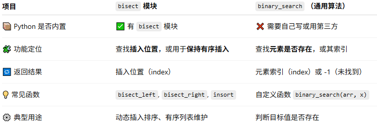
insort举例：
```python
import bisect

nums = [10, 20, 30, 40]
bisect.insort(nums, 25)
print(nums) # 输出 [10, 20, 25, 30, 40]
```
nums 原本是有序的。
我们插入 25，insort() 自动找到合适的位置（通过二分查找）。
插入后，列表依然有序。
整个过程不需要重新排序（比 list.sort() 更高效）。

小练习1：
Title:
Dynamic Leaderboard: Real-Time Insertion and Sorting

Description:
Accepts keyboard input of student name + score.
Dynamically inserts the new entry into a descending leaderboard.
Automatically maintains order without re-sorting the entire list.
Displays the updated leaderboard after each entry.
#### 练习 53.3: 面试扩展

**题目**:给定包含整数和浮点数的混合列表，先排序再查找目标值的索引。

```python
arr = [3, 1.2, 5.5, 2]
arr_sorted = sorted(arr)
print(binary_search(arr_sorted, 5.5))
```

---

### 🧩 Day 54: 常用数据结构

**目标**:掌握栈、队列、堆和链表的实战应用。

#### 练习 54.1: 栈（Stack）

**题目**:用 list 模拟栈操作，并处理空栈弹出异常。

```python
stack = []
stack.append('A')
stack.append('B')
try:
    print(stack.pop())
    print(stack.pop())
    print(stack.pop())  # 捕获 IndexError
except IndexError:
    print("栈为空")
```
栈是 后进先出（LIFO） 数据结构
栈顶元素总是 最后入栈的元素

#### 练习 54.2: 队列（Queue）

**题目**:用 deque 模拟队列操作，支持任意数据类型。

```python
from collections import deque
queue = deque([1, 'b', 3.5])
queue.append('end')
print(queue.popleft())  # 1
```
deque 是double-ended queue（双端队列） 的缩写，可以 高效实现队列（FIFO）或栈（LIFO）
可以 两端快速添加和删除元素，相比列表，deque 在 队首插入/删除 更高效（O(1) 时间复杂度）
队列特点：先进先出（FIFO），第一个进入的元素最先被移除。

#### 练习 54.3: 堆（Heap）

**题目**:使用 heapq 实现最小堆和最大堆，并取前 k 个元素。

```python
import heapq
nums = [9, 1.5, 5, 3]
heapq.heapify(nums)
print(heapq.nsmallest(2, nums))  # [1.5, 3]
print(heapq.nlargest(2, nums))   # [9, 5]
```

heapq（堆）在 Python 面试中是非常高频的考点之一！
尤其在算法、数据结构、数据分析类岗位（如后端开发、算法工程师、数据工程师）中。


#### 练习 54.4: 链表（Linked List）
链表和内存管理的关系”是 操作系统和底层计算机科学中的经典应用
**题目**:实现单向链表插入和遍历。

```python
class Node:
    def __init__(self, val):
        self.val = val
        self.next = None

class LinkedList:
    def __init__(self):
        self.head = None
    def append(self, val):
        node = Node(val)
        if not self.head:
            self.head = node
            return
        cur = self.head
        while cur.next:
            cur = cur.next
        cur.next = node
    def traverse(self):
        cur = self.head
        res = []
        while cur:
            res.append(cur.val)
            cur = cur.next
        return res

ll = LinkedList()
ll.append(1)
ll.append('b')
ll.append(3.5)
print(ll.traverse())
```
1️⃣ 内存分配与释放

计算机程序在运行时，需要动态申请和释放内存。例如：

C/C++ 中的 malloc() / free()

操作系统中的堆（heap）管理

问题：

内存是有限的，且可能被多次分配和释放。

分配过后形成碎片（free block 散落在不同地方）。

2️⃣ 链表在内存管理中的作用

链表提供了一种 动态、灵活记录内存块的方法：

示例：空闲内存块链表

每个节点表示一块空闲内存：

Node:
    start_address: 1000
    size: 1024
    next -> 下一块空闲内存


当程序申请内存时：

遍历链表找到合适的空闲块（first fit / best fit）

将该块分割或删除

当程序释放内存时：

把释放的块插回链表

可与相邻块合并

优点：

不需要连续的大块内存（数组就不行）

插入和删除空闲块操作快（O(1) 或 O(n)）

动态调整，适合碎片化情况

3️⃣ 操作系统中的真实应用

堆管理（Heap Management）：
内核用链表管理 free list（空闲内存链表）
内存池（Memory Pool）：
预分配固定大小节点，用链表快速分配和回收

分页/分段管理：
空闲页或段也可用链表记录

4️⃣ 小结

链表在内存管理中核心价值在于：

动态记录 内存块位置和大小
高效插入/删除 内存块
避免连续内存需求，降低碎片问题
数组或固定结构无法灵活处理动态分配和释放，但链表正好擅长这种“动态、非连续”的场景。
---

### 🧩 Day 55: 动态规划（DP）入门
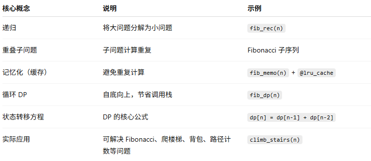

**目标**:掌握递归、记忆化、循环实现 DP，处理实际问题。

#### 练习 55.1: 递归 Fibonacci

**题目**:实现递归 Fibonacci，注意性能问题。

```python
def fib_rec(n):
    if n <= 2:
        return 1
    return fib_rec(n-1) + fib_rec(n-2)
print(fib_rec(10))
```

#### 练习 55.2: 记忆化 Fibonacci

**题目**:优化递归，使用缓存提高效率。

```python
from functools import lru_cache
@lru_cache(None)
def fib_memo(n):
    if n <= 2:
        return 1
    return fib_memo(n-1) + fib_memo(n-2)
print(fib_memo(35))
```
这里重点是导入python的内置装饰器@lru_cache，它的功能是缓存函数调用结果，当它写在函数前面时候
就形成了装饰函数，当同样的参数再次调用函数时，会直接返回缓存的结果，而不用再次计算。
#### 练习 55.3: 循环 Fibonacci（DP）

**题目**:用循环计算 Fibonacci，适合大 n。

```python
def fib_dp(n):
    if n <= 2:
        return 1
    a, b = 1, 1
    for _ in range(3, n+1): # 注意这里的n+1，是函数的边界问题！函数本身的“左闭右开”特性：
        a, b = b, a+b # 这里a变成了b，b成了a+b
    return b
print(fib_dp(50))
```
关键点：
_ 只是一个占位符，不代表任何实际值
Python range(start, stop) 左闭右开
包含 start
不包含 stop
所以 range(3, n) 会循环到 n-1，不会包含 n
边界问题与 Fibonacci 序列下标无关

在 Fibonacci 中，我们是从第 3 个数开始循环计算（因为前两个数已经初始化）
为了计算到第 n 个数，循环终止值必须设置为 n+1，这样最后一次循环 i=n 时也会执行
#### 练习 55.4: 爬楼梯问题

**题目**:每次可以爬 1 或 2 阶，求 n 阶楼梯的爬法总数。

```python
def climb_stairs(n):
    if n <= 2:
        return n
    a, b = 1, 2
    for _ in range(3, n+1):
        a, b = b, a+b
    return b
print(climb_stairs(10))
```

---

### 🧩 Day 56: 项目实战与综合应用
#### 练习 56.1: 数据预处理和清洗的核心技能
**目标**:数据清洗练习。

🧩 10 Real-World Data Cleaning Practice Problems (with Python Solutions)

🎯 Goal: Master core data cleaning techniques such as deduplication, filtering, exception handling, normalization, and statistical analysis through 10 realistic exercises inspired by actual data preprocessing tasks.

🧹 1️⃣ Remove Duplicates and Sort a Mixed List

📘 Background
A website exported a raw user data list that contains mixed information:

User IDs (numbers)
Usernames (strings)
Invalid data (e.g., None, empty strings, duplicates, or wrong types)

As a data engineer, your job is to:
1️⃣ Clean the data
2️⃣ Classify and count valid entries
3️⃣ Generate a reporting dictionary

Data Example:
data = [102, 'Alice', 101, None, 'Bob', '', 'alice', 102, 'Bob', False, 0.5]

Code:
```python
def clean_mixed_list(data):
    unique = list(set(data)) # set(data) 会把列表 data 转换成 集合，保证无重复元素，list(set(...)) 再把集合变回列表，得到一个 顺序可能不同 的列表，比如 [3, 5, 'a', 'b'] 或 [5, 'b', 3, 'a']，集合本身是无序的。
    nums = sorted([x for x in unique if isinstance(x, (int, float)) and not isinstance(x,bool)]) # 列表推导式（List Comprehension）
    strs = sorted([x for x in unique if isinstance(x, str) and x.strip() !=""]) # 列表推导式（List Comprehension）
    return nums + strs

print(clean_mixed_list(data))  # [0.5, 101, 102, 'Alice', 'Bob', 'alice']
```
重点：列表推导式的写法：[表达式 for 变量 in 可迭代对象 if 条件] -> expression for variable in iterable if condition

📊 2️⃣ Count Valid Log Entries

Scenario:
Your log file contains invalid entries (e.g., None, numbers).
Task:
Count only valid string entries.

Data Example:

logs = ["login", None, "logout", 123, "login"]


Code:
```python
def count_valid_logs(logs):
    counter = {}
    for item in logs:
        if isinstance(item, str):
            counter[item] = counter.get(item, 0) + 1
    return counter

print(count_valid_logs(logs))  # {'login': 2, 'logout': 1}
```
📈 3️⃣ Filter Invalid Values and Compute Average

Scenario:
Sensor readings include invalid or negative values.
Task:
Keep only positive numeric values and compute their average.

Data Example:

data = [10, -5, 'a', 20, 30]


Code:
```python
def clean_and_average(data):
    clean = []
    for x in data:
        try:
            val = float(x)
            if val > 0:
                clean.append(val)
        except (TypeError, ValueError):
            continue
    return sum(clean) / len(clean) if clean else 0

print(clean_and_average(data))  # 20.0
```
📄 4️⃣ Remove Records with Missing Fields
🧩 Advanced Scenario: User Data Cleaning, Reporting & Analytics (CSV + Dates + Multi-Column)
📘 Background

You have a raw CSV file exported from a website containing user activity data, possibly with:

Date (date of record)

UserID (numeric)

Username (string)

Email (string)

Score (numeric, optional)

Some invalid entries (None, empty strings, errors)

Goals:
1️⃣ Clean multiple columns while preserving duplicates and chronological order
2️⃣ Generate counts of valid entries, duplicates, and unique values
3️⃣ Group by date for daily statistics
4️⃣ Output JSON report

```python
import pandas as pd
import json

# Step 0: Data
data = [
    {"Date": "2025-10-20", "UserID": 102, "Username": "Alice", "Email": "alice@mail.com", "Score": 88},
    {"Date": "2025-10-21", "UserID": 101, "Username": "Bob", "Email": "", "Score": 92},
    {"Date": "2025-10-22", "UserID": None, "Username": "alice", "Email": "alice@mail.com", "Score": "error"},
    {"Date": "2025-10-23", "UserID": 102, "Username": "Bob", "Email": "bob@mail.com", "Score": 85},
    {"Date": "2025-10-24", "UserID": 0.5, "Username": "", "Email": None, "Score": 90},
    {"Date": "2025-10-24", "UserID": 102, "Username": "Alice", "Email": "alice@mail.com", "Score": 88}
]

# Step 1: Create DataFrame
df = pd.DataFrame(data)

# Step 2: Clean numeric columns
for col in ['UserID', 'Score']:
    df[col] = pd.to_numeric(df[col], errors='coerce')
# 数字列用 Pandas 的 to_numeric 方法转换，非数字值会变为 NaN

# Step 3: Clean string columns
for col in ['Username', 'Email']:
    df[col] = df[col].replace('', pd.NA)
# 字符串列用 DataFrame/Series 自身方法替换空字符串为缺失值

# Step 4: Date column to datetime
df['Date'] = pd.to_datetime(df['Date'], errors='coerce')
df = df.sort_values('Date')
# Date 列用 Pandas 的 to_datetime 方法转换为 datetime 类型，然后按日期排序
print("=== Cleaned DataFrame ===")
print(df)

# Step 5: Overall statistics
report = {}
for col in ['UserID', 'Username', 'Email', 'Score']:
    series = df[col].dropna()
    report[col] = {
        'valid_count': int(series.count()),
        'unique_count': int(series.nunique()),
        'duplicates_count': int(series.count() - series.nunique()),
        'values': [v.item() if hasattr(v, 'item') else v for v in series.tolist()]
    }

# Step 6: Daily stats
daily_stats = df.groupby('Date').agg({
    'UserID': 'count',
    'Username': 'count',
    'Email': 'count',
    'Score': 'count'
}).rename(columns=lambda x: f'{x}_valid_count').reset_index()

# Convert Timestamp and numpy to native Python types
daily_records = []
for _, row in daily_stats.iterrows():
    daily_records.append({k: (v.item() if hasattr(v, 'item') else str(v) if isinstance(v, pd.Timestamp) else v)
                          for k, v in row.items()})

# Step 7: Combine
final_report = {
    'overall': report,
    'daily': daily_records
}

# Step 8: Write JSON safely
with open('user_data_report.json', 'w') as f:
    json.dump(final_report, f, indent=4)

# Print
print(json.dumps(final_report, indent=4))

```
```
Sample Output (JSON)
{
    "overall": {
        "UserID": {
            "valid_count": 5,
            "unique_count": 3,
            "duplicates_count": 2,
            "values": [102.0, 101.0, 102.0, 0.5, 102.0]
        },
        "Username": {
            "valid_count": 5,
            "unique_count": 3,
            "duplicates_count": 2,
            "values": ["Alice", "Bob", "alice", "Bob", "Alice"]
        },
        "Email": {
            "valid_count": 4,
            "unique_count": 3,
            "duplicates_count": 1,
            "values": ["alice@mail.com", "alice@mail.com", "bob@mail.com", "alice@mail.com"]
        },
        "Score": {
            "valid_count": 5,
            "unique_count": 4,
            "duplicates_count": 1,
            "values": [88.0, 92.0, 85.0, 90.0, 88.0]
        }
    },
    "daily": [
        {
            "Date": "2025-10-20",
            "UserID_valid_count": 1,
            "Username_valid_count": 1,
            "Email_valid_count": 1,
            "Score_valid_count": 1
        },
        {
            "Date": "2025-10-21",
            "UserID_valid_count": 1,
            "Username_valid_count": 1,
            "Email_valid_count": 0,
            "Score_valid_count": 1
        },
        {
            "Date": "2025-10-22",
            "UserID_valid_count": 0,
            "Username_valid_count": 1,
            "Email_valid_count": 1,
            "Score_valid_count": 0
        },
        {
            "Date": "2025-10-23",
            "UserID_valid_count": 1,
            "Username_valid_count": 1,
            "Email_valid_count": 1,
            "Score_valid_count": 1
        },
        {
            "Date": "2025-10-24",
            "UserID_valid_count": 2,
            "Username_valid_count": 1,
            "Email_valid_count": 1,
            "Score_valid_count": 2
        }
    ]
}
🔹 Key Features

Preserve duplicates & chronological order

Important for time series or repeated user actions.

Handle multiple invalid types

Non-numeric → NaN

Empty strings → pd.NA

Generate overall statistics

Valid entries, unique entries, duplicates, and full value lists

Daily statistics by Date

Count valid entries per column per day

Export JSON report

Easy to use in dashboards, further analytics, or downstream systems

👥 5️⃣ Deduplicate by Multiple Fields

Scenario:
When merging multiple user datasets, some records are duplicates based on multiple columns.
Task:
Remove duplicates using both name and email as a composite key.

Data Example:

users = [
    {'name': 'Alice', 'email': 'a@x.com'},
    {'name': 'Bob', 'email': 'b@x.com'},
    {'name': 'Alice', 'email': 'a@x.com'}
]


Code:
```python
def deduplicate_users(users):
    seen = set()
    result = []
    for u in users:
        key = (u['name'], u['email'])
        if key not in seen:
            seen.add(key)
            result.append(u)
    return result

print(deduplicate_users(users))
```
🚶‍♂️ 6️⃣ Unique Users per Sliding Window

Scenario:
You want to analyze website traffic to find the number of unique users in every window of size k.
Task:
Compute the number of distinct users in each sliding window.

Data Example:

users = ['A', 'B', 'A', 'C', 'B', 'D']
k = 3


Code:
```python
def unique_users_in_window(users, k):
    result = []
    for i in range(len(users) - k + 1):
        window = set(users[i:i+k])
        result.append(len(window))
    return result

print(unique_users_in_window(users, k))  # [2, 3, 3, 3]
```
🧾 7️⃣ Filter Alphabetic Strings and Sort by Length

Scenario:
Your log contains mixed words and symbols.
Task:
Keep only words that contain letters only, and sort them by length.

Data Example:

words = ['hi', '123', 'test!', 'ok', 'Python']


Code:
```python
def filter_and_sort_words(words):
    valid = [w for w in words if w.isalpha()]
    return sorted(valid, key=len)

print(filter_and_sort_words(words))  # ['hi', 'ok', 'Python']
```
⚙️ 8️⃣ Normalize Numeric Data

Scenario:
You need to normalize numeric sensor values to a 0–1 range.
Task:
Ignore invalid entries, then apply normalization formula (x - min) / (max - min).

Data Example:

data = [10, 20, 30, None, 'x']


Code:
```python
def normalize_data(data):
    clean = [x for x in data if isinstance(x, (int, float))]
    if not clean:
        return []
    mn, mx = min(clean), max(clean)
    return [(x - mn) / (mx - mn) for x in clean]

print(normalize_data(data))  # [0.0, 0.5, 1.0]
```
📉 9️⃣ Calculate Missing Field Rates

Scenario:
You need to audit database field completeness.
Task:
Calculate the missing rate for each field in a list of dictionaries.

Data Example:

records = [
    {'name': 'Alice', 'email': 'a@x.com'},
    {'name': 'Bob'},
    {'email': 'b@x.com'}
]


Code:
```python
def missing_rate(records):
    total = len(records)
    keys = set(k for r in records for k in r.keys())
    stats = {k: 0 for k in keys}
    for r in records:
        for k in keys:
            if k not in r or not r[k]:
                stats[k] += 1
    return {k: stats[k] / total for k in stats}

print(missing_rate(records))
```
⚠️ 🔟 Log Classification by Severity

Scenario:
You’re analyzing system logs and want to count the number of log messages by level.
Task:
Count occurrences of ERROR, WARN, and INFO messages.

Data Example:

logs = [
    "[ERROR] Disk full",
    "[WARN] Low memory",
    "[INFO] Service started",
    "[ERROR] Timeout"
]


Code:
```python
def classify_logs(logs):
    levels = {'ERROR': 0, 'WARN': 0, 'INFO': 0}
    for log in logs:
        for key in levels.keys():
            if isinstance(log, str) and key in log:
                levels[key] += 1
    return levels

print(classify_logs(logs))  # {'ERROR': 2, 'WARN': 1, 'INFO': 1}
```
✅ Skill Map
Skill Type	                Problems	            Techniques Covered
Iteration & Filtering	    1, 2, 4	                Basic data cleanup
Hash Map Counting	        2, 5, 10	            Frequency, duplication
Exception Handling	        3, 8	                Error-tolerant data
Sliding Window	            6	                    Time-series analysis
Sorting & Normalization	    1, 7, 8	                Standardization
Dict & Set Operations	    4, 5, 9	                Multi-field analysis

#### 练习 56.2: 链表实战题集

**题目**:如何用链表高效表示动态数据结构。

1️⃣ Reverse a Linked List

Goal: Reverse the nodes of a linked list.
Scenario: Reversing process logs or undoing user actions.
```python
class Node:
    def __init__(self, val):
        self.val = val
        self.next = None

def reverse_list(head):
    prev = None
    curr = head
    while curr:
        nxt = curr.next
        curr.next = prev
        prev = curr
        curr = nxt
    return prev

def print_list(head):
    curr = head
    while curr:
        print(curr.val, end=" -> ")
        curr = curr.next
    print("None")

# Example
data = [1, 2, 3, 4, 5]
head = Node(data[0])
curr = head
for val in data[1:]:
    curr.next = Node(val)
    curr = curr.next

print("Original:")
print_list(head)
print("Reversed:")
print_list(reverse_list(head))
```
2️⃣ Detect a Cycle in Linked List

Goal: Determine if a linked list has a cycle.
Scenario: Detect infinite loops in task scheduling or data pipelines.
```python
def has_cycle(head):
    slow = fast = head
    while fast and fast.next:
        slow = slow.next
        fast = fast.next.next
        if slow == fast:
            return True
    return False

# Example
data = [3, 2, 0, -4]
nodes = [Node(x) for x in data]
for i in range(len(nodes)-1):
    nodes[i].next = nodes[i+1]
nodes[-1].next = nodes[1]  # Create cycle

print("Cycle exists:", has_cycle(nodes[0]))
```
3️⃣ Merge Two Sorted Linked Lists

Goal: Merge two sorted linked lists into a new sorted list.
Scenario: Merging customer lists or sorted transaction logs.
```python
def merge_sorted_lists(l1, l2):
    dummy = Node(0)
    tail = dummy
    while l1 and l2:
        if l1.val < l2.val:
            tail.next, l1 = l1, l1.next
        else:
            tail.next, l2 = l2, l2.next
        tail = tail.next
    tail.next = l1 or l2
    return dummy.next

# Example
a = Node(1); a.next = Node(3); a.next.next = Node(5)
b = Node(2); b.next = Node(4); b.next.next = Node(6)
merged = merge_sorted_lists(a, b)
print("Merged list:")
print_list(merged)
```
4️⃣ Remove Duplicates from Sorted List

Goal: Remove duplicate elements from a sorted linked list.
Scenario: Clean up user data or remove redundant entries.
```python
def remove_duplicates(head):
    curr = head
    while curr and curr.next:
        if curr.val == curr.next.val:
            curr.next = curr.next.next
        else:
            curr = curr.next
    return head

# Example
data = [1, 1, 2, 3, 3, 4]
head = Node(data[0])
curr = head
for val in data[1:]:
    curr.next = Node(val)
    curr = curr.next
print("After removing duplicates:")
print_list(remove_duplicates(head))
```
5️⃣ Find the Middle of Linked List

Goal: Find the middle node in a linked list.
Scenario: Useful for splitting data, load balancing, or partitioning tasks.
```python
def find_middle(head):
    slow = fast = head
    while fast and fast.next:
        slow = slow.next
        fast = fast.next.next
    return slow

# Example
data = [10, 20, 30, 40, 50, 60]
head = Node(data[0])
curr = head
for val in data[1:]:
    curr.next = Node(val)
    curr = curr.next
print("Middle node:", find_middle(head).val)
```
6️⃣ Delete a Node Without Head Reference

Goal: Delete a node when only that node is given (not the head).
Scenario: Used in memory cleanup when head pointer is lost.
```python
def delete_node(node):
    if node and node.next:
        node.val = node.next.val
        node.next = node.next.next

# Example
data = [4, 5, 1, 9]
head = Node(data[0])
curr = head
for val in data[1:]:
    curr.next = Node(val)
    curr = curr.next
print("Before delete:")
print_list(head)

delete_node(head.next)  # Delete node with value 5
print("After delete:")
print_list(head)
```
7️⃣ Add Two Numbers (as Linked Lists)

Goal: Add two numbers represented by linked lists (each node = one digit).
Scenario: Simulate big number addition for accounting or finance systems.
```python
def add_two_numbers(l1, l2):
    dummy = Node(0)
    curr = dummy
    carry = 0
    while l1 or l2 or carry:
        val = (l1.val if l1 else 0) + (l2.val if l2 else 0) + carry
        carry, digit = divmod(val, 10)
        curr.next = Node(digit)
        curr = curr.next
        l1 = l1.next if l1 else None
        l2 = l2.next if l2 else None
    return dummy.next

# Example
# 342 + 465 = 807
a = Node(2); a.next = Node(4); a.next.next = Node(3)
b = Node(5); b.next = Node(6); b.next.next = Node(4)
result = add_two_numbers(a, b)
print("Sum as list:")
print_list(result)
```
✅ Summary Table
#	Problem	                Real-world Scenario	        LeetCode Ref
1	Reverse Linked List	    Undo history	            #206
2	Detect Cycle	        Infinite loop detection	    #141
3	Merge Two Lists	        Sorted data merge	        #21
4	Remove Duplicates	    Clean data	                #83
5	Find Middle	            Data partition	            #876
6	Delete Node	            Memory cleanup	            #237
7	Add Two Numbers	        Large number addition	    #2

#### 练习 56.3: 综合项目

**题目**:Task Scheduling, Inventory Management & Path Planning

1️⃣ Task Scheduling – Minimum Time Between Tasks

Scenario:
CPU needs to schedule tasks with cooldown period n.
Task:
Given tasks represented by letters, return minimum intervals needed to finish all tasks.

Data Example:

tasks = ['A', 'A', 'A', 'B', 'B', 'C']
n = 2


Code:
```python
from collections import Counter
import heapq

def least_interval(tasks, n):
    count = Counter(tasks)
    max_heap = [-cnt for cnt in count.values()]
    heapq.heapify(max_heap)
    time = 0

    while max_heap:
        temp = []
        for _ in range(n+1):
            if max_heap:
                temp.append(heapq.heappop(max_heap))
        for cnt in temp:
            if cnt + 1 < 0:
                heapq.heappush(max_heap, cnt + 1)
        time += n + 1 if max_heap else len(temp)
    return time

print(least_interval(tasks, n))  # Output: 8
```

Skills: Greedy Algorithm, Priority Queue, Interval calculation

2️⃣ Task Scheduling – Minimum Number of Arrows to Burst Balloons

Scenario:
Find minimum resources (arrows) to complete overlapping tasks (balloons).
Task:
Each balloon is an interval; compute minimum arrows to cover all.

Data Example:

points = [[10,16],[2,8],[1,6],[7,12]]


Code:
```python
def find_min_arrows(points):
    if not points:
        return 0
    points.sort(key=lambda x: x[1])
    arrows = 1
    end = points[0][1]
    for start, finish in points[1:]:
        if start > end:
            arrows += 1
            end = finish
    return arrows

print(find_min_arrows(points))  # Output: 2
```

Skills: Greedy Algorithm, Sorting, Interval Management

3️⃣ Inventory Management – Top K Frequent Items

Scenario:
Track top-selling products.
Task:
Return the K most frequent items.

Data Example:

items = ['apple','banana','apple','orange','banana','apple']
k = 2


Code:
```python
from collections import Counter
import heapq

def top_k_frequent(items, k):
    count = Counter(items)
    return [item for item, freq in count.most_common(k)]

print(top_k_frequent(items, k))  # Output: ['apple','banana']
```

Skills: Hash Table, Sorting, Heap

4️⃣ Inventory Management – Insert Delete GetRandom Simulation

Scenario:
Simulate inventory operations supporting fast insertion, deletion, and random access.

Code:
```python
import random

class Inventory:
    def __init__(self):
        self.data = []
        self.pos = {}

    def insert(self, val):
        if val in self.pos:
            return False
        self.data.append(val)
        self.pos[val] = len(self.data) - 1
        return True

    def remove(self, val):
        if val not in self.pos:
            return False
        idx = self.pos[val]
        last = self.data[-1]
        self.data[idx] = last
        self.pos[last] = idx
        self.data.pop()
        del self.pos[val]
        return True

    def get_random(self):
        return random.choice(self.data)

# Example
inv = Inventory()
inv.insert('apple')
inv.insert('banana')
inv.insert('orange')
inv.remove('banana')
print(inv.get_random())  # Randomly 'apple' or 'orange'
```

Skills: Hash Map, Dynamic Updates, Random Access

5️⃣ Path Planning – Climbing Stairs

Scenario:
Number of ways to climb n stairs, taking 1 or 2 steps.

Data Example:
n = 5

Code:
```python
def climb_stairs(n):
    if n <= 2:
        return n
    a, b = 1, 2
    for _ in range(3, n+1):
        a, b = b, a+b
    return b

print(climb_stairs(n))  # Output: 8
```

Skills: Dynamic Programming, State Transition, Boundary Conditions

6️⃣ Path Planning – Unique Paths in Grid

Scenario:
Robot moves from top-left to bottom-right in a grid (m x n), can only move right or down.
Data Example:

m, n = 3, 3


Code:

def unique_paths(m, n):
    dp = [1]*n
    for _ in range(1, m):
        for j in range(1, n):
            dp[j] += dp[j-1]
    return dp[-1]

print(unique_paths(m, n))  # Output: 6


Skills: Dynamic Programming, Space Optimization, Grid Traversal

7️⃣ Path Planning – Minimum Path Sum

Scenario:
Find path with minimum sum from top-left to bottom-right of a grid.
Data Example:

grid = [
    [1,3,1],
    [1,5,1],
    [4,2,1]
]


Code:

def min_path_sum(grid):
    m, n = len(grid), len(grid[0])
    for i in range(1, n):
        grid[0][i] += grid[0][i-1]
    for i in range(1, m):
        grid[i][0] += grid[i-1][0]
    for i in range(1, m):
        for j in range(1, n):
            grid[i][j] += min(grid[i-1][j], grid[i][j-1])
    return grid[-1][-1]

print(min_path_sum(grid))  # Output: 7


Skills: Dynamic Programming, State Transition, Grid Traversal

✅ Skill Map Summary
Category	                        Problem	Skills                              Practiced
Task Scheduling	                    Least Interval / Min Arrows	                Greedy, Sorting, Heap, Interval Management
Inventory Management	            Top K Frequent / Insert Delete GetRandom	Hash Map, Heap, Random Access, Dynamic Updates
Path Planning	                    Climb Stairs / Unique Paths / Min Path Sum	Dynamic Programming, State Transition, Boundary Conditions
⸻

## Week 9: 模块化与性能优化
📘 学习内容:
```
	•	项目模块化
	•	单元测试（pytest/unittest）
	•	调试技巧（pdb, logging）
	•	性能优化，代码优化
	•	面试模拟
```
### 🗓️ Day 57: 项目模块化设计

**目标:** 理解模块化思想并设计项目结构。

**内容:**

* 模块化的优势:可维护、可测试、可复用。
* 设计目录结构和模块划分。
* Python 包与模块的概念（`__init__.py`、import 语法）。

#### 🔧练习57

* 创建示例项目目录结构:

  ```
  project/
  ├── src/
  │   ├── data_handler.py
  │   ├── analyzer.py
  │   └── visualizer.py
  ├── tests/
  ├── main.py
  └── requirements.txt
  ```
* 将不同功能拆分到独立模块。

---

### 🗓️ Day 58: 函数与类的模块化

**目标:** 将功能逻辑封装为函数和类。

**内容:**

* 函数与类的设计原则:单一职责、可复用。
* 输入输出规范与文档化。
* 模块间依赖管理。

#### 🔧练习58

* 将数据处理、分析、可视化功能封装到不同类或函数中。
* 编写 docstring 注释。

---

### 🗓️ Day 59: 单元测试基础

**目标:** 掌握 pytest / unittest 的使用。

**内容:**

* 测试的重要性。
* pytest 与 unittest 的基本用法。
* 断言方法:`assertEqual`, `assertTrue`, `assertRaises` 等。

#### 🔧练习59

* 为 `data_handler.py` 和 `analyzer.py` 编写单元测试。
* 运行测试并确保覆盖关键逻辑。

---

### 🗓️ Day 60: 调试技巧

**目标:** 掌握 pdb 和 logging 进行调试。

**内容:**

* 使用 `pdb.set_trace()` 设置断点，单步调试。
* logging 模块:日志级别、日志格式、输出到文件。
* 调试异常与追踪堆栈。

#### 🔧练习60

* 在 `analyzer.py` 中插入断点调试数据处理流程。
* 为项目添加日志记录模块，记录关键操作与异常。

---

### 🗓️ Day 61: 性能分析

**目标:** 找出性能瓶颈并分析代码。

**内容:**

* timeit:测试小函数执行时间。
* cProfile:分析整体程序性能。
* 识别循环、I/O、算法复杂度问题。

#### 🔧练习61

* 使用 timeit 测试数据处理函数耗时。
* 使用 cProfile 分析整个项目运行情况。
* 输出性能报告。

---

### 🗓️ Day 62: 代码优化技巧

**目标:** 提升代码可读性与性能。

**内容:**

* 避免重复计算、优化循环、使用列表推导式。
* 使用内置函数和标准库优化性能。
* 变量命名、函数拆分、注释规范。

#### 🔧练习62

* 重构 `analyzer.py` 中重复代码。
* 优化数据处理函数，减少内存占用。
* 提升函数执行效率。

---

### 🗓️ Day 63: 项目重构与总结

**目标:** 综合应用模块化、测试、调试与优化技能。

**内容:**

* 检查项目模块依赖与代码结构。
* 确保单元测试覆盖率高。
* 日志记录完善。
* 性能优化已完成。

#### 🔧练习63

* 完整运行项目，检查功能是否正确。
* 提交最终版本至 GitHub。
* 总结学习成果并记录优化前后的性能差异。

## Week 10: From Intermediate to Advanced Programming

📘 学习内容:

• Advanced Data Structures (Graphs, Trees)
• Advanced Dynamic Programming
• Greedy + Heap Applications
• Concurrency & Async Programming
• System Design Basics
• Performance Profiling & Optimization
• Integrated Mini Project

### 🗓️ Day 64: Advanced Data Structures – Graphs & Trees

目标: 掌握图与树的高级数据结构及应用。

内容:

图类型: 有向/无向、有权/无权

图表示: 邻接表、邻接矩阵

常用操作: BFS、DFS、拓扑排序

树遍历: 中序、前序、后序、层序

#### 🔧练习64
# BFS for graph
graph = {
    'A': ['B', 'C'],
    'B': ['D', 'E'],
    'C': ['F'],
    'D': [], 'E': [], 'F': []
}

def bfs(start):
    queue = [start]
    visited = set()
    while queue:
        node = queue.pop(0)
        if node not in visited:
            print(node)
            visited.add(node)
            queue.extend(graph[node])

bfs('A')  # Output: A B C D E F

### 🗓️ Day 65: Advanced Dynamic Programming

目标: 学习复杂动态规划模式。

内容:

序列 DP: 最长递增子序列 (LIS)

区间 DP: 矩阵链乘法

网格 DP: Minimum Path Sum, Unique Paths II

状态 DP: Bitmask DP, Subset DP

#### 🔧练习65
# Longest Increasing Subsequence
nums = [10,9,2,5,3,7,101,18]
dp = [1]*len(nums)
for i in range(len(nums)):
    for j in range(i):
        if nums[i] > nums[j]:
            dp[i] = max(dp[i], dp[j]+1)
print(max(dp))  # Output: 4

### 🗓️ Day 66: Greedy + Heap – Advanced Applications

目标: 使用堆解决间隔、优先级和资源分配问题。

内容:

使用堆实现任务优先队列

间隔调度与区间合并

Top-K 问题

#### 🔧练习66
import heapq

tasks = [(2, 5), (1, 3), (4, 7)]
tasks.sort(key=lambda x: x[0])
heap = []
for start, end in tasks:
    if heap and heap[0] <= start:
        heapq.heappop(heap)
    heapq.heappush(heap, end)
print(len(heap))  # Minimum resources needed

### 🗓️ Day 67: Concurrency & Async Programming

目标: 掌握多线程与异步编程。

内容:

线程、锁、队列

异步 I/O (asyncio)

线程安全与竞态条件

#### 🔧练习67
import asyncio

async def task(i):
    print(f'Start {i}')
    await asyncio.sleep(1)
    print(f'End {i}')

async def main():
    await asyncio.gather(task(1), task(2), task(3))

asyncio.run(main())

### 🗓️ Day 68: System Design Basics

目标: 理解可扩展系统架构设计。

内容:

微服务与 API

数据库分区、缓存策略 (Redis, LRU)

消息队列: Kafka, RabbitMQ

高并发处理

#### 🔧练习68

设计 URL Shortener 系统:

API: create, redirect

数据库: url_id, original_url

缓存热访问 URL

绘制系统架构图

### 🗓️ Day 69: Performance Profiling & Optimization

目标: 优化大规模应用性能。

内容:

算法优化: O(n²) → O(n log n)

内存分析: tracemalloc

并行处理: multiprocessing, concurrent.futures

缓存策略: memoization, LRU

#### 🔧练习69
from functools import lru_cache

@lru_cache(None)
def fib(n):
    if n < 2: return n
    return fib(n-1) + fib(n-2)

print(fib(100))  # Fast calculation using cache

### 🗓️ Day 70: Integrated Mini Project

目标: 综合应用高级数据结构、DP、堆、并发和性能优化。

项目示例: Task Scheduler with Priority + Concurrency + Reporting

输入: 任务列表（duration, priority, dependencies）

功能:

最小化总完成时间的任务调度 (greedy + heap)

支持并行执行 (async / threads)

输出性能报告 (time, memory)

#### 🔧练习70

使用图或优先队列建模任务

实现调度算法

使用异步或多线程执行

分析性能并优化

✅ Week 10 Outcome

掌握图、树及复杂动态规划

能解决高级贪心 + 堆问题

掌握并发和异步编程

理解基础系统设计概念

进行性能分析与优化

能独立完成综合小项目