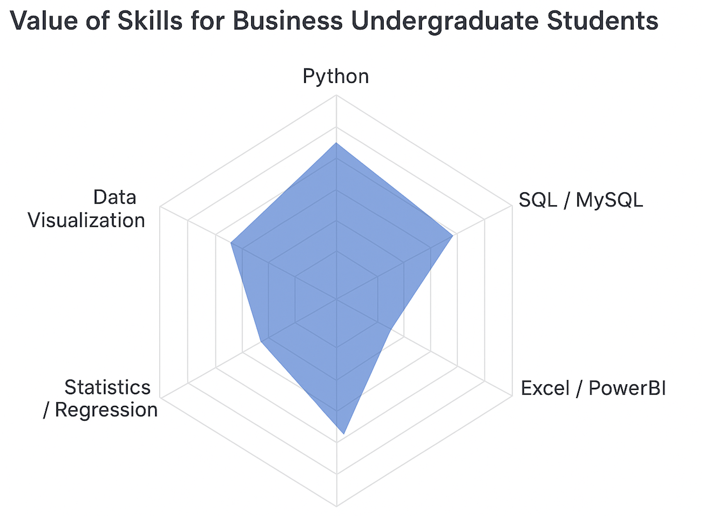
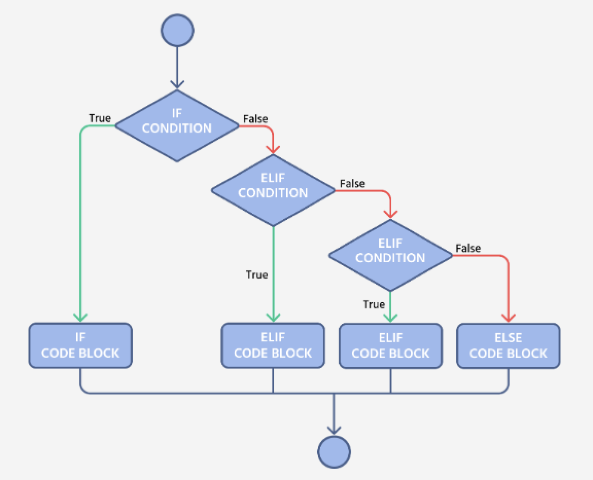
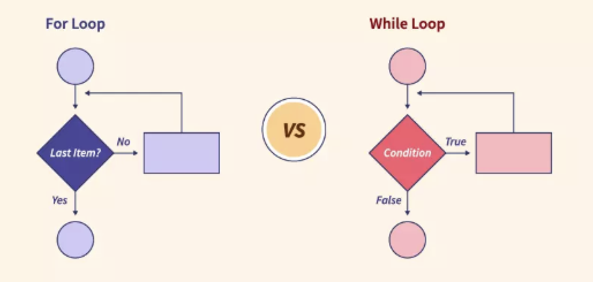
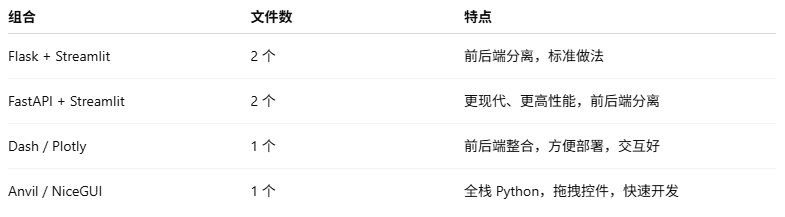
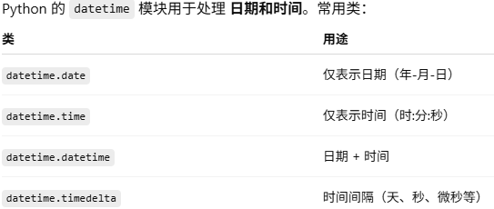
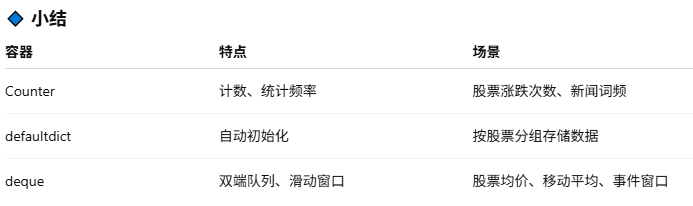
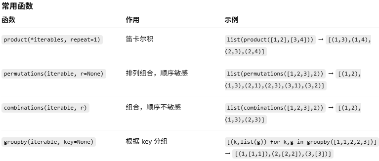
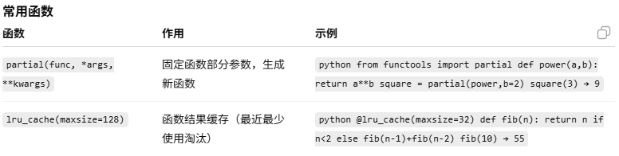

# 🐍 QiQi 和她爹的Python基地（丰富版）10周

- [🐍 QiQi 和她爹的Python基地（丰富版）10周](#-qiqi-和她爹的python基地丰富版10周)
	- [Week 1：Python 基础与环境](#week-1python-基础与环境)
		- [📑 Day 1：环境搭建 \& IDE](#-day-1-环境搭建--ide)
		- [📑 Day 2：变量与数据类型](#-day-2-变量与数据类型)
			- [🔧练习：](#练习)
		- [📑 Day 3：运算符](#-day-3运算符)
			- [🔧练习：](#练习-1)
		- [📑 Day 4：条件语句 if-else](#-day-4-条件语句-if-else)
			- [🔧练习：](#练习-2)
		- [📑 Day 5：循环 for \& while](#-day-5-循环-for--while)
			- [🔧练习:](#练习-3)
		- [📑 Day 6：综合练习 — 迷你计算器](#-day-6-综合练习--迷你计算器)
			- [🔧🔧综合练习1: Mini Calculator(具体请看Week1子目录下)](#综合练习1-mini-calculator具体请看week1子目录下的calcluaterreadme)
		- [📑 Day 7 ：面试模拟  小项目2— 股票最大收益：](#-day-7-面试模拟--小项目2-股票最大收益)
			- [🔧🔧综合练习2：最佳买卖股票,(具体请看Week1子目录下)](#综合练习2-best-time-to-buy-and-sell-stock具体请看week1子目录下的stock)
	- [Week 2：数据结构与文件操作](#week-2数据结构与文件操作)
		- [数据结构学习内容：](#数据结构学习内容)
		- [📑 Day 8：list（列表）基础](#-day-8-list列表基础)
			- [🔧练习：创建一个 list，增加、插入、删除元素，并排序输出。](#练习创建一个-list增加插入删除元素并排序输出)
		- [📑 Day 9：tuple（元组）基础](#-day-9-tuple元组基础)
			- [🔧练习：创建一个 tuple，统计元素出现次数，并查找索引。](#练习创建一个-tuple统计元素出现次数并查找索引)
		- [📑 Day 10：set（集合）基础](#-day-10-set集合基础)
			- [🔧练习：创建两个 set，并进行集合运算。](#练习创建两个-set并进行集合运算)
		- [📑 Day 11：dict（字典）基础](#-day-11-dict字典基础)
			- [🔧练习：创建一个字典，访问、更新和遍历元素。](#练习创建一个字典访问更新和遍历元素)
		- [📑 Day 12：切片与推导式](#-day-12-切片与推导式)
			- [🔧练习：使用切片和推导式创建新的 list。](#练习使用切片和推导式创建新的-list)
		- [📑 Day 13：深拷贝 vs 浅拷贝](#-day-13-深拷贝-vs-浅拷贝)
			- [🔧练习：演示浅拷贝和深拷贝的不同。](#练习演示浅拷贝和深拷贝的不同)
		- [📑 Day 14：文件操作与异常处理](#-day-14-文件操作与异常处理)
			- [🔧练习：读取 txt 文件并捕获异常。](#练习读取-txt-文件并捕获异常)
			- [🔧🔧综合练习3: 图书管理系统：](#综合练习3-library-management-system-with-json-persistence)
			- [🔧🔧综合练习4:（面试模拟）股票分析：](#综合练习4-面试模拟stock-data-analysiscsv-reader-with-statistics-and-volatility)
			- [🔧🔧综合练习5: 增强电影管理](#综合练习5-advanced-movie-collection-manager-with-json-persistence)
	- [Week 3：函数进阶与面向对象](#week-3函数进阶与面向对象)
    	- [📑 Day 15: 函数基础](#-day-15-函数基础)
        	- [🔧练习 定义函数](#练习1定义函数示例)
    	- [📑 Day 16: 函数进阶与作用域](#-day-16-函数进阶与作用域)
        	- [🔧练习 全局和局部变量](#练习局部变量全局变量示例)
    	- [📑 Day 17: 模块与包](#-day-17-模块与包)
        	- [🔧练习 模块导入](#练习模块导入与自定义模块示例)
    	- [📑 Day 18: 文件操作](#-day-18-文件操作)
        	- [🔧练习 文件读写](#练习文件读写示例)
    	- [📑 Day 19: 异常处理](#-day-19-异常处理)
        	- [🔧练习 tryexcept](#练习tryexcept示例)
    	- [📑 Day 20: OOP 基础](#-day-20-oop-基础)
        	- [🔧练习 OOP](#练习类和对象示例)
    	- [📑 Day 21: OOP 进阶](#-day-21-oop-进阶)
        	- [🔧练习 继承多态](#练习继承多态示例)
        	- [🔧🔧综合练习6： 银行账户管理](#综合练习6-银行账户管理)
        	- [🔧🔧综合练习7： 股票投资组合](#综合练习7-股票投资组合类面试模拟)
    - [week 4: 模块、库与工具](#week-4模块库与工具)
    	- [📑 Day 22: os-sys-pathlib](#-day-22-os-sys-pathlib)
        	- [🔧练习 sys](#练习-sys)
    	- [📑 Day 23: datetime](#-day-23-datetime--金融应用)
			- [🔧练习 date](#练习-date)
    	- [📑 Day 24: collections](#-day-24-collections)
        	- [🔧练习 Counter](#练习-counter)
    	- [📑 Day 25: itertools](#-day-25-itertools--functools)
        	- [🔧练习 itertools](#练习-itertools)
    	- [📑 Day 26: 迭代器与生成器](#-day-26-迭代器与生成器)
        	- [🔧练习 迭代器与生成器](#练习-迭代器与生成器)
    	- [📑 Day 27: 正则表达式](#-day-27-正则表达式-re)
        	- [🔧练习 正则表达式](#练习-正则表达式)
    	- [📑 Day 28: 虚拟环境与依赖管理](#-day-28-虚拟环境与依赖管理)
	- [week 5: 数学分析基础  ](#week-5pandas-数据分析基础)
	- [week 6: 数据可视化    ](#week-6数据可视化)
	- [week 7: 数据获取方法  ](#week-7爬虫与数据获取)
	- [week 8: 算法与数据结构](#week-8算法与数据结构应用)
	- [week 9: 机器学习基础  ](#week-9机器学习基础)
	- [week 10: 综合考察     ](#week-10综合项目--模拟面试)

## Week 1：Python 基础与环境

📘 学习内容：
	•	Python 环境与 IDE（Anaconda / venv / pyenv）
	•	基础语法：变量、数据类型（int, float, str, bool）
	•	运算符：算术、逻辑、比较
	•	控制语句：if-else，循环（for、while）
	•	输入输出：input()、print() 格式化输出
	•	注释、代码风格（PEP 8）

### 📑 Day 1：环境搭建 & IDE
	•	安装 Python（推荐 pyenv 或 Anaconda）。
	•	学会创建虚拟环境（venv / conda）。
	•	安装 IDE：Jupyter Notebook / VS Code。
	•	用 print("Hello, Python!") 输出第一行代码。
	•	在 VS Code + Jupyter 里跑通第一个 .py 文件和 .ipynb 文件。

### 📑 Day 2：变量与数据类型
	•	学习 Python 的四种基本类型：int, float, str, bool。
	•	学会使用 type() 查看类型，str() int() float() 做类型转换。
	•	了解 Python 的动态类型特性。
#### 🔧练习：
Write a small program that takes the user’s input for name and age, and prints a  sentence. Pay attention to converting to bool:
```python
# P2.1 Get user input
name = input("Enter your name: ")
age_input = input("Enter your age: ")
# Convert age to integer
age = int(age_input)
# Example of bool conversion: check if age is positive
is_age_valid = bool(age > 0)
# Print a sentence
print(f"Hello, {name}! You are {age} years old. Age valid? {is_age_valid}")
```
Convert age to integer
```python
age = int(age_input)
```
Example of bool conversion: check if age is positive
```python
is_age_valid = bool(age > 0)
```
bool() 的转换规则是这样的：
	1 数值：
	•	0 → False
	•	任何非零数（比如 -1, 3.14, 100）→ True
	2 字符串:
	•	空字符串 "" → False
	•	任何非空字符串（哪怕只是 " " 一个空格，或 "hello"）→ True
    总结一句话：Python 里只要字符串不是完全空的，就认为它是真 (True)

### 📑 Day 3：运算符
	•	学习算术运算符（+ - * / // % **）。
	•	学习比较运算符（== != > < >= <=）。
	•	学习逻辑运算符（and or not）。
	•	学习赋值运算符（+=, -=, *=, /=）。
#### 🔧练习：
Let the user enter a number, and output its square, whether it is greater than 10, and whether it is even.
```python
# P 3.1
a = int(input("Please input a number: "))
# 计算平方
square = a * a
# 判断是否大于 10
greater_than_10 = square > 10
# 判断是否偶数
is_even = square % 2 == 0
# 输出结果
print(f"The square of {a} is: {square}")
print(f"Is the square greater than 10? {greater_than_10}")
print(f"Is the square even? {is_even}")
```
### 📑 Day 4：条件语句 if-else
	•	if-else 语句语法。
	•	多分支：if-elif-else。
#### 🔧练习：
	•	输入一个分数，输出成绩等级：
	•	90+ 优秀
	•	70-89 良好
	•	60-69 及格
	•	<60 不及格
```python
# P 4.1
scope = int(input("please input scope:"))
if scope >= 90:
     grade = "Excellent"
elif scope > 70:
     grade = "Good"
elif scope > 60:
     grade = "Pass"
else:
     grade = "Fail"
print(f"your grade is: {grade}")
```

### 📑 Day 5：循环 for & while
	•	for i in range(n)。
	•	while 循环。
	•	break & continue。
#### 🔧练习:
1. 9x9 multiplication table,,,Write a program to print the multiplication table from 1×1 up to 9×9.
```python
# P 5.1
for i in range(1, 10): # rows 是外循环来控制
    for j in range(1, i+1): # clus 是内循环来控制
        print(f"{j}×{i}={i*j}", end="\t")
    print()  # New line after each row
```

2. Sum with while,,,Use a while loop to calculate the sum of numbers from 1 to 100.
```python
# P 5.2 Calculate sum from 1 to 100
total = 0
i = 1
while i <= 100:
    total += i
    i += 1

print(f"The sum of numbers from 1 to 100 is: {total}")
```

### 📑 Day 6：综合练习 — 迷你计算器
	•	结合 if-else、输入输出、函数。
	•	实现加、减、乘、除、开方、幂运算。
	•	进阶： 加入异常处理：不能除以 0。
#### 🔧🔧综合练习1: Mini Calculator(具体请看Week1子目录下的CalcluaterREADME)
迷你计算器：加减乘除、平方、开方、百分比。
Comprehensive Exercise — Mini Calculator
	•	Combine if-else, input/output, and functions(注意这里有函数的表述).
	•	Implement addition, subtraction, multiplication, division, square root, and exponentiation.
	•	Advanced: Add exception handling to prevent division by zero.
```python
import math

def calculator(a, b, op):
    if op == "+":
        return a + b
    elif op == "-":
        return a - b
    elif op == "*":
        return a * b
    elif op == "/":
        if b == 0:
            return "错误：不能除以 0！"
        return a / b
    elif op == "^":
        return a ** b
    elif op == "sqrt":
        if a < 0:
            return "错误：不能对负数开方！"
        return math.sqrt(a)
    else:
        return "错误：不支持的运算符！"

print("欢迎使用迷你计算器！")
print("支持运算: +, -, *, /, ^, sqrt")

while True:
    op = input("请输入运算符（输入 q 退出）： ")

    if op == "q":
        print("再见！")
        break

    try:
        if op == "sqrt":
            a = float(input("请输入一个数字: "))
            result = calculator(a, None, op)
        else:
            a = float(input("请输入第一个数字: "))
            b = float(input("请输入第二个数字: "))
            result = calculator(a, b, op)

        print(f"结果是: {result}")
    except ValueError:
        print("输入无效，请输入数字！")
```
注意: 这里有导入包:math,它是python自带库文件,可以实现已经封装好的计算逻辑(函数)
### 📑 Day 7 ：面试模拟  小项目2— 股票最大收益：
股票价格数组，求 最大收益区间（买入/卖出）。
	•	问题：给定一个股票价格数组，找到最大利润（一次买入卖出）。
	•	训练点：
	•	遍历数组。
	•	变量存储最小买入价、最大利润。
#### 🔧🔧综合练习2：Best Time to Buy and Sell Stock,(具体请看Week1子目录下的Stock)
	•	You are given a list of stock prices where prices[i] is the price of a given stock on day i...prices = [7,1,5,3,6,4]
	•	You want to maximize your profit by choosing one day to buy and one later day to sell.
	•	Write a function that returns the maximum profit you can achieve. If no profit is possible, return 0.
训练点
	1.	遍历数组
	•	从头到尾遍历价格数组，每天判断是否能更新最小买入价或最大利润。
	2.	变量存储
	•	min_price：记录到当前为止的最低价格（潜在买入价）。
	•	max_profit：记录到当前为止能得到的最大利润。
	3.	思路总结
	•	对每一天的价格：
	1.	更新最小买入价：min_price = min(min_price, price)
	2.	计算今天卖出的利润：profit = price - min_price
	3.	更新最大利润：max_profit = max(max_profit, profit)

```python
# P 7.1
def max_profit(prices):
    if not prices:
        return 0

    min_price = prices[0]  # 初始化最低买入价
    max_profit = 0         # 初始化最大利润

    for price in prices:
        # 更新最低买入价
        if price < min_price:
            min_price = price
        
        # 更新最大利润
        profit = price - min_price
        if profit > max_profit:
            max_profit = profit

    return max_profit

# 测试
prices = [7,1,5,3,6,4]
print(max_profit(prices))  # 输出 5

```
## Week 2：数据结构与文件操作
### 数据结构学习内容：
```
	•	数据结构：list、tuple、set、dict
	•	切片、推导式（list/dict comprehension）
	•	深拷贝 vs 浅拷贝
	•	文件操作：读写 txt、CSV、JSON
	•	异常处理：try-except-finally
```python
list（列表）
	•	有序、可变的元素集合
	•	元素可以重复
	•	通过索引 (index) 访问
list 常用方法：
	•	append(x) → 末尾追加
	•	insert(i, x) → 指定位置插入
	•	pop(i) → 删除并返回元素
	•	remove(x) → 删除第一个值为 x 的元素
	•	sort() → 排序
	•	reverse() → 反转
tuple（元组）
	•	有序、不可变的元素集合
	•	元素可以重复
	•	通过索引 (index) 访问
	•	常用于存储固定的数据，比如函数返回多个值
tuple 常用操作/方法：
	•	count(x) → 统计元素 x 出现次数
	•	index(x) → 返回元素 x 第一次出现的位置
注意：元组不可变，不能使用 append(), remove() 等修改方法
set（集合）
	•	无序、可变的元素集合
	•	元素唯一，重复元素会自动去重
	•	支持集合运算：交集、并集、差集、对称差集
set 常用方法：
	•	add(x) → 添加元素 x
	•	remove(x) → 删除元素 x（不存在会报错）
	•	discard(x) → 删除元素 x（不存在不会报错）
	•	pop() → 随机删除并返回一个元素
	•	union(other_set) → 并集
	•	intersection(other_set) → 交集
	•	difference(other_set) → 差集
	•	symmetric_difference(other_set) → 对称差集
dict（字典）
	•	无序（Python 3.7+ 实际保持插入顺序）、可变的键值对集合
	•	键 (key) 唯一，值 (value) 可重复
	•	通过键 (key) 访问
dict 常用方法：
	•	keys() → 所有键
	•	values() → 所有值
	•	items() → 键值对 (tuple)
	•	get(key, default) → 获取值，找不到返回默认值
	•	update({...}) → 批量更新
类型对比表
类型	有序	可变	元素唯一	索引访问	 常用场景
list	✅		✅		❌		✅		 可变列表、栈/队列
tuple	✅		❌		❌		✅		 固定数据、函数返回值
set		❌		✅		✅		❌		 去重、集合运算
dict	❌		✅		键唯一	通过 key	键值映射
```
### 📑 Day 8：list（列表）基础
	•	学习 list 的有序性、可变性和重复元素特性。
	•	学会通过索引访问元素。
	•	掌握 append(), insert(), pop(), remove(), sort(), reverse() 方法。

#### 🔧练习：创建一个 list，增加、插入、删除元素，并排序输出。
```python
# P8.1 List操作练习
fruits = ["apple", "banana", "cherry"]
# 追加
fruits.append("orange")
# 插入
fruits.insert(1, "grape")
# 删除
fruits.remove("banana")
# 弹出,注意这里是定义了popped,因此可以打印,但如果不定义的话可以直接用fruis.pop()
popped = fruits.pop(2)
# 排序
fruits.sort()
# 输出结果
print("Fruits:", fruits)
print("Popped element:", popped)
```
### 📑 Day 9：tuple（元组）基础
	•	学习 tuple 的有序性、不可变性和重复元素特性。
	•	通过索引访问元素。
	•	掌握 count(), index() 方法。
	•	了解 tuple 常用于固定数据或函数返回多个值。
#### 🔧练习：创建一个 tuple，统计元素出现次数，并查找索引。
```python
# P9.1 Tuple练习
numbers = (1, 2, 3, 2, 4, 2) # 注意tuple用(),而list用[],而且count() 和 index() 都可以用在 有序序列（list 或 tuple）上,他们是这两种序列的方法。count是计数,计算它出现的次数,而index是它索引的位置.
# tuple 之所以经常提到这些方法，是因为它 不可变，你无法用 append/remove 之类修改它，所以这些只读方法就显得尤为重要。
count_2 = numbers.count(2)
index_3 = numbers.index(3)
print("Tuple:", numbers)
print("Count of 2:", count_2)
print("Index of 3:", index_3)
```
### 📑 Day 10：set（集合）基础
	•	学习 set 的无序性、可变性和唯一性。
	•	掌握集合运算：交集、并集、差集、对称差集。
	•	学会使用 add(), remove(), discard(), pop() 方法。

#### 🔧练习：创建两个 set，并进行集合运算。
```python
# P10.1 Set操作练习,非空集合可以用 {},空集合必须用 set(),可以用 set() 将 list、tuple、字符串等可迭代对象转换为集合.
a = {1, 2, 3, 4}
b = {3, 4, 5, 6}
# 添加元素
a.add(5)
# 删除元素
a.remove(2)
# 并集
union_set = a.union(b)
# 交集
intersection_set = a.intersection(b)
# 差集
diff_set = a.difference(b)
print("Set a:", a)
print("Set b:", b)
print("Union:", union_set)
print("Intersection:", intersection_set)
print("Difference:", diff_set)
```
### 📑 Day 11：dict（字典）基础
	•	学习 dict 的键唯一、值可重复、可变特性。
	•	通过 key 访问元素。
	•	掌握 keys(), values(), items(), get(), update() 方法。

#### 🔧练习：创建一个字典，访问、更新和遍历元素。
```python
# P11.1 Dict操作练习
student = {"name": "Alice", "age": 20, "major": "CS"}
# 获取值
age = student.get("age")
# 更新
student.update({"age": 21, "grade": "A"})
# 遍历
for key, value in student.items(): # 注意这里定义的两个循环变量:key和value,这种写法就可以自动拆包,如果是for key in student呢?就是只用一个变量呢?结果会是什么样子?
    print(key, ":", value)
```
### 📑 Day 12：切片与推导式
	•	学习 list、tuple 的切片方法。
	•	学习 list/dict comprehension。
	•	了解推导式在创建新集合中的优势。

#### 🔧练习：使用切片和推导式创建新的 list。
```python
# P12.1 切片与推导式
numbers = [0, 1, 2, 3, 4, 5, 6]
# 切片
slice_numbers = numbers[2:6]
# list comprehension
squares = [x*x for x in numbers if x%2==0]
print("Slice:", slice_numbers)
print("Squares of even numbers:", squares)
```
### 📑 Day 13：深拷贝 vs 浅拷贝
	•	理解浅拷贝 (shallow copy) 与深拷贝 (deep copy) 的区别。
	•	学会使用 copy() 和 deepcopy()。
	•	了解嵌套列表复制的注意点。

#### 🔧练习：演示浅拷贝和深拷贝的不同。
```python
# P13.1
import copy

original = [[1, 2], [3, 4]]
shallow = copy.copy(original)
deep = copy.deepcopy(original)

original[0][0] = 99
print("Original:", original)
print("Shallow copy:", shallow) # 浅copy = 外层分家,内层同居,一旦改变b的内层将会影响a的内层
print("Deep copy:", deep)  # 深copy = 外层分家,内层也分家,一旦改变b的内层不会影响a的内层
# P13.2
import copy
a = [1,2 [3, 4]]
b = copy.copy(a) # shallow copy

print(a) #[1, 2, [3, 4]]
print(b) #[1, 2, [3, 4]]

b[0] = 99
print(a) #[1, 2, [3, 4]]
print(b) #[99, 2, [3, 4]] 外层数据分开了

b[2][0] = 77 # b的第二个元素(0,1,2)的第零个元素被新赋值为77
print(a) = #[1, 2, [77, 4]] 它的内层被修改了
print(b) = #99, 2, [77, 4]]

# P13.3
a = [1,2 [3, 4]]
c = copy.deepcopy(a) # deep copy

c[0] = 99
c[2][0] = 77

print(a) # [1, 2, [3, 4]] 外层完全不受影响
print(c) # [99,2, [77, 4]]
```
### 📑 Day 14：文件操作与异常处理
	•	学习文件读写 txt、CSV、JSON。
	•	掌握异常处理 try-except-finally。
	•	了解文件操作中的常见错误及处理方法。

#### 🔧练习：读取 txt 文件并捕获异常。
```python
# P14.1 文件操作练习
try: # try表示“尝试执行下面的执行块, 如果出错,会转到except
    with open("example.txt", "r") as f: # 表示以只读模式(r) 打开example.txt, Ms.ariana 请注意:
		# 每个文件都分为很多种模式,对于系统文件,大部分都为只读文件,对于公开文件,都为可修改模式. r = read only
		# with...as f是上下文管理器:保证文件用完后自动关闭,即使中途出错也会执行f.close().
        content = f.read() # 读取整个文件内容,返回字符串,并保存到content变量里,
        print("File content:", content)
except FileNotFoundError: # 如果这个文件不存在,就会捕获这个错误并执行里面的代码,这样做的好处(此处的逻辑)是避免程序直接崩溃
    print("File not found!")
finally: # 无论是否出错,finally里的代码都会执行
    print("Execution finished.")
```

#### 🔧🔧综合练习3:  Library Management System with JSON Persistence：
建立一个图书管理系统：能添加/删除/查询，并保存到 JSON 文件。
功能点：
	1.	添加书籍（书名、作者、年份）。
	2.	删除书籍（通过书名或索引）。
	3.	查询书籍（查看全部或按书名搜索）。
	4.	数据保存到 JSON 文件，下次打开仍能读取。
	
```python
import json
import os

FILE_NAME = "books.json"

# 初始化书籍列表
if os.path.exists(FILE_NAME):
    with open(FILE_NAME, "r") as f:
        books = json.load(f) # 把json文件的内容读出来,并转换成python对象(list或dict),放在内存里,下面定义的几个函数add,query和delete都是在内存里操作,只有调用save函数的时候,才会把内存里的列表写回文件.
		# 同时注意这个books是一个全局变量,定义在所有函数的外卖,所有函数都可以访问它(只要不在函数里用books=...重新赋值它)

else:
    books = [] # 空列表; 或空字典: books = {}; 或空集合: books = set(),这里先定义它为列表,它只是个容器,里面的元素可能是字典

def save_books():
    with open(FILE_NAME, "w") as f: # 这段代码中用“w”打开,会清除文件里的内容
        json.dump(books, f, indent=4) # 这段用dump,会把保存在内存里的内容都重新保存在文件里

def add_book():
    title = input("请输入书名: ") # 这个新增变量是局部变量,只在此函数内部有效,当此函数执行完毕,这个变量就不存在了(被销毁)
    author = input("请输入作者: ") # 同上
    year = input("请输入年份: ") # 同上
    books.append({"title": title, "author": author, "year": year}) # 用花括号{}代表写代码是考虑到用字典类型, 这样键值配对,可用键直接访问对象,直观和方便, 也就是说把字典放在列表里注意这段代码只是用append把它加入到字典里,这时候输入的内容都保存在内存里
    save_books()
    print("添加成功!")

def delete_book():
    title = input("请输入要删除的书名: ")
    for book in books: # 这时的book是新定义的局部变量,叫循环变量,用来表示列表books当前便利到的元素,这个元素只在循环体内有效,循环结束后它就不再被使用了
        if book["title"] == title: # 如果这个变量被找到,即和输入的书名一致的话,而且这里面的key,即title是字符串类型,因此需要加“”包起来,第二个title 本身是变量,它本身就是字符串,因此不用“”.
            books.remove(book) #调用列表的删除方法
            save_books()
            print("删除成功!")
            return # 注意这个return,它是立即结束此函数的意思,最有一句未找到该书就不会被打印(整个也可以换成if... break... else语句)
			#注意这个return的位置,当它在if缩进里的时候,条件成立会自动删除和保存文件;但当它不缩进在if(即和for并列时候)时相当于无条件退出函数了.
    print("未找到该书!") # 这个意思是if里面遍历完没找到,就会打印此句

def query_books():
    if not books: # 这里是没有书籍,即书籍列表为空的情况下
        print("没有书籍信息")
        return  
    print("当前书籍列表:")
    for i, book in enumerate(books, start=1): # enumerate为python的内置函数,它会把列表books 遍历,同时生成索引i, 并从1开始,这是典型的for后面跟多个变量,它遍历的每个元素是序列,自动拆包,这是python中常用的元组/列表解包技巧.
        print(f"{i}. {book['title']} - {book['author']} ({book['year']})")

# 主循环
while True:
    print("\n1-添加书籍  2-删除书籍  3-查看书籍  4-退出")
    choice = input("请选择操作: ")
    if choice == "1":
        add_book()
    elif choice == "2":
        delete_book()
    elif choice == "3":
        query_books()
    elif choice == "4":
        break
    else:
        print("无效输入")
```
注意: 运行此程序的时候,会提示你添加docstring,要分清注释(#)和文档字符串(docstring)之间的区别:
docstring是同时给人和机器看的,可通过help()或.__doc__获取;# 只是给人看的.

#### 🔧🔧综合练习4:（面试模拟）Stock Data Analysis:CSV Reader with Statistics and Volatility：
build a small program that reads historical stock data from a CSV file and computer basic statistics
读取股票历史数据 CSV，输出：
	•	最高/最低价
	•	平均收盘价
	•	波动率
功能点：
	1.	读取 CSV（包含 Date、Open、High、Low、Close）。
	2.	输出最高价、最低价、平均收盘价。
	3.	计算波动率（通常用收盘价的标准差 / 平均值）。

示例代码：
```python
import pandas as pd

# 读取 CSV 文件
file_name = "stock_data.csv"  # CSV 文件应包含 Date, Open, High, Low, Close
df = pd.read_csv(file_name)

# 输出最高价和最低价
highest = df['High'].max()
lowest = df['Low'].min()
print(f"最高价: {highest}, 最低价: {lowest}")

# 平均收盘价
avg_close = df['Close'].mean()
print(f"平均收盘价: {avg_close:.2f}")

# 波动率: 收盘价标准差 / 平均值
volatility = df['Close'].std() / avg_close
print(f"波动率: {volatility:.2%}")
```
⸻
#### 🔧🔧综合练习5: Advanced Movie Collection Manager with JSON Persistence
Objective:
Build a movie collection management system that allows users to add, delete, view, and search movies, with data stored persistently in a JSON file. The system should include input validation and prevent duplicate entries.
Functional Requirements:
Add a movie
Fields: Title, Director, Release Year, Genre
Validation:
##### Title and Director cannot be empty
##### Release Year must be a number between 1888 and the current year
##### Prevent duplicate titles (case-insensitive)
##### Genre is optional; default to "Unknown" if left blank
Delete a movie
##### Users can delete by title (case-insensitive) or index number in the list
Print a message if the movie is not found
View movies
Display all movies in a readable JSON-like format
##### Sort movies by Release Year
Search movies (optional challenge)
Allow filtering by title, director, or year
Data persistence
All movie data must be saved in a JSON file
On program start, load existing data so the collection persists between sessions
##### Extra Challenge (Optional)
Improve user experience with pretty-printing
Allow partial search (e.g., searching for "Star" finds "Star Wars")
Prevent invalid input for all fields
##### Starter Hints
Use the json module to read/write JSON files
Use os.path.exists() to check if the JSON file exists
Validate user input before saving
Use json.dumps(..., indent=4) to display movies neatly
```python
import json
import os
from datetime import datetime

FILE_NAME = "movies.json"

# Load existing movie data or create empty list
if os.path.exists(FILE_NAME):
	with open(FILE_NAME, "r") as f: # 以只读模式打开指定文件，并把文件对象命名为 f，在代码块结束时会自动关闭文件。
		movies = json.load(f) # 从文件 f 里读取 JSON 格式的数据，把它转换成 Python 的对象（比如列表或字典），并赋值给变量 movies。
else:
	movies = []

# Save movies to JSON
def save_movies():
	with open(FILE_NAME, "w") as f: # 以写入模式打开指定文件，并把文件对象命名为 f，在代码块结束时会自动关闭文件。
		json.dump(movies, f, indent=4, ensure_ascii=False) # 把 movies 这个 Python 数据（列表/字典）转成 JSON 格式，并写进文件 f 里，还排版好缩进，保证能显示中文而不是乱码。

# Validate year
def validate_year(year_str): # 这里的函数就加了参数(argu,year_str),表明要调用(callable)它的时候需要提供输入值,它是函数的行参,validate_year("2020"),这个时候2020会传递给year_str,函数内部就可以直接使用year_str了,这时2020是实参.
	current_year = datetime.now().year # 获取当前年份的数值
	if not year_str.isdigit():# 检查它是否全部由数字组成,注意这句if not，它在python就是：如果失败 / 不存在 / 无效的意思
		return False, "Year must be a number!"# 
	year = int(year_str)
	if year < 1888 or year > current_year:  # First movie: 1888,等价于if 1888<= year <= current_year，但如果写：如果在范围内，就需要加上else：
		return False, f"Year must be between 1888 and {current_year}!"
	return True, year # 注意,这个函数里有三条return!!! 第一种是数字合法,第二种是数字范围,第三种是正确.

# Check for duplicate title
def is_duplicate(title): #
	for movie in movies:
		if movie["title"].lower() == title.lower():
			return True
	return False


# Add a movie
def add_movie():
	title = input("Enter movie title: ").strip()
	if not title:
		print("Title cannot be empty!")
		return
	if is_duplicate(title):
		print("This movie already exists in the collection!")
		return
	
	director = input("Enter director name: ").strip()
	if not director:
		print("Director cannot be empty!")
		return
	
	year_input = input("Enter release year: ").strip()
	valid, year_or_msg = validate_year(year_input)
	if not valid:
		print(year_or_msg)
		return
	year = year_or_msg
	
	genre = input("Enter genre: ").strip()
	if not genre:
		genre = "Unknown"
	
	movies.append({
		"title": title,
		"director": director,
		"year": year,
		"genre": genre
	})
	save_movies()
	print("Movie added successfully!")

# Delete a movie
def delete_movie():
	if not movies:
		print("No movies to delete.")
		return

	print("Current movies:")
	for i, m in enumerate(movies):
		print(f"{i+1}. {m['title']} ({m['year']})")
	
	choice = input("Enter movie title or index to delete: ").strip()
	if choice.isdigit():
		index = int(choice) - 1
		if 0 <= index < len(movies):
			removed = movies.pop(index)
			save_movies()
			print(f"Removed movie: {removed['title']}")
			return
		else:
			print("Invalid index!")
			return
	
	# Delete by title
	for movie in movies:
		if movie["title"].lower() == choice.lower():
			movies.remove(movie)
			save_movies()
			print(f"Removed movie: {movie['title']}")
			return
	
	print("Movie not found!")

# Query movies
def query_movies():
	if not movies:
		print("No movies in the collection.")
		return
	# Sort by year before displaying
	sorted_movies = sorted(movies, key=lambda x: x["year"])
	print(json.dumps(sorted_movies, indent=4, ensure_ascii=False))

# Main loop
while True:
	print("\n1 - Add movie, 2 - Delete movie, 3 - View movies, 4 - Exit")
	choice = input("Enter your choice: ").strip()
	
	if choice == "1":
		add_movie()
	elif choice == "2":
		delete_movie()
	elif choice == "3":
		query_movies()
	elif choice == "4":
		print("Exiting program. Bye!")
		break
	else:
		print("Invalid choice, try again!")
```
## Week 3：函数进阶与面向对象
📘 学习内容：
	•	函数参数（默认参数、可变参数 *args/**kwargs）
	•	Lambda、map、filter、reduce
	•	面向对象 OOP：类、对象、封装、继承、多态
	•	魔法方法（__init__, __repr__, __len__）
	•	装饰器 @decorator

### 📑 Day 15: 函数基础
	•	定义函数
	    为什么需要函数？函数是 把代码组织成可重用模块 的方式。避免重复代码，提高可读性和可维护性。
		可以像“黑箱”一样调用函数，而不用关心内部实现。
	•	返回值:
	•	函数参数类型:位置参数,关键字参数,默认参数,可变阐述 *args/**kwargs
1 位置参数（positional arguments）按照顺序传入
```python
	def add(a, b):
		return a + b

	print(add(3, 5))  # 8
```
2 关键字参数（keyword arguments）通过“参数名=值”方式传入，不依赖顺序。
```python
	def student_info(name, age):
		return f"{name} is {age} years old."

	print(student_info(age=20, name="QiQi"))

```
3 默认参数（default arguments）参数有默认值，不传参时使用默认值。
```python
	def greet(name, msg="Hello"):
		return f"{msg}, {name}!"

	print(greet("Shaoxian"))        # Hello, Shaoxian!
	print(greet("Shaoxian", "Hi"))  # Hi, Shaoxian!

```	
	⚠️ 注意：默认参数 必须放在非默认参数之后，否则报错
4 可变参数: * 和 ** 才是 Python 语法的一部分
*args：接收任意数量的 位置参数(positional arguments)，打包成元组,也就是说：* 用来“打散”位置参数（tuple 解包）。
** kwargs：接收任意数量的 关键字参数(keyword arguments)，参数名=值，打包成字典，也就是说：** 用来“打散”关键字参数（dict 解包）。
args 和 kwargs 只是变量名，换成别的名字也能用,常用它们只不过是约定成俗的写法，但* 和**是固定语法。
```python
	def show_args(*args, **kwargs):
		print("args:", args)
		print("kwargs:", kwargs)

	show_args(1, 2, 3, name="QiQi", age=5)
	# args: (1, 2, 3)
	# kwargs: {'name': 'QiQi', 'age': 5}

```
	返回值：return 可以返回 单个值，也可以返回 多个值（实际上是元组），如果没有写 return，函数默认返回 None

#### 🔧练习1：定义函数示例
```python
def greet(name):# name是参数，形参（placeholder）调用函数时传入的 "Shaoxian" 是 实参。
	return f"Hello, {name}!" 。# return 表达式会把结果返回给调用者

if __name__ == "__main__":
    print(greet("Shaoxian"))
```
#### 🔧练习2：返回统计信息
输入一组分数，返回最高分、最低分、平均分。
```python
def stats(scores):
    return max(scores), min(scores), sum(scores) / len(scores)

print(stats([89, 95, 72, 100, 85]))
```
#### 🔧练习3：购物小票
写一个函数，接收商品和价格（关键字参数形式），计算总价。
```python
def checkout(**items): ## **是解包， .values()和.keys()是两个方法
    total = sum(items.values())
    return f"Items: {list(items.keys())}, Total: {total}"

print(checkout(apple=3, banana=2, milk=5))

```
### 📑 Day 16: 函数进阶与作用域
	•	局部变量 VS 全局变量: 局部：在函数内部定义，只能在函数内部使用； 全局：在函数外部定义，整个文件都可以访问。
	•	global 与 nonlocal：如果想在函数内部修改全局变量，需要用 global 关键字。

```python
count = 0  # 全局变量

def increment():
	global count
	count += 1
	return count

print(increment())  # 1
print(increment())  # 2

```
nonlocal：如果函数内部嵌套了一个函数，nonlocal 可以让内层函数修改外层函数的局部变量。
```python
def outer():
x = 10
def inner():
	nonlocal x
	x += 5
	return x
return inner()

print(outer())  # 15

```
•	匿名函数: lambda:  用于定义 简短的匿名函数，常和高阶函数配合使用。
		语法：lambda 参数: 表达式
```python
square = lambda x: x * x
print(square(5))  # 25
```
📌 与普通函数对比：
```python
def square_func(x):
return x * x
```
•	高阶函数: map(),filter(),reduce(),sorted(),zip()
map():对序列中的每个元素应用一个函数，返回迭代器。
```python
nums = [1, 2, 3, 4]
squares = list(map(lambda x: x**2, nums))
print(squares)  # [1, 4, 9, 16]
```
filter():过滤序列，返回符合条件的元素。
```python
nums = [1, 2, 3, 4, 5, 6]
evens = list(filter(lambda x: x % 2 == 0, nums))
print(evens)  # [2, 4, 6]
```
reduce():累积运算，需要从 functools 导入。
```python
from functools import reduce
nums = [1, 2, 3, 4]
product = reduce(lambda x, y: x * y, nums)
print(product)  # 24
```

sorted():支持自定义排序规则。
```python
words = ["banana", "apple", "pear", "watermelon"]
sorted_words = sorted(words, key=lambda w: len(w))
print(sorted_words)  # ['pear', 'apple', 'banana', 'watermelon']
```

zip():把多个可迭代对象打包成元组。
```python
names = ["Alice", "Bob", "Cathy"]
scores = [85, 90, 95]
zipped = list(zip(names, scores))
print(zipped)  # [('Alice', 85), ('Bob', 90), ('Cathy', 95)]
```
#### 🔧练习：局部变量、全局变量示例
```python
count = 0  # 全局变量
def increment():
    global count
    count += 1
    return count

if __name__ == "__main__":
    print(increment())
```
### 📑 Day 17: 模块与包
	•	模块导入: import module/from module import func
		**模块**：就是一个 `.py` 文件，里面包含了函数、类、变量等。  
		好处：  
  		   代码复用（写一次，多处调用）  
  		   代码组织更清晰  
  		   避免文件过大、难以维护
		**模块导入**
		普通导入  		 ：import math
		选择性导入		 ：from math import sqrt, pi
		导入并起别名	 ：import datetime as dt
		导入所有（不推荐）：from math import * #⚠️ 缺点：容易和已有变量冲突。

	•	常用标准库: math,random,datetime,os,sys
	•	自定义模块: 创建.py文件并导入
	    例子：创建文件 mymath.py：
```python
def add(a, b):
return a + b

def subtract(a, b):
return a - b
```
导入自定义模块:
```python
import mymath

print(mymath.add(3, 5))       # 8
print(mymath.subtract(10, 4)) # 6
```
•	包/package:
	    包：一个文件夹，里面有多个模块，并包含 __init__.py 文件。用于更大规模的项目组织。
		结构示例：
mypackage/
	__init__.py
	utils.py
	calculator.py
使用：
	from mypackage import utils
	from mypackage.calculator import add

#### 🔧练习:模块导入与自定义模块示例
```python
import math

def circle_area(r):
    return math.pi * r ** 2

if __name__ == "__main__":
    print(circle_area(5))
```
### 📑 Day 18: 文件操作
	•	打开文件: open(‘file.txt’,mode)
	•	文件模式: r,w,a,rb,wb
	•	读取方法: read(),deadline(),readlines()
	•	写入方法: write(),writelines()
	•	使用 with 自动关闭文件: 
#### 🔧练习:文件读写示例
```python
with open("movies.txt", "w") as f:
    f.write("Inception, Nolan, 2010\n")

with open("movies.txt", "r") as f:
    print(f.read())
```
### 📑 Day 19: 异常处理
	•	try...except...finally
	•	捕获特定异常
	•	自定义异常
#### 🔧练习:try/except示例
```python
try:
    x = int(input("Enter a number: "))
    y = int(input("Enter another number: "))
    print(x / y)
except ZeroDivisionError:
    print("Cannot divide by zero!")
except ValueError:
    print("Invalid input!")
```
### 📑 Day 20: OOP 基础
	•	类和对象:class and object, 类 (Class)：描述一类事物的模板，比如“电影”;对象 (Object)：类的具体实例，比如《指环王》。
	•	属性与方法：学会定义 属性 (Attributes) 和 方法 (Methods)
	•	构造方法: __init__：用来在对象创建时初始化属性。self 代表当前对象实例。
```python
class Movie:
	def __init__(self, title, director, year): # 在 Python 中，self 不是关键字，但是在定义类的方法时，它是一个 约定俗成的名字，必须作为实例方法的第一个参数。
		"""这个类的初始化方法种，它有四个个形参，但self是它本身而已self 是 类实例自身的引用，真正有用的是下面三个形参"""
		self.title = title        # 实例属性
		self.director = director
		self.year = year
```
•   创建对象
```python
m = Movie("Inception", "Nolan", 2010) #这里是创建对象和真正的初始化
print(m.title)       # Inception
print(m.director)    # Nolan
print(m.year)        # 2010
```
•	实例化对象: 类里面定义的函数，必须带上 self。
```python
class Movie:
	def __init__(self, title, director, year):
		self.title = title
		self.director = director
		self.year = year
	
	def info(self):  # 实例方法
		return f"{self.title} ({self.year}), directed by {self.director}"

m = Movie("Inception", "Nolan", 2010)
print(m.info())   # Inception (2010), directed by Nolan
```
#### 🔧练习:类和对象示例
```python
class Movie:
    def __init__(self, title, director, year, genre="Unknown"):
		"""=unknown是展示如何给属性设置默认值"""
        self.title = title
        self.director = director
        self.year = year
        self.genre = genre
        self.rating = None  # rating 不是构造函数的参数，而是直接在对象里创建一个属性，无论调用时是否传参，rating 都会被创建，只是初始值为空

    def info(self):
        """返回电影的完整信息"""
        return f"{self.title} ({self.year}), directed by {self.director}, Genre: {self.genre}, Rating: {self.rating or 'N/A'}"

    def set_rating(self, rating):
        """给电影评分"""
        if 0 <= rating <= 10:
            self.rating = rating
        else:
            print("Rating must be between 0 and 10")

# 模拟电影收藏
if __name__ == "__main__":
    # 创建多个电影对象
    m1 = Movie("Inception", "Nolan", 2010, "Sci-Fi")
    m2 = Movie("The Matrix", "Wachowski", 1999, "Action")
    m3 = Movie("Interstellar", "Nolan", 2014, "Sci-Fi")

    # 设置评分
    m1.set_rating(9)
    m2.set_rating(8.5)

    # 打印电影信息
    for movie in [m1, m2, m3]:
        print(movie.info())

```
### 📑 Day 21.1: OOP 进阶
	•	继承与多态：Inheritance and Polymorphism
	    - 继承：子类继承父类的属性和方法。
```python
class Animal:
	def speak(self):
		return "Some sound"

class Dog(Animal):
	def speak(self):
		return "Woof!"  # 方法重写

```
• 多态：不同对象调用相同方法，表现不同结果。
```python
		animals = [Dog(), Animal()]
		for a in animals:
    		print(a.speak())  # Woof! / Some sound
```
• 方法重写：Override
• super():学会使用super（）调用父类方法
```python
class Person:
	def __init__(self, name):
		self.name = name

class Student(Person):
	def __init__(self, name, student_id):
		super().__init__(name)   # 调用父类构造方法
		self.student_id = student_id
```
• 类属性与实例属性的区分
  类属性：所有对象共享的。实例属性：每个对象单独的。
```python
class Circle:
    pi = 3.14159   # 类属性
    
def __init__(self, r):
    self.r = r   # 实例属性
	c1 = Circle(5)
	c2 = Circle(10)
print(c1.pi, c2.pi)   # 3.14159 3.14159
print(c1.r, c2.r)     # 5 10
```
#### 🔧练习:继承、多态示例
```python

class Book:
    def __init__(self, title):
        self.title = title
    def info(self):
        print("Book title:", self.title)

class EBook(Book):
    def __init__(self, title, size):
        super().__init__(title) # 调用父类，初始化title
        self.size = size # 增加子类的一个属性
    def info(self):
        print("EBook title:", self.title, "Size:", self.size)

if __name__ == "__main__":
    ebook = EBook("Python 101", 5) # 创建并执行对象，先用父类初始化title，传进去title名，再设置size=5
    ebook.info() #调用子类的info方法
```
### 📑 Day 21.2: OOP 高级 
学习目标
理解 类方法 (classmethod) 与 静态方法 (staticmethod) 的区别与应用
学习 封装 (Encapsulation) 与 @property 装饰器
掌握常见 魔法方法 (dunder methods)
提升对 OOP 的实用性和 Python 风格的理解

• 类方法 (@classmethod)
第一个参数是 cls（类本身），而不是 self（对象实例）。
常用于定义 工厂方法（创建对象的另一种方式）。
```python
class Student:
    def __init__(self, name, grade):
        self.name = name
        self.grade = grade
    
    @classmethod 
	# 类方法 @classmethod 是类内部定义的一个方法，所以它的缩进必须 
	# 在类的作用域里，不能和类定义平齐
	
    def from_string(cls, info_str): # 只是定义了一个方法，不执行也不创建，在类方法 (@classmethod) 中，第一个参数通常写作 cls，代表类本身，而不是实例
        name, grade = info_str.split("-") # 用split()来进行序列解包，把传入的字符串拆分成两个部分，并赋值给变量 name 和 grade
        return cls(name, int(grade)) # 创建并返回一个 Student 对象：创建并返回一个 Student 对象；return 将这个实例返回给调用者

s = Student.from_string("Alice-90")
	"""
	注意这个知识点：工厂函数方法，原本类直接可以实例化，但用工厂方法的话，可以从不同来源生成对象，隐藏对象初始化的细节
	拆分和类型转换逻辑 都在类方法里，调用者只关心“给我一个字符串，我得到对象”，无需知道内部实现，如果输入格式改了，
	只要改 from_string 方法就行
	"""
print(s.name, s.grade)   # Alice 90

```
• 静态方法 (@staticmethod)
不需要 self 或 cls 参数。
类似于普通函数，只是逻辑上放在类里面。
```python
class MathHelper:
	"""
	静态方法 更多是组织代码的一种风格，让函数与类关联，而不是放在全局，增强可读性和可维护性。
	表示这个方法 属于类，但 不依赖实例 (self) 或类对象 (cls)
    可以用类直接调用，也可以用实例调用，但它内部 不能访问实例属性或类属性
	"""
    @staticmethod 
    def add(a, b):
        return a + b

print(MathHelper.add(3, 5))  # 8
    """
	静态方法 (@staticmethod)
    属于类，但 不接收 self 或 cls
	可以用类名直接调用
	不能访问实例或类属性
	不是“类函数”严格意义上的概念，官方叫 Static Method
	"""
```
• 封装与属性控制
Python 没有严格的 private，但约定以下划线 _ 开头表示 受保护属性。
使用 @property 装饰器来优雅地 控制属性访问。
```python
class Account:
    def __init__(self, balance):
        self._balance = balance   # 以单下划线 _ 开头的变量是 Python 的约定：是受保护属性，提示程序员不要在类外直接访问。
    
    @property
	"""让 _balance 变成“可读属性” balance,调用时像访问普通属性一样，不需要加括号"""
    def balance(self):
        return self._balance
    
    @balance.setter
    def balance(self, amount):
        if amount >= 0:
            self._balance = amount
        else:
            raise ValueError("余额不能为负数")
	"""封装的作用
	隐藏内部实现：外部只看到 balance 属性，而不是 _balance,
	控制访问逻辑：可以在 setter 中加入合法性检查
	保持接口不变：以后内部实现改变，外部代码无需修改，只要接口一致即可"""
```
• 魔法方法 (Dunder Methods)
Python 内置以 __xxx__ 命名的方法，控制对象行为。

常用的魔法方法：
__str__: 控制 print(obj) 的显示
__len__: 定义 len(obj) 行为
__eq__: 定义 == 行为
__add__: 定义 + 运算符行为
```python
class Vector:
    def __init__(self, x, y):
        self.x = x
        self.y = y
    
    def __str__(self):
        return f"Vector({self.x}, {self.y})"
    
    def __add__(self, other):
        return Vector(self.x + other.x, self.y + other.y)

v1 = Vector(1, 2)
v2 = Vector(3, 4)
print(v1)          # Vector(1, 2)
print(v1 + v2)     # Vector(4, 6)
```
#### 🔧 练习：综合 OOP 高级特性
```python
import datetime


class Employee:
    raise_rate = 1.05  # 类属性

    def __init__(self, name, salary):
        self.name = name
        self._salary = salary

    @property  # 属性方法
    def salary(self):
        return self._salary

    @salary.setter  # 属性方法（带setter）
    def salary(self, value):
        if value >= 0:
            self._salary = value
        else:
            raise ValueError("Salary cannot be negative")

    def apply_raise(self):  # 实例方法
        self._salary *= self.raise_rate

    @classmethod  # 类方法
    def set_raise_rate(cls, rate):
        cls.raise_rate = rate

    @staticmethod  # 静态方法
    def is_workday(day):
        return day.weekday() < 5  # 0-4 是工作日；如果用isoweekday（）的话是1-7

    def __str__(self):  # 魔法方法
        return f"{self.name} earns {self._salary}"


# 使用示例
e = Employee("Bob", 5000)
print(e)   # Bob earns 5000
e.apply_raise()
print(e)   # Bob earns 5250
Employee.set_raise_rate(1.1)
e.apply_raise()
print(e)   # Bob earns 5775
print(Employee.is_workday(datetime.date(2025, 9, 19)))  # True / False
```

#### 🔧🔧综合练习6:📝 银行账户管理：
银行账户管理系统（支持开户、存款、取款、利息计算）。

```python
见week3子目录
```
#### 🔧🔧综合练习7:📝 股票投资组合类（面试模拟）：
股票投资组合类（添加/删除股票、计算总市值/收益率、支持多种货币）。设计一个 股票投资组合类：
	•	添加/删除股票
	•	计算总市值、收益率
	•	支持多种货币（汇率转换）
```python

```

⸻

## Week 4：模块、库与工具
📘 学习内容：
```
    • 	Python 内置模块：os, sys, datetime, collections, itertools, functools
	• 	collections（Counter, defaultdict, deque）
  	• 	itertools（组合、排列、笛卡尔积）
	• 	functools（partial, lru_cache）
	• 	虚拟环境与依赖管理（pip, requirements.txt, poetry）
	• 	学习正则表达式与迭代器/生成器（增强数据处理能力）
	• 	通过小项目练习工程化思维
```
### 📑 Day 22 ：os, sys, pathlib
	•	os.getcwd()  👉 就是 获取当前工作目录（Current Working Directory, CWD） 的函数。
	•	os.listdir() 👉 用来 列出指定目录下的所有文件和文件夹名称（不递归子目录）。
	•	sys.argv 	 👉 获取命令行参数
	•	pathlib.Path 👉 操作文件路径

#### 🔧练习 sys
写一个脚本，遍历某文件夹，统计 .py 文件数量。
```
import os
import sys
from pathlib import Path

def count_py_files(folder_path: str) -> int:
    """统计指定文件夹下的 .py 文件数量"""
    folder = Path(folder_path)
    if not folder.exists() or not folder.is_dir():
        print(f"❌ 错误: {folder_path} 不是有效的文件夹路径")
        return 0
    
    count = sum(1 for f in folder.iterdir() if f.is_file() and f.suffix == ".py")
    return count

if __name__ == "__main__":
    # sys.argv[0] 是脚本本身的名字，参数从 sys.argv[1] 开始
    if len(sys.argv) < 2: 
        print("用法: python count_py_files.py <folder_path>")
        sys.exit(1)
    
    folder_path = sys.argv[1]
    num_files = count_py_files(folder_path)
    print(f"📂 文件夹: {folder_path}")
    print(f"共有 {num_files} 个 .py 文件")

```
💻 使用方法
假设你把脚本保存为 count_py_files.py，然后在命令行执行：
```
python count_py_files.py ./myproject
```
📝 说明
1. 用 sys.argv 获取命令行参数 → 这是 Day 22 的重点
2. 用 pathlib.Path 遍历文件夹 → 更现代，推荐替代 os.listdir()
3. 如果不给参数，会提示用法

### 📑 Day 23 ：datetime + 金融应用
	•	datetime.date, datetime.timedelta
	•	判断周末，跳到下一个工作日



1️⃣ datetime 基础
1.1 datetime.date
```
from datetime import date, timedelta

today = date.today()
print("今天:", today)

# 加 5 天
future = today + timedelta(days=5)
print("5天后:", future)

# 减 3 天
past = today - timedelta(days=3)
print("3天前:", past)
```
1.2 datetime.timedelta
timedelta 表示 两个日期/时间之间的差值，也可以用来做日期运算。
```
from datetime import date, timedelta

today = date.today()
print("今天:", today)

# 加 5 天
future = today + timedelta(days=5)
print("5天后:", future)

# 减 3 天
past = today - timedelta(days=3)
print("3天前:", past)
```
2️⃣ 判断周末
date.weekday() 返回 周几（0=周一, 6=周日）
周末 = 5 或 6(周六或周日)
```
from datetime import date

def is_weekend(d: date) -> bool:
    return d.weekday() >= 5  # True 表示周六/周日

d1 = date(2025, 10, 4)  # 周六
d2 = date(2025, 10, 6)  # 周一

print(is_weekend(d1))  # True
print(is_weekend(d2))  # False
```
3️⃣ 跳到下一个工作日（金融应用）
金融应用中，如果交易日遇到周末或节假日，需要跳到下一个交易日。
```
from datetime import date, timedelta

def next_working_day(d: date, holidays=None) -> date:
    """
    输入日期 d，返回下一个工作日
    holidays: 可选节假日列表（date对象）
    """
    if holidays is None:
        holidays = []

    next_day = d + timedelta(days=1)
    # 循环跳过周末和节假日
    while next_day.weekday() >= 5 or next_day in holidays:
        next_day += timedelta(days=1)
    return next_day

# 示例
holidays = [date(2025, 10, 7)]  # 假设 10/7 是节假日
d = date(2025, 10, 4)  # 周六
next_day = next_working_day(d, holidays)
print("下一个交易日:", next_day)

```
4️⃣ 扩展应用（可选）
如果你有完整 节假日表，可以传入 holidays，函数会自动跳过节假日，非常适合股票或期货交易日计算。
```
trading_days = []
start_date = date(2025, 10, 1)
for _ in range(5):
    next_day = next_working_day(start_date, holidays=[date(2025, 10, 7)])
    trading_days.append(next_day)
    start_date = next_day
print(trading_days)

```
#### 🔧练习 date
实现函数 next_trading_day(date_str)，输入日期（含节假日列表），返回下一个交易日
```
from datetime import datetime, timedelta

def next_trading_day(date_str: str, holidays=None) -> str:
    """
    输入：
        date_str: 日期字符串，格式 "YYYY-MM-DD"
        holidays: 节假日列表，元素为 "YYYY-MM-DD" 字符串
    返回：
        下一个交易日的日期字符串 "YYYY-MM-DD"
    """
    if holidays is None:
        holidays = []

    # 转换日期字符串为 date 对象
    current = datetime.strptime(date_str, "%Y-%m-%d").date()
    # 转换节假日为 date 对象
    holidays_dates = [datetime.strptime(h, "%Y-%m-%d").date() for h in holidays]

    # 循环找到下一个交易日
    next_day = current + timedelta(days=1)
    while next_day.weekday() >= 5 or next_day in holidays_dates:  # 周末或节假日
        next_day += timedelta(days=1)
    
    return next_day.strftime("%Y-%m-%d")

# 🔹 示例
holidays = ["2025-10-07", "2025-10-08"]  # 节假日列表
print(next_trading_day("2025-10-04", holidays))  # 周六 → 输出 2025-10-06
print(next_trading_day("2025-10-06", holidays))  # 工作日 → 输出 2025-10-09

```
✅ 说明
1. 周末判断：weekday() >= 5 → 周六或周日
2. 节假日判断：通过 holidays_dates 列表判断
3. 输入/输出：都使用 "YYYY-MM-DD" 字符串格式，方便在金融系统或 CSV/数据库中使用

### 📑 Day 24 ：collections
	•	Counter → 词频统计
	•	defaultdict → 避免 KeyError
	•	deque → 双端队列（股票价格滑动窗口常用）
Python 内置的 collections 模块提供了一些高级容器，比普通的 list/dict/set 功能更强大、更高效。
常用容器：
1. Counter → 计数器，常用于词频统计或事件计数
2. defaultdict → 自动初始化字典值，避免 KeyError
3. deque → 双端队列，快速头尾操作，常用于滑动窗口、缓存

1️⃣ Counter（计数器）: Counter 是 字典的子类，用来统计元素出现次数，非常方便。
```
from collections import Counter

# 示例 1：列表计数
data = ['apple', 'banana', 'apple', 'orange', 'banana', 'apple']
c = Counter(data)
print(c)
# 输出：Counter({'apple': 3, 'banana': 2, 'orange': 1})

# 获取最常见的元素
print(c.most_common(2))  # [('apple', 3), ('banana', 2)]

# 示例 2：字符串计数（词频统计）
text = "apple apple banana apple orange banana"
words = text.split()
word_count = Counter(words)
print(word_count)
# 输出：Counter({'apple': 3, 'banana': 2, 'orange': 1})

```
💡 金融场景应用：
1. 统计交易品种成交次数
2. 统计股票涨跌事件频率
3. 高频新闻关键词统计

2️⃣ defaultdict（避免 KeyError）
defaultdict 是字典的子类，可以为 不存在的 key 自动设置默认值。
```
from collections import defaultdict

# 默认值为 int（即 0）
dd = defaultdict(int)
dd['apple'] += 1
dd['banana'] += 2
print(dd)
# 输出：defaultdict(<class 'int'>, {'apple': 1, 'banana': 2})

# 默认值为 list
dd_list = defaultdict(list)
dd_list['fruits'].append('apple')
dd_list['fruits'].append('banana')
print(dd_list)
# 输出：defaultdict(<class 'list'>, {'fruits': ['apple', 'banana']})

```
💡 金融场景应用：
1. 按股票代码分组存储交易数据
2. 构建多维字典存储时间序列数据
3. 聚合事件、新闻或信号

3️⃣ deque（双端队列）
deque（double-ended queue）是 双端队列，支持快速 头尾添加或删除，效率比 list 高。
```
from collections import deque

# 创建 deque
dq = deque([1, 2, 3])
print(dq)  # deque([1, 2, 3])

# 末尾添加
dq.append(4)
# 开头添加
dq.appendleft(0)
print(dq)  # deque([0, 1, 2, 3, 4])

# 删除元素
dq.pop()        # 删除尾部
dq.popleft()    # 删除头部
print(dq)       # deque([1, 2, 3])

```
💡 滑动窗口应用（股票/金融时间序列）：
假设我们需要计算 过去 3 天的平均股价，可以用 deque 来实现：
```
from collections import deque

prices = [100, 102, 101, 105, 107]
window_size = 3
window = deque(maxlen=window_size)  # 限制长度

for price in prices:
    window.append(price)
    avg = sum(window) / len(window)
    print(f"窗口内价格: {list(window)}, 平均价: {avg}")

```
输出：
```
窗口内价格: [100], 平均价: 100.0
窗口内价格: [100, 102], 平均价: 101.0
窗口内价格: [100, 102, 101], 平均价: 101.0
窗口内价格: [102, 101, 105], 平均价: 102.66666666666667
窗口内价格: [101, 105, 107], 平均价: 104.33333333333333
```
✅ 特点：
1. deque(maxlen=N) 自动丢弃最旧元素
2. O(1) 时间复杂度的头尾操作，比 list 高效



#### 🔧练习 TradeStats Portfolio Manager:最小可用版 Gradio 股票账户展示工具

对交易数据进行多维统计和分析.
1️⃣ 项目结构
```
GradioTrade/
├─ trade_portfolio.py   # 核心逻辑
├─ app.py               # Gradio 前端+图表
├─ data/
│   └─ trades.csv       # 示例买卖记录
├─ requirements.txt
└─ README.md
```
2️⃣ 核心持仓逻辑 trade_portfolio.py
```
# trade_portfolio.py
import pandas as pd
import os

DATA_DIR = "data"  # 指向 data 目录
TRADES_FILE = os.path.join(DATA_DIR, "trades.csv")


def load_trades(file_path=TRADES_FILE):
    df = pd.read_csv(file_path)
    return df


def calculate_portfolio(trades):
    portfolio = {}
    for _, row in trades.iterrows():
        stock = row['stock']
        action = row['action']
        qty = row['quantity']
        price = row['price']

        if stock not in portfolio:
            portfolio[stock] = {'quantity': 0, 'book_cost': 0}

        if action == 'buy':
            portfolio[stock]['quantity'] += qty
            portfolio[stock]['book_cost'] += qty * price
        elif action == 'sell':
            # 卖出时减少数量和账面成本（简单处理）
            portfolio[stock]['quantity'] -= qty
            portfolio[stock]['book_cost'] -= min(qty,
                                                 portfolio[stock]['quantity'] + qty) * price

    # 计算平均成本
    for stock in portfolio:
        q = portfolio[stock]['quantity']
        portfolio[stock]['average_cost'] = round(
            portfolio[stock]['book_cost']/q, 2) if q else 0
    return portfolio


def get_portfolio_summary(portfolio, market_prices):
    summary = []
    total_market_value = sum(
        portfolio[s]['quantity']*market_prices.get(s, 0) for s in portfolio)
    for stock, data in portfolio.items():
        qty = data['quantity']
        book_cost = data['book_cost']
        avg_cost = data['average_cost']
        market_value = qty * market_prices.get(stock, 0)
        gain_loss = market_value - book_cost
        pct = round(market_value/total_market_value *
                    100, 2) if total_market_value else 0
        summary.append({
            "Stock": stock,
            "Quantity": qty,
            "Market Value": round(market_value, 2),
            "Gain/Loss": round(gain_loss, 2),
            "Average Cost": avg_cost,
            "Book Cost": round(book_cost, 2),
            "Portfolio %": pct
        })
    return summary
```
3️⃣ Gradio 前端 app.py
```
import gradio as gr
import pandas as pd
import yfinance as yf
from trade_portfolio import load_trades, calculate_portfolio, get_portfolio_summary
import plotly.express as px

# 加载交易记录
trades = load_trades()

# 获取所有股票代码
stocks = sorted(trades['stock'].unique())

# 获取实时市场价格


def get_market_prices(stocks):
    prices = {}
    for s in stocks:
        try:
            ticker = yf.Ticker(s)
            prices[s] = ticker.history(period="1d")['Close'].iloc[-1]
        except Exception as e:
            prices[s] = 0  # 出错时默认价格为0
    return prices

# 更新投资组合


def update_portfolio():
    market_price = get_market_prices(stocks)
    portfolio = calculate_portfolio(trades)
    summary = get_portfolio_summary(portfolio, market_price)
    df = pd.DataFrame(summary)

    # 饼图：持仓占比
    pie_fig = px.pie(df, names='Stock', values='Portfolio %',
                     title='Portfolio %')

    # 条形图：盈亏
    bar_fig = px.bar(df, x='Stock', y='Gain/Loss', title='Gain/Loss per Stock')

    return df, pie_fig, bar_fig


# Gradio 界面
with gr.Blocks() as demo:
    gr.Markdown("## 📊 Real-Time Stock Portfolio Dashboard")

    update_btn = gr.Button("Refresh Portfolio")

    portfolio_table = gr.Dataframe(
        headers=["Stock", "Quantity", "Market Value", "Gain/Loss",
                 "Average Cost", "Book Cost", "Portfolio %"],
        datatype=["str", "number", "number",
                  "number", "number", "number", "number"]
    )
    pie_chart = gr.Plot()
    bar_chart = gr.Plot()

    update_btn.click(
        fn=update_portfolio,
        inputs=[],
        outputs=[portfolio_table, pie_chart, bar_chart]
    )

demo.launch()
```
4️⃣ requirements.txt
```
gradio
pandas
plotly
```
### 📑 Day 25 ：itertools + functools
	•	itertools：product、permutations、combinations、groupby
	•	functools：partial、lru_cache
1️⃣ itertools 模块（迭代器工具）
itertools 用于生成复杂迭代序列，尤其适合组合、排列、笛卡尔积、分组等任务。

应用场景
1. 股票策略测试：所有买卖组合 (product)
2. 组合分析：从一篮子股票挑选组合 (combinations)
3. 排列测试：交易顺序敏感策略 (permutations)
4. 数据分组：按行业、日期分组统计收益 (groupby)

2️⃣ functools 模块（函数工具）
functools 用于高阶函数操作，如部分参数固定、函数缓存、函数包装等。

应用场景
1. 高频计算：缓存重复计算的函数，节省性能
2. 策略回测：同一参数组合下结果缓存
3. 函数定制：快速生成带固定参数的函数，简化代码

#### 🔧练习 itertools
写一个函数，生成扑克牌所有可能的 5 张牌组合（52 choose 5）。

### 📑 Day 26 ：迭代器与生成器
	•	自定义迭代器：实现 __iter__ 和 __next__
	•	生成器 yield 与惰性计算
	•	yield from 简化嵌套生成器

#### 🔧练习 迭代器与生成器
写一个生成器，逐行读取大文件（模拟日志流）。

### 📑 Day 27 ：正则表达式 re
	•	findall, search, sub
	•	常见模式：邮箱、手机号、日期、URL

#### 🔧练习 正则表达式
写一个函数，判断用户输入是否是合法邮箱。
### 📑 Day 28 ：虚拟环境与依赖管理
	•	venv 基础操作
	•	pip freeze > requirements.txt
	•	poetry 初体验：创建虚拟环境、安装依赖

小项目 1

实现随机密码生成器（支持长度、字母/数字/特殊符号选项）。
📝 小项目1（综合练习）：
随机密码生成器（支持字母/数字/特殊符号）。

📝 小项目2（面试模拟）：
写函数：输入交易日日期（含节假日），返回 下一个交易日（考察 datetime & 金融应用）。

⸻

## Week 5：Pandas 数据分析基础
📘 学习内容：
	•	Pandas 数据结构：Series, DataFrame
	•	导入数据（CSV, Excel, JSON, SQL）
	•	数据清洗：缺失值处理、重复值去除
	•	统计分析：均值、中位数、方差、相关性
	•	分组聚合：groupby, pivot_table

📝 小项目1（综合练习）：
销售数据分析：
	•	每月总销售额
	•	最畅销商品
	•	客户购买频率

📝 小项目2（面试模拟）：
股票 CSV → 计算：
	•	日收益率
	•	累计收益率曲线
	•	波动率（标准差）

⸻

## Week 6：数据可视化
📘 学习内容：
	•	matplotlib：折线图、柱状图、散点图
	•	seaborn：分布图、热力图
	•	图表美化：标题、标签、图例、颜色
	•	双轴图、子图
	•	交互式可视化：plotly

📝 小项目1（综合练习）：
绘制 销售额趋势图 + 热力图。

📝 小项目2（面试模拟）：
绘制 股票价格 K 线图，叠加 移动平均线。

⸻

## Week 7：爬虫与数据获取

📘 学习内容：
	•	requests 请求网页/API
	•	BeautifulSoup 解析 HTML
	•	JSON 数据解析
	•	爬虫异常处理与重试
	•	API 调用：Alpha Vantage / Yahoo Finance

📝 小项目1（综合练习）：
爬取新闻标题，保存到 CSV。

📝 小项目2（面试模拟）：
调用金融 API，获取股票数据并绘制趋势图。

⸻

## Week 8：算法与数据结构应用

📘 学习内容：
	•	常见算法：排序、查找、二分法
	•	数据结构：栈、队列、堆、链表
	•	动态规划（DP）入门
	•	时间复杂度 Big-O

📝 小项目1（综合练习）：
实现一个 排序工具（支持冒泡、快速排序）。

📝 小项目2（面试模拟）：
经典题：
连续子数组最大和（Kadane 算法，动态规划）。

⸻

## Week 9：机器学习基础

📘 学习内容：
	•	机器学习流程（数据 → 训练 → 测试 → 评估）
	•	监督学习：线性回归、逻辑回归、KNN
	•	模型评估：MSE、准确率、混淆矩阵
	•	scikit-learn 基本用法

📝 小项目1（综合练习）：
波士顿房价预测（线性回归）。

📝 小项目2（面试模拟）：
股票二分类预测（明日涨/跌）。

⸻

## Week 10：综合项目 & 模拟面试

📘 学习内容：
	•	项目模块化
	•	单元测试（pytest/unittest）
	•	调试（pdb, logging）
	•	代码优化与面试模拟

📝 小项目1（综合练习）：
个人理财助手：
	•	输入支出/收入
	•	输出收支统计与趋势图

📝 小项目2（面试模拟）：
金融数据面试题：
	•	给定股票/基金数据，计算 最大回撤、夏普比率、收益率
	•	输出结果并可视化
