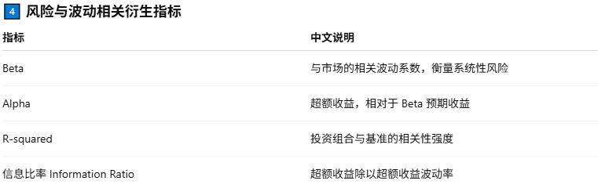

# 🐍 QiQi 和她爹的Python基地（丰富版）10周

- [🐍 QiQi 和她爹的Python基地（丰富版）](#-qiqi-和她爹的python基地丰富版10周)
	- [Week 1：Python 基础与环境](#week-1-python-基础与环境)
		- [📑 Day 1：环境搭建 \& IDE](#-day-1-环境搭建--ide)
		- [📑 Day 2：变量与数据类型](#-day-2-变量与数据类型)
			- [🔧练习：简单打印](#练习2)
		- [📑 Day 3：运算符](#-day-3-运算符)
			- [🔧练习：判断输出](#练习3)
		- [📑 Day 4：条件语句 if-else](#-day-4-条件语句-if-else)
			- [🔧练习：分类成绩](#练习4)
		- [📑 Day 5：循环 for \& while](#-day-5-循环-for--while)
			- [🔧练习: 9X9乘法表](#练习5)
		- [📑 Day 6：综合练习 — 迷你计算器](#-day-6-综合练习--迷你计算器)
			- [🔧🔧综合练习1: Mini Calculator(具体请看Week1子目录下)](#综合练习1-mini-calculator具体请看week1子目录下的calcluaterreadme)
		- [📑 Day 7 ：面试模拟  小项目2— 股票最大收益：](#-day-7-面试模拟--小项目2-股票最大收益)
			- [🔧🔧综合练习2：最佳买卖股票,(具体请看Week1子目录下)](#综合练习2-best-time-to-buy-and-sell-stock具体请看week1子目录下的stock)
	- [Week 2：数据结构与文件操作](#week-2-数据结构与文件操作)
		- [📑 Day 8：list（列表）基础](#-day-8-list列表基础)
			- [🔧练习：创建一个 list，增加、插入、删除元素，并排序输出。](#练习8)
		- [📑 Day 9：tuple（元组）基础](#-day-9tuple元组基础)
			- [🔧练习：创建一个 tuple，统计元素出现次数，并查找索引。](#练习9)
		- [📑 Day 10：set（集合）基础](#-day-10-set集合基础)
			- [🔧练习：创建两个 set，并进行集合运算。](#练习10)
		- [📑 Day 11：dict（字典）基础](#-day-11-dict字典基础)
			- [🔧练习：创建一个字典，访问、更新和遍历元素。](#练习11)
		- [📑 Day 12：切片与推导式](#-day-12-切片与推导式)
			- [🔧练习：使用切片和推导式创建新的 list。](#练习12)
		- [📑 Day 13：深拷贝 vs 浅拷贝](#-day-13-深拷贝-vs-浅拷贝)
			- [🔧练习：演示浅拷贝和深拷贝的不同。](#练习13)
		- [📑 Day 14：文件操作与异常处理](#-day-14-文件操作与异常处理)
			- [🔧练习：读取 txt 文件并捕获异常。](#练习14)
			- [🔧🔧综合练习3: 图书管理系统：](#综合练习3-library-management-system-with-json-persistence)
			- [🔧🔧综合练习4:（面试模拟）股票分析](#综合练习4-stock-data-analysis)
			- [🔧🔧综合练习5: 增强电影管理](#综合练习5-advanced-movie-collection-manager-with-json-persistence)
	- [Week 3：函数进阶与面向对象](#week-3-函数进阶与面向对象)
    	- [📑 Day 15: 函数基础](#-day-15-函数基础)
        	- [🔧练习 定义函数](#练习15-1)
    	- [📑 Day 16: 函数进阶与作用域](#-day-16-函数进阶与作用域)
        	- [🔧练习 全局和局部变量](#练习16)
    	- [📑 Day 17: 模块与包](#-day-17-模块与包)
        	- [🔧练习 模块导入](#练习17)
    	- [📑 Day 18: 文件操作](#-day-18-文件操作)
        	- [🔧练习 文件读写](#练习18)
    	- [📑 Day 19: 异常处理](#-day-19-异常处理)
        	- [🔧练习 tryexcept](#练习19)
    	- [📑 Day 20: OOP 基础](#-day-20-oop-基础)
        	- [🔧练习 OOP](#练习20)
    	- [📑 Day 21: OOP 进阶](#-day-21-1-oop-进阶)
        	- [🔧练习 继承多态](#练习21-1)
        	- [🔧🔧综合练习6： 银行账户管理](#综合练习6-银行账户管理)
        	- [🔧🔧综合练习7： 股票投资组合](#综合练习7-股票投资组合类面试模拟)
    - [week 4: 模块、库与工具](#week-4-模块库与工具)
    	- [📑 Day 22: os-sys-pathlib](#-day-22-os-sys-pathlib)
        	- [🔧练习 sys](#练习22)
    	- [📑 Day 23: datetime](#-day-23-datetime--金融应用)
			- [🔧练习 date](#练习23)
    	- [📑 Day 24: collections](#-day-24-collections)
        	- [🔧练习 TradeStats Portfolio Manager](#练习24)
    	- [📑 Day 25: itertools](#-day-25-itertools--functools)
        	- [🔧练习 itertools](#练习25)
    	- [📑 Day 26: 迭代器与生成器](#-day-26-迭代器与生成器)
        	- [🔧练习 迭代器与生成器](#练习26)
    	- [📑 Day 27: 正则表达式](#-day-27-正则表达式-regular-expressions)
        	- [🔧练习 正则表达式](#练习27)
    	- [📑 Day 28: 虚拟环境与依赖管理](#-day-28-虚拟环境与依赖管理)
	- [week 5: 数学分析基础](#week-5-pandas-数据分析基础)
	    - [📑 Day 29: 认识pandas](#day-29-认识-pandas-与-series--dataframe)
        	- [🔧练习 创建并操作简单数据](#练习29)
    	- [📑 Day 30: 数据导入与初步查看](#day-30-数据导入与初步查看)
			- [🔧练习 读取 CSV / Excel / JSON](#练习30)
    	- [📑 Day 31: 数据清洗缺失值与重复值](#day-31-数据清洗缺失值与重复值)
        	- [🔧练习 处理缺失与重复值](#练习31)
    	- [📑 Day 32: 统计分析与分组聚合](#day-32-统计分析与分组聚合)
        	- [🔧练习 groupby + pivot_table](#练习32)
    	- [📑 Day 33: 模拟项目](#day-33-股票收益分析面试模拟项目)
        	- [🔧练习 收益率、累计收益、波动率](#练习33)
		- [📑 Day 34: pandas进阶](#day-34-pandas-进阶技巧与性能优化)
        	- [🔧练习 多级索引、apply、自定义函数](#练习34)
    	- [📑 Day 35: 可视化](#day-34-pandas-进阶技巧与性能优化)
        	- [🔧练习 销售与收益可视化](#练习35销售与收益可视化仪表板)
	- [week 6: 数据可视化](#week-6-数据可视化)
		- [📑 Day 36: matplotlib-基础](#day-36-matplotlib-基础)
        	- [🔧练习 绘制折线图](#练习36)
    	- [📑 Day 37: matplotlib-进阶](#day-37-matplotlib-进阶)
			- [🔧练习 绘制条形图](#练习37)
    	- [📑 Day 38: seaborn-基础](#day-38-seaborn-基础)
        	- [🔧练习 绘制箱型和散点图](#练习38)
    	- [📑 Day 39: seaborn-高级](#day-39-seaborn-高级)
        	- [🔧练习 绘制热力图](#练习39)
    	- [📑 Day 40: plotly-交互式可视化](#day-40-plotly-交互式可视化)
        	- [🔧练习 Plotly 练习](#练习40)
		- [📑 Day 41: altair-声明式可视化](#day-41-altair-声明式可视化)
        	- [🔧练习 Altair和pandas练习](#练习41)
    	- [📑 Day 42: 综合可视化项目](#day-42-综合可视化项目)
        	- [🔧练习 股票收益可视化](#练习42-示例项目)
	- [week 7: 爬虫与数据获取](#week-7-爬虫与数据获取)
		- [📑 Day 43: requests-基础与网页请求](#day-43-requests-基础与网页请求)
        	- [🔧练习 请求网页](#练习43)
    	- [📑 Day 44: html-解析与-beautifulsoup](#day-44-html-解析与-beautifulsoup)
			- [🔧练习 爬取网站标题](#练习44)
    	- [📑 Day 45: json-数据解析与保存](#day-45-json-数据解析与保存)
        	- [🔧练习 数据解析练习](#练习45)
    	- [📑 Day 46: 爬虫异常处理与重试机制](#day-46-爬虫异常处理与重试机制)
        	- [🔧练习 异常处理的爬取函数](#练习46)
    	- [📑 Day 47: api-调用](#day-47-api-调用--alpha-vantage--yahoo-finance)
        	- [🔧练习 API调用](#练习47)
		- [📑 Day 48: 新闻标题爬取](#day-48-小项目1--新闻标题爬取)
        - [📑 Day 49: api-实战](#day-49-小项目2--金融数据-api-实战)
	- [week 8: 算法与数据结构](#-week-8python-算法与数据结构)
		- [📑 Day 50: 算法与复杂度基础](#-day-50算法与复杂度基础)
        	- [🔧练习 线性查找函数](#练习-501通用线性查找)
			- [🔧练习 线性查找函数](#练习-502通用二分查找有序)
			- [🔧练习 线性查找函数](#练习-503效率对比)
    	- [📑 Day 51: 排序算法基础1](#day-51-排序算法基础1)
			- [🔧练习 排序算法1](#练习51)
    	- [📑 Day 52: 排序算法进阶2](#day-52-排序算法进阶2)
        	- [🔧练习 排序算法2](#练习52)
    	- [📑 Day 53: 查找算法与二分法](#day-53-查找算法与二分法)
        	- [🔧练习 二分查找函数](#练习53)
    	- [📑 Day 54: 常用数据结构](#day-54-常用数据结构)
        	- [🔧练习 用 list 模拟栈和队列](#练习54)
		- [📑 Day 55: 动态规划dp入门](#day-55-动态规划dp入门)
        	- [🔧练习 Fibonacci 练习](#练习55)
    	- [📑 Day 56: 项目实战与综合应用](#day-56-项目实战与综合应用)
	- [week 9: 模块化与性能优化](#week-9-模块化与性能优化)
		- [📑 Day 57: 项目模块化设计](#️-day-57-项目模块化设计)
        - [🔧练习 创建示例项目目录结构](#练习57)
    	- [📑 Day 58: 函数与类的模块化](#️-day-58-函数与类的模块化)
			- [🔧练习 封装函数](#练习58)
    	- [📑 Day 59: 单元测试基础)](#️-day-59-单元测试基础)
        	- [🔧练习 单元测试](#练习59)
    	- [📑 Day 60: 调试技巧](#️-day-60-调试技巧)
        	- [🔧练习 调试技巧](#练习60)
    	- [📑 Day 61: 性能分析](#️-day-61-性能分析)
        	- [🔧练习 性能分析](#练习61)
		- [📑 Day 62: 代码优化技巧](#️-day-62-代码优化技巧)
        	- [🔧练习 代码优化](#练习62)
    	- [📑 Day 63: 项目重构与总结](#️-day-63-项目重构与总结)

## Week 1: Python 基础与环境
📘 学习内容：
```
	•	Python 环境与 IDE（Anaconda / venv / pyenv）
	•	基础语法：变量、数据类型（int, float, str, bool）
	•	运算符：算术、逻辑、比较
	•	控制语句：if-else，循环（for、while）
	•	输入输出：input()、print() 格式化输出
	•	注释、代码风格（PEP 8）
```
### 📑 Day 1: 环境搭建 & IDE
	•	安装 Python（推荐 pyenv 或 Anaconda）。
	•	学会创建虚拟环境（venv / conda）。
	•	安装 IDE：Jupyter Notebook / VS Code。
	•	用 print("Hello, Python!") 输出第一行代码。
	•	在 VS Code + Jupyter 里跑通第一个 .py 文件和 .ipynb 文件。

### 📑 Day 2: 变量与数据类型
	•	学习 Python 的四种基本类型：int, float, str, bool。
	•	学会使用 type() 查看类型，str() int() float() 做类型转换。
	•	了解 Python 的动态类型特性。
#### 🔧练习2:
Write a small program that takes the user’s input for name and age, and prints a  sentence. Pay attention to converting to bool:
```python
# P2.1 Get user input
name = input("Enter your name: ")
age_input = input("Enter your age: ")
# Convert age to integer
age = int(age_input)
# Example of bool conversion: check if age is positive
is_age_valid = bool(age > 0)
# Print a sentence
print(f"Hello, {name}! You are {age} years old. Age valid? {is_age_valid}")
```
Convert age to integer
```python
age = int(age_input)
```
Example of bool conversion: check if age is positive
```python
is_age_valid = bool(age > 0)
```
bool() 的转换规则是这样的：
	1 数值：
	•	0 → False
	•	任何非零数（比如 -1, 3.14, 100）→ True
	2 字符串:
	•	空字符串 "" → False
	•	任何非空字符串（哪怕只是 " " 一个空格，或 "hello"）→ True
    总结一句话：Python 里只要字符串不是完全空的，就认为它是真 (True)

### 📑 Day 3: 运算符
	•	学习算术运算符（+ - * / // % **）。
	•	学习比较运算符（== != > < >= <=）。
	•	学习逻辑运算符（and or not）。
	•	学习赋值运算符（+=, -=, *=, /=）。
#### 🔧练习3:
Let the user enter a number, and output its square, whether it is greater than 10, and whether it is even.
```python
# P 3.1
a = int(input("Please input a number: "))
# 计算平方
square = a * a
# 判断是否大于 10
greater_than_10 = square > 10
# 判断是否偶数
is_even = square % 2 == 0
# 输出结果
print(f"The square of {a} is: {square}")
print(f"Is the square greater than 10? {greater_than_10}")
print(f"Is the square even? {is_even}")
```
### 📑 Day 4: 条件语句 if-else
	•	if-else 语句语法。
	•	多分支：if-elif-else。
#### 🔧练习4:
	•	输入一个分数，输出成绩等级：
	•	90+ 优秀
	•	70-89 良好
	•	60-69 及格
	•	<60 不及格
```python
# P 4.1
scope = int(input("please input scope:"))
if scope >= 90:
     grade = "Excellent"
elif scope > 70:
     grade = "Good"
elif scope > 60:
     grade = "Pass"
else:
     grade = "Fail"
print(f"your grade is: {grade}")
```

### 📑 Day 5: 循环 for & while
	•	for i in range(n)。
	•	while 循环。
	•	break & continue。
#### 🔧练习5:
1. 9x9 multiplication table,,,Write a program to print the multiplication table from 1×1 up to 9×9.
```python
# P 5.1
for i in range(1, 10): # rows 是外循环来控制
    for j in range(1, i+1): # clus 是内循环来控制
        print(f"{j}×{i}={i*j}", end="\t")
    print()  # New line after each row
```

2. Sum with while,,,Use a while loop to calculate the sum of numbers from 1 to 100.
```python
# P 5.2 Calculate sum from 1 to 100
total = 0
i = 1
while i <= 100:
    total += i
    i += 1

print(f"The sum of numbers from 1 to 100 is: {total}")
```

### 📑 Day 6: 综合练习 — 迷你计算器
	•	结合 if-else、输入输出、函数。
	•	实现加、减、乘、除、开方、幂运算。
	•	进阶： 加入异常处理：不能除以 0。
#### 🔧🔧综合练习1: Mini Calculator(具体请看Week1子目录下的CalcluaterREADME)
迷你计算器：加减乘除、平方、开方、百分比。
Comprehensive Exercise — Mini Calculator
	•	Combine if-else, input/output, and functions(注意这里有函数的表述).
	•	Implement addition, subtraction, multiplication, division, square root, and exponentiation.
	•	Advanced: Add exception handling to prevent division by zero.
```python
import math

def calculator(a, b, op):
    if op == "+":
        return a + b
    elif op == "-":
        return a - b
    elif op == "*":
        return a * b
    elif op == "/":
        if b == 0:
            return "错误：不能除以 0！"
        return a / b
    elif op == "^":
        return a ** b
    elif op == "sqrt":
        if a < 0:
            return "错误：不能对负数开方！"
        return math.sqrt(a)
    else:
        return "错误：不支持的运算符！"

print("欢迎使用迷你计算器！")
print("支持运算: +, -, *, /, ^, sqrt")

while True:
    op = input("请输入运算符（输入 q 退出）： ")

    if op == "q":
        print("再见！")
        break

    try:
        if op == "sqrt":
            a = float(input("请输入一个数字: "))
            result = calculator(a, None, op)
        else:
            a = float(input("请输入第一个数字: "))
            b = float(input("请输入第二个数字: "))
            result = calculator(a, b, op)

        print(f"结果是: {result}")
    except ValueError:
        print("输入无效，请输入数字！")
```
注意: 这里有导入包:math,它是python自带库文件,可以实现已经封装好的计算逻辑(函数)
### 📑 Day 7: 面试模拟  小项目2— 股票最大收益
股票价格数组，求 最大收益区间（买入/卖出）。
	•	问题：给定一个股票价格数组，找到最大利润（一次买入卖出）。
	•	训练点：
	•	遍历数组。
	•	变量存储最小买入价、最大利润。
#### 🔧🔧综合练习2: Best Time to Buy and Sell Stock,(具体请看Week1子目录下的Stock)
	•	You are given a list of stock prices where prices[i] is the price of a given stock on day i...prices = [7,1,5,3,6,4]
	•	You want to maximize your profit by choosing one day to buy and one later day to sell.
	•	Write a function that returns the maximum profit you can achieve. If no profit is possible, return 0.
训练点
	1.	遍历数组
	•	从头到尾遍历价格数组，每天判断是否能更新最小买入价或最大利润。
	2.	变量存储
	•	min_price：记录到当前为止的最低价格（潜在买入价）。
	•	max_profit：记录到当前为止能得到的最大利润。
	3.	思路总结
	•	对每一天的价格：
	1.	更新最小买入价：min_price = min(min_price, price)
	2.	计算今天卖出的利润：profit = price - min_price
	3.	更新最大利润：max_profit = max(max_profit, profit)

```python
# P 7.1
def max_profit(prices):
    if not prices:
        return 0

    min_price = prices[0]  # 初始化最低买入价
    max_profit = 0         # 初始化最大利润

    for price in prices:
        # 更新最低买入价
        if price < min_price:
            min_price = price
        
        # 更新最大利润
        profit = price - min_price
        if profit > max_profit:
            max_profit = profit

    return max_profit

# 测试
prices = [7,1,5,3,6,4]
print(max_profit(prices))  # 输出 5

```
## Week 2: 数据结构与文件操作
📘 学习内容：
```
	•	数据结构：list、tuple、set、dict
	•	切片、推导式（list/dict comprehension）
	•	深拷贝 vs 浅拷贝
	•	文件操作：读写 txt、CSV、JSON
	•	异常处理：try-except-finally
```python
list（列表）
	•	有序、可变的元素集合
	•	元素可以重复
	•	通过索引 (index) 访问
list 常用方法：
	•	append(x) → 末尾追加
	•	insert(i, x) → 指定位置插入
	•	pop(i) → 删除并返回元素
	•	remove(x) → 删除第一个值为 x 的元素
	•	sort() → 排序
	•	reverse() → 反转
tuple（元组）
	•	有序、不可变的元素集合
	•	元素可以重复
	•	通过索引 (index) 访问
	•	常用于存储固定的数据，比如函数返回多个值
tuple 常用操作/方法：
	•	count(x) → 统计元素 x 出现次数
	•	index(x) → 返回元素 x 第一次出现的位置
注意：元组不可变，不能使用 append(), remove() 等修改方法
set（集合）
	•	无序、可变的元素集合
	•	元素唯一，重复元素会自动去重
	•	支持集合运算：交集、并集、差集、对称差集
set 常用方法：
	•	add(x) → 添加元素 x
	•	remove(x) → 删除元素 x（不存在会报错）
	•	discard(x) → 删除元素 x（不存在不会报错）
	•	pop() → 随机删除并返回一个元素
	•	union(other_set) → 并集
	•	intersection(other_set) → 交集
	•	difference(other_set) → 差集
	•	symmetric_difference(other_set) → 对称差集
dict（字典）
	•	无序（Python 3.7+ 实际保持插入顺序）、可变的键值对集合
	•	键 (key) 唯一，值 (value) 可重复
	•	通过键 (key) 访问
dict 常用方法：
	•	keys() → 所有键
	•	values() → 所有值
	•	items() → 键值对 (tuple)
	•	get(key, default) → 获取值，找不到返回默认值
	•	update({...}) → 批量更新
类型对比表
类型	有序	可变	元素唯一	索引访问	 常用场景
list	✅		✅		❌		✅		 可变列表、栈/队列
tuple	✅		❌		❌		✅		 固定数据、函数返回值
set		❌		✅		✅		❌		 去重、集合运算
dict	❌		✅		键唯一	通过 key	键值映射
```
### 📑 Day 8: list（列表）基础
	•	学习 list 的有序性、可变性和重复元素特性。
	•	学会通过索引访问元素。
	•	掌握 append(), insert(), pop(), remove(), sort(), reverse() 方法。

#### 🔧练习8: 
创建一个 list，增加、插入、删除元素，并排序输出。
```python
# P8.1 List操作练习
fruits = ["apple", "banana", "cherry"]
# 追加
fruits.append("orange")
# 插入
fruits.insert(1, "grape")
# 删除
fruits.remove("banana")
# 弹出,注意这里是定义了popped,因此可以打印,但如果不定义的话可以直接用fruis.pop()
popped = fruits.pop(2)
# 排序
fruits.sort()
# 输出结果
print("Fruits:", fruits)
print("Popped element:", popped)
```
### 📑 Day 9：tuple（元组）基础
	•	学习 tuple 的有序性、不可变性和重复元素特性。
	•	通过索引访问元素。
	•	掌握 count(), index() 方法。
	•	了解 tuple 常用于固定数据或函数返回多个值。
#### 🔧练习9:
创建一个 tuple，统计元素出现次数，并查找索引。
```python
# P9.1 Tuple练习
numbers = (1, 2, 3, 2, 4, 2) # 注意tuple用(),而list用[],而且count() 和 index() 都可以用在 有序序列（list 或 tuple）上,他们是这两种序列的方法。count是计数,计算它出现的次数,而index是它索引的位置.
# tuple 之所以经常提到这些方法，是因为它 不可变，你无法用 append/remove 之类修改它，所以这些只读方法就显得尤为重要。
count_2 = numbers.count(2)
index_3 = numbers.index(3)
print("Tuple:", numbers)
print("Count of 2:", count_2)
print("Index of 3:", index_3)
```
### 📑 Day 10: set（集合）基础
	•	学习 set 的无序性、可变性和唯一性。
	•	掌握集合运算：交集、并集、差集、对称差集。
	•	学会使用 add(), remove(), discard(), pop() 方法。

#### 🔧练习10:
创建两个 set，并进行集合运算。
```python
# P10.1 Set操作练习,非空集合可以用 {},空集合必须用 set(),可以用 set() 将 list、tuple、字符串等可迭代对象转换为集合.
a = {1, 2, 3, 4}
b = {3, 4, 5, 6}
# 添加元素
a.add(5)
# 删除元素
a.remove(2)
# 并集
union_set = a.union(b)
# 交集
intersection_set = a.intersection(b)
# 差集
diff_set = a.difference(b)
print("Set a:", a)
print("Set b:", b)
print("Union:", union_set)
print("Intersection:", intersection_set)
print("Difference:", diff_set)
```
### 📑 Day 11: dict（字典）基础
	•	学习 dict 的键唯一、值可重复、可变特性。
	•	通过 key 访问元素。
	•	掌握 keys(), values(), items(), get(), update() 方法。

#### 🔧练习11:
创建一个字典，访问、更新和遍历元素。
```python
# P11.1 Dict操作练习
student = {"name": "Alice", "age": 20, "major": "CS"}
# 获取值
age = student.get("age")
# 更新
student.update({"age": 21, "grade": "A"})
# 遍历
for key, value in student.items(): # 注意这里定义的两个循环变量:key和value,这种写法就可以自动拆包,如果是for key in student呢?就是只用一个变量呢?结果会是什么样子?
    print(key, ":", value)
```
### 📑 Day 12: 切片与推导式
	•	学习 list、tuple 的切片方法。
	•	学习 list/dict comprehension。
	•	了解推导式在创建新集合中的优势。

#### 🔧练习12:
使用切片和推导式创建新的 list。
```python
# P12.1 切片与推导式
numbers = [0, 1, 2, 3, 4, 5, 6]
# 切片
slice_numbers = numbers[2:6]
# list comprehension
squares = [x*x for x in numbers if x%2==0]
print("Slice:", slice_numbers)
print("Squares of even numbers:", squares)
```
### 📑 Day 13: 深拷贝 vs 浅拷贝
	•	理解浅拷贝 (shallow copy) 与深拷贝 (deep copy) 的区别。
	•	学会使用 copy() 和 deepcopy()。
	•	了解嵌套列表复制的注意点。

#### 🔧练习13:
演示浅拷贝和深拷贝的不同。
```python
# P13.1
import copy

original = [[1, 2], [3, 4]]
shallow = copy.copy(original)
deep = copy.deepcopy(original)

original[0][0] = 99
print("Original:", original)
print("Shallow copy:", shallow) # 浅copy = 外层分家,内层同居,一旦改变b的内层将会影响a的内层
print("Deep copy:", deep)  # 深copy = 外层分家,内层也分家,一旦改变b的内层不会影响a的内层
# P13.2
import copy
a = [1,2 [3, 4]]
b = copy.copy(a) # shallow copy

print(a) #[1, 2, [3, 4]]
print(b) #[1, 2, [3, 4]]

b[0] = 99
print(a) #[1, 2, [3, 4]]
print(b) #[99, 2, [3, 4]] 外层数据分开了

b[2][0] = 77 # b的第二个元素(0,1,2)的第零个元素被新赋值为77
print(a) = #[1, 2, [77, 4]] 它的内层被修改了
print(b) = #99, 2, [77, 4]]

# P13.3
a = [1,2 [3, 4]]
c = copy.deepcopy(a) # deep copy

c[0] = 99
c[2][0] = 77

print(a) # [1, 2, [3, 4]] 外层完全不受影响
print(c) # [99,2, [77, 4]]
```
### 📑 Day 14: 文件操作与异常处理
	•	学习文件读写 txt、CSV、JSON。
	•	掌握异常处理 try-except-finally。
	•	了解文件操作中的常见错误及处理方法。

#### 🔧练习14:
读取 txt 文件并捕获异常。
```python
# P14.1 文件操作练习
try: # try表示“尝试执行下面的执行块, 如果出错,会转到except
    with open("example.txt", "r") as f: # 表示以只读模式(r) 打开example.txt, Ms.ariana 请注意:
		# 每个文件都分为很多种模式,对于系统文件,大部分都为只读文件,对于公开文件,都为可修改模式. r = read only
		# with...as f是上下文管理器:保证文件用完后自动关闭,即使中途出错也会执行f.close().
        content = f.read() # 读取整个文件内容,返回字符串,并保存到content变量里,
        print("File content:", content)
except FileNotFoundError: # 如果这个文件不存在,就会捕获这个错误并执行里面的代码,这样做的好处(此处的逻辑)是避免程序直接崩溃
    print("File not found!")
finally: # 无论是否出错,finally里的代码都会执行
    print("Execution finished.")
```

#### 🔧🔧综合练习3: Library Management System with JSON Persistence：
建立一个图书管理系统：能添加/删除/查询，并保存到 JSON 文件。
功能点：
	1.	添加书籍（书名、作者、年份）。
	2.	删除书籍（通过书名或索引）。
	3.	查询书籍（查看全部或按书名搜索）。
	4.	数据保存到 JSON 文件，下次打开仍能读取。
	
```python
import json
import os

FILE_NAME = "books.json"

# 初始化书籍列表
if os.path.exists(FILE_NAME):
    with open(FILE_NAME, "r") as f:
        books = json.load(f) # 把json文件的内容读出来,并转换成python对象(list或dict),放在内存里,下面定义的几个函数add,query和delete都是在内存里操作,只有调用save函数的时候,才会把内存里的列表写回文件.
		# 同时注意这个books是一个全局变量,定义在所有函数的外卖,所有函数都可以访问它(只要不在函数里用books=...重新赋值它)

else:
    books = [] # 空列表; 或空字典: books = {}; 或空集合: books = set(),这里先定义它为列表,它只是个容器,里面的元素可能是字典

def save_books():
    with open(FILE_NAME, "w") as f: # 这段代码中用“w”打开,会清除文件里的内容
        json.dump(books, f, indent=4) # 这段用dump,会把保存在内存里的内容都重新保存在文件里

def add_book():
    title = input("请输入书名: ") # 这个新增变量是局部变量,只在此函数内部有效,当此函数执行完毕,这个变量就不存在了(被销毁)
    author = input("请输入作者: ") # 同上
    year = input("请输入年份: ") # 同上
    books.append({"title": title, "author": author, "year": year}) # 用花括号{}代表写代码是考虑到用字典类型, 这样键值配对,可用键直接访问对象,直观和方便, 也就是说把字典放在列表里注意这段代码只是用append把它加入到字典里,这时候输入的内容都保存在内存里
    save_books()
    print("添加成功!")

def delete_book():
    title = input("请输入要删除的书名: ")
    for book in books: # 这时的book是新定义的局部变量,叫循环变量,用来表示列表books当前便利到的元素,这个元素只在循环体内有效,循环结束后它就不再被使用了
        if book["title"] == title: # 如果这个变量被找到,即和输入的书名一致的话,而且这里面的key,即title是字符串类型,因此需要加“”包起来,第二个title 本身是变量,它本身就是字符串,因此不用“”.
            books.remove(book) #调用列表的删除方法
            save_books()
            print("删除成功!")
            return # 注意这个return,它是立即结束此函数的意思,最有一句未找到该书就不会被打印(整个也可以换成if... break... else语句)
			#注意这个return的位置,当它在if缩进里的时候,条件成立会自动删除和保存文件;但当它不缩进在if(即和for并列时候)时相当于无条件退出函数了.
    print("未找到该书!") # 这个意思是if里面遍历完没找到,就会打印此句

def query_books():
    if not books: # 这里是没有书籍,即书籍列表为空的情况下
        print("没有书籍信息")
        return  
    print("当前书籍列表:")
    for i, book in enumerate(books, start=1): # enumerate为python的内置函数,它会把列表books 遍历,同时生成索引i, 并从1开始,这是典型的for后面跟多个变量,它遍历的每个元素是序列,自动拆包,这是python中常用的元组/列表解包技巧.
        print(f"{i}. {book['title']} - {book['author']} ({book['year']})")

# 主循环
while True:
    print("\n1-添加书籍  2-删除书籍  3-查看书籍  4-退出")
    choice = input("请选择操作: ")
    if choice == "1":
        add_book()
    elif choice == "2":
        delete_book()
    elif choice == "3":
        query_books()
    elif choice == "4":
        break
    else:
        print("无效输入")
```
注意: 运行此程序的时候,会提示你添加docstring,要分清注释(#)和文档字符串(docstring)之间的区别:
docstring是同时给人和机器看的,可通过help()或.__doc__获取;# 只是给人看的.

#### 🔧🔧综合练习4: Stock Data Analysis
CSV Reader with Statistics and Volatility
build a small program that reads historical stock data from a CSV file and computer basic statistics and Volatility
读取股票历史数据 CSV，输出：
	•	最高/最低价
	•	平均收盘价
	•	波动率
功能点：
	1.	读取 CSV（包含 Date、Open、High、Low、Close）。
	2.	输出最高价、最低价、平均收盘价。
	3.	计算波动率（通常用收盘价的标准差 / 平均值）。

示例代码：
```python
import pandas as pd

# 读取 CSV 文件
file_name = "stock_data.csv"  # CSV 文件应包含 Date, Open, High, Low, Close
df = pd.read_csv(file_name)

# 输出最高价和最低价
highest = df['High'].max()
lowest = df['Low'].min()
print(f"最高价: {highest}, 最低价: {lowest}")

# 平均收盘价
avg_close = df['Close'].mean()
print(f"平均收盘价: {avg_close:.2f}")

# 波动率: 收盘价标准差 / 平均值
volatility = df['Close'].std() / avg_close
print(f"波动率: {volatility:.2%}")
```
⸻
#### 🔧🔧综合练习5: Advanced Movie Collection Manager with JSON Persistence
Objective:
Build a movie collection management system that allows users to add, delete, view, and search movies, with data stored persistently in a JSON file. The system should include input validation and prevent duplicate entries.
Functional Requirements:
Add a movie
Fields: Title, Director, Release Year, Genre
Validation:
Title and Director cannot be empty
Release Year must be a number between 1888 and the current year
Prevent duplicate titles (case-insensitive)
Genre is optional; default to "Unknown" if left blank
Delete a movie
Users can delete by title (case-insensitive) or index number in the list
Print a message if the movie is not found
View movies
Display all movies in a readable JSON-like format
Sort movies by Release Year
Search movies (optional challenge)
Allow filtering by title, director, or year
Data persistence
All movie data must be saved in a JSON file
On program start, load existing data so the collection persists between sessions
Extra Challenge (Optional)
Improve user experience with pretty-printing
Allow partial search (e.g., searching for "Star" finds "Star Wars")
Prevent invalid input for all fields
Starter Hints
Use the json module to read/write JSON files
Use os.path.exists() to check if the JSON file exists
Validate user input before saving
Use json.dumps(..., indent=4) to display movies neatly
```python
import json
import os
from datetime import datetime

FILE_NAME = "movies.json"

# Load existing movie data or create empty list
if os.path.exists(FILE_NAME):
	with open(FILE_NAME, "r") as f: # 以只读模式打开指定文件，并把文件对象命名为 f，在代码块结束时会自动关闭文件。
		movies = json.load(f) # 从文件 f 里读取 JSON 格式的数据，把它转换成 Python 的对象（比如列表或字典），并赋值给变量 movies。
else:
	movies = []

# Save movies to JSON
def save_movies():
	with open(FILE_NAME, "w") as f: # 以写入模式打开指定文件，并把文件对象命名为 f，在代码块结束时会自动关闭文件。
		json.dump(movies, f, indent=4, ensure_ascii=False) # 把 movies 这个 Python 数据（列表/字典）转成 JSON 格式，并写进文件 f 里，还排版好缩进，保证能显示中文而不是乱码。

# Validate year
def validate_year(year_str): # 这里的函数就加了参数(argu,year_str),表明要调用(callable)它的时候需要提供输入值,它是函数的行参,validate_year("2020"),这个时候2020会传递给year_str,函数内部就可以直接使用year_str了,这时2020是实参.
	current_year = datetime.now().year # 获取当前年份的数值
	if not year_str.isdigit():# 检查它是否全部由数字组成,注意这句if not，它在python就是：如果失败 / 不存在 / 无效的意思
		return False, "Year must be a number!"# 
	year = int(year_str)
	if year < 1888 or year > current_year:  # First movie: 1888,等价于if 1888<= year <= current_year，但如果写：如果在范围内，就需要加上else：
		return False, f"Year must be between 1888 and {current_year}!"
	return True, year # 注意,这个函数里有三条return!!! 第一种是数字合法,第二种是数字范围,第三种是正确.

# Check for duplicate title
def is_duplicate(title): #
	for movie in movies:
		if movie["title"].lower() == title.lower():
			return True
	return False


# Add a movie
def add_movie():
	title = input("Enter movie title: ").strip()
	if not title:
		print("Title cannot be empty!")
		return
	if is_duplicate(title):
		print("This movie already exists in the collection!")
		return
	
	director = input("Enter director name: ").strip()
	if not director:
		print("Director cannot be empty!")
		return
	
	year_input = input("Enter release year: ").strip()
	valid, year_or_msg = validate_year(year_input)
	if not valid:
		print(year_or_msg)
		return
	year = year_or_msg
	
	genre = input("Enter genre: ").strip()
	if not genre:
		genre = "Unknown"
	
	movies.append({
		"title": title,
		"director": director,
		"year": year,
		"genre": genre
	})
	save_movies()
	print("Movie added successfully!")

# Delete a movie
def delete_movie():
	if not movies:
		print("No movies to delete.")
		return

	print("Current movies:")
	for i, m in enumerate(movies):
		print(f"{i+1}. {m['title']} ({m['year']})")
	
	choice = input("Enter movie title or index to delete: ").strip()
	if choice.isdigit():
		index = int(choice) - 1
		if 0 <= index < len(movies):
			removed = movies.pop(index)
			save_movies()
			print(f"Removed movie: {removed['title']}")
			return
		else:
			print("Invalid index!")
			return
	
	# Delete by title
	for movie in movies:
		if movie["title"].lower() == choice.lower():
			movies.remove(movie)
			save_movies()
			print(f"Removed movie: {movie['title']}")
			return
	
	print("Movie not found!")

# Query movies
def query_movies():
	if not movies:
		print("No movies in the collection.")
		return
	# Sort by year before displaying
	sorted_movies = sorted(movies, key=lambda x: x["year"])
	print(json.dumps(sorted_movies, indent=4, ensure_ascii=False))

# Main loop
while True:
	print("\n1 - Add movie, 2 - Delete movie, 3 - View movies, 4 - Exit")
	choice = input("Enter your choice: ").strip()
	
	if choice == "1":
		add_movie()
	elif choice == "2":
		delete_movie()
	elif choice == "3":
		query_movies()
	elif choice == "4":
		print("Exiting program. Bye!")
		break
	else:
		print("Invalid choice, try again!")
```
## Week 3: 函数进阶与面向对象
📘 学习内容：
```
	•	函数参数（默认参数、可变参数 *args/**kwargs）
	•	Lambda、map、filter、reduce
	•	面向对象 OOP：类、对象、封装、继承、多态
	•	魔法方法（__init__, __repr__, __len__）
	•	装饰器 @decorator
```
### 📑 Day 15: 函数基础
	•	定义函数
	    为什么需要函数？函数是 把代码组织成可重用模块 的方式。避免重复代码，提高可读性和可维护性。
		可以像“黑箱”一样调用函数，而不用关心内部实现。
	•	返回值:
	•	函数参数类型:位置参数,关键字参数,默认参数,可变阐述 *args/**kwargs
1 位置参数（positional arguments）按照顺序传入
```python
	def add(a, b):
		return a + b

	print(add(3, 5))  # 8
```
2 关键字参数（keyword arguments）通过“参数名=值”方式传入，不依赖顺序。
```python
	def student_info(name, age):
		return f"{name} is {age} years old."

	print(student_info(age=20, name="QiQi"))

```
3 默认参数（default arguments）参数有默认值，不传参时使用默认值。
```python
	def greet(name, msg="Hello"):
		return f"{msg}, {name}!"

	print(greet("Shaoxian"))        # Hello, Shaoxian!
	print(greet("Shaoxian", "Hi"))  # Hi, Shaoxian!

```	
	⚠️ 注意：默认参数 必须放在非默认参数之后，否则报错
4 可变参数: * 和 ** 才是 Python 语法的一部分
*args：接收任意数量的 位置参数(positional arguments)，打包成元组,也就是说：* 用来“打散”位置参数（tuple 解包）。
** kwargs：接收任意数量的 关键字参数(keyword arguments)，参数名=值，打包成字典，也就是说：** 用来“打散”关键字参数（dict 解包）。
args 和 kwargs 只是变量名，换成别的名字也能用,常用它们只不过是约定成俗的写法，但* 和**是固定语法。
```python
	def show_args(*args, **kwargs):
		print("args:", args)
		print("kwargs:", kwargs)

	show_args(1, 2, 3, name="QiQi", age=5)
	# args: (1, 2, 3)
	# kwargs: {'name': 'QiQi', 'age': 5}

```
	返回值：return 可以返回 单个值，也可以返回 多个值（实际上是元组），如果没有写 return，函数默认返回 None

#### 🔧练习15-1: 
定义函数示例
```python
def greet(name):# name是参数，形参（placeholder）调用函数时传入的 "Shaoxian" 是 实参。
	return f"Hello, {name}!" 。# return 表达式会把结果返回给调用者

if __name__ == "__main__":
    print(greet("Shaoxian"))
```
#### 🔧练习15-2: 
返回统计信息
输入一组分数，返回最高分、最低分、平均分。
```python
def stats(scores):
    return max(scores), min(scores), sum(scores) / len(scores)

print(stats([89, 95, 72, 100, 85]))
```
#### 🔧练习15-3:
购物小票
写一个函数，接收商品和价格（关键字参数形式），计算总价。
```python
def checkout(**items): ## **是解包， .values()和.keys()是两个方法
    total = sum(items.values())
    return f"Items: {list(items.keys())}, Total: {total}"

print(checkout(apple=3, banana=2, milk=5))

```
### 📑 Day 16: 函数进阶与作用域
	•	局部变量 VS 全局变量: 局部：在函数内部定义，只能在函数内部使用； 全局：在函数外部定义，整个文件都可以访问。
	•	global 与 nonlocal：如果想在函数内部修改全局变量，需要用 global 关键字。

```python
count = 0  # 全局变量

def increment():
	global count
	count += 1
	return count

print(increment())  # 1
print(increment())  # 2

```
nonlocal：如果函数内部嵌套了一个函数，nonlocal 可以让内层函数修改外层函数的局部变量。
```python
def outer():
x = 10
def inner():
	nonlocal x
	x += 5
	return x
return inner()

print(outer())  # 15

```
•	匿名函数: lambda:  用于定义 简短的匿名函数，常和高阶函数配合使用。
		语法：lambda 参数: 表达式
```python
square = lambda x: x * x
print(square(5))  # 25
```
📌 与普通函数对比：
```python
def square_func(x):
return x * x
```
•	高阶函数: map(),filter(),reduce(),sorted(),zip()
map():对序列中的每个元素应用一个函数，返回迭代器。
```python
nums = [1, 2, 3, 4]
squares = list(map(lambda x: x**2, nums))
print(squares)  # [1, 4, 9, 16]
```
filter():过滤序列，返回符合条件的元素。
```python
nums = [1, 2, 3, 4, 5, 6]
evens = list(filter(lambda x: x % 2 == 0, nums))
print(evens)  # [2, 4, 6]
```
reduce():累积运算，需要从 functools 导入。
```python
from functools import reduce
nums = [1, 2, 3, 4]
product = reduce(lambda x, y: x * y, nums)
print(product)  # 24
```

sorted():支持自定义排序规则。
```python
words = ["banana", "apple", "pear", "watermelon"]
sorted_words = sorted(words, key=lambda w: len(w))
print(sorted_words)  # ['pear', 'apple', 'banana', 'watermelon']
```

zip():把多个可迭代对象打包成元组。
```python
names = ["Alice", "Bob", "Cathy"]
scores = [85, 90, 95]
zipped = list(zip(names, scores))
print(zipped)  # [('Alice', 85), ('Bob', 90), ('Cathy', 95)]
```
#### 🔧练习16:
局部变量、全局变量示例
```python
count = 0  # 全局变量
def increment():
    global count
    count += 1
    return count

if __name__ == "__main__":
    print(increment())
```
### 📑 Day 17: 模块与包
	•	模块导入: import module/from module import func
		**模块**：就是一个 `.py` 文件，里面包含了函数、类、变量等。  
		好处：  
  		   代码复用（写一次，多处调用）  
  		   代码组织更清晰  
  		   避免文件过大、难以维护
		**模块导入**
		普通导入  		 ：import math
		选择性导入		 ：from math import sqrt, pi
		导入并起别名	 ：import datetime as dt
		导入所有（不推荐）：from math import * #⚠️ 缺点：容易和已有变量冲突。

	•	常用标准库: math,random,datetime,os,sys
	•	自定义模块: 创建.py文件并导入
	    例子：创建文件 mymath.py：
```python
def add(a, b):
return a + b

def subtract(a, b):
return a - b
```
导入自定义模块:
```python
import mymath

print(mymath.add(3, 5))       # 8
print(mymath.subtract(10, 4)) # 6
```
•	包/package:
	    包：一个文件夹，里面有多个模块，并包含 __init__.py 文件。用于更大规模的项目组织。
		结构示例：
mypackage/
	__init__.py
	utils.py
	calculator.py
使用：
	from mypackage import utils
	from mypackage.calculator import add

#### 🔧练习17:
模块导入与自定义模块示例
```python
import math

def circle_area(r):
    return math.pi * r ** 2

if __name__ == "__main__":
    print(circle_area(5))
```
### 📑 Day 18: 文件操作
	•	打开文件: open(‘file.txt’,mode)
	•	文件模式: r,w,a,rb,wb
	•	读取方法: read(),deadline(),readlines()
	•	写入方法: write(),writelines()
	•	使用 with 自动关闭文件: 
#### 🔧练习18:
文件读写示例
```python
with open("movies.txt", "w") as f:
    f.write("Inception, Nolan, 2010\n")

with open("movies.txt", "r") as f:
    print(f.read())
```
### 📑 Day 19: 异常处理
	•	try...except...finally
	•	捕获特定异常
	•	自定义异常
#### 🔧练习19:
try/except示例
```python
try:
    x = int(input("Enter a number: "))
    y = int(input("Enter another number: "))
    print(x / y)
except ZeroDivisionError:
    print("Cannot divide by zero!")
except ValueError:
    print("Invalid input!")
```
### 📑 Day 20: OOP 基础
	•	类和对象:class and object, 类 (Class)：描述一类事物的模板，比如“电影”;对象 (Object)：类的具体实例，比如《指环王》。
	•	属性与方法：学会定义 属性 (Attributes) 和 方法 (Methods)
	•	构造方法: __init__：用来在对象创建时初始化属性。self 代表当前对象实例。
```python
class Movie:
	def __init__(self, title, director, year): # 在 Python 中，self 不是关键字，但是在定义类的方法时，它是一个 约定俗成的名字，必须作为实例方法的第一个参数。
		"""这个类的初始化方法种，它有四个个形参，但self是它本身而已self 是 类实例自身的引用，真正有用的是下面三个形参"""
		self.title = title        # 实例属性
		self.director = director
		self.year = year
```
•   创建对象
```python
m = Movie("Inception", "Nolan", 2010) #这里是创建对象和真正的初始化
print(m.title)       # Inception
print(m.director)    # Nolan
print(m.year)        # 2010
```
•	实例化对象: 类里面定义的函数，必须带上 self。
```python
class Movie:
	def __init__(self, title, director, year):
		self.title = title
		self.director = director
		self.year = year
	
	def info(self):  # 实例方法
		return f"{self.title} ({self.year}), directed by {self.director}"

m = Movie("Inception", "Nolan", 2010)
print(m.info())   # Inception (2010), directed by Nolan
```
#### 🔧练习20:
类和对象示例
```python
class Movie:
    def __init__(self, title, director, year, genre="Unknown"):
		"""=unknown是展示如何给属性设置默认值"""
        self.title = title
        self.director = director
        self.year = year
        self.genre = genre
        self.rating = None  # rating 不是构造函数的参数，而是直接在对象里创建一个属性，无论调用时是否传参，rating 都会被创建，只是初始值为空

    def info(self):
        """返回电影的完整信息"""
        return f"{self.title} ({self.year}), directed by {self.director}, Genre: {self.genre}, Rating: {self.rating or 'N/A'}"

    def set_rating(self, rating):
        """给电影评分"""
        if 0 <= rating <= 10:
            self.rating = rating
        else:
            print("Rating must be between 0 and 10")

# 模拟电影收藏
if __name__ == "__main__":
    # 创建多个电影对象
    m1 = Movie("Inception", "Nolan", 2010, "Sci-Fi")
    m2 = Movie("The Matrix", "Wachowski", 1999, "Action")
    m3 = Movie("Interstellar", "Nolan", 2014, "Sci-Fi")

    # 设置评分
    m1.set_rating(9)
    m2.set_rating(8.5)

    # 打印电影信息
    for movie in [m1, m2, m3]:
        print(movie.info())

```
### 📑 Day 21-1: OOP 进阶
	•	继承与多态：Inheritance and Polymorphism
	    - 继承：子类继承父类的属性和方法。
```python
class Animal:
	def speak(self):
		return "Some sound"

class Dog(Animal):
	def speak(self):
		return "Woof!"  # 方法重写

```
• 多态：不同对象调用相同方法，表现不同结果。
```python
		animals = [Dog(), Animal()]
		for a in animals:
    		print(a.speak())  # Woof! / Some sound
```
• 方法重写：Override
• super():学会使用super（）调用父类方法
```python
class Person:
	def __init__(self, name):
		self.name = name

class Student(Person):
	def __init__(self, name, student_id):
		super().__init__(name)   # 调用父类构造方法
		self.student_id = student_id
```
• 类属性与实例属性的区分
  类属性：所有对象共享的。实例属性：每个对象单独的。
```python
class Circle:
    pi = 3.14159   # 类属性
    
def __init__(self, r):
    self.r = r   # 实例属性
	c1 = Circle(5)
	c2 = Circle(10)
print(c1.pi, c2.pi)   # 3.14159 3.14159
print(c1.r, c2.r)     # 5 10
```
#### 🔧练习21-1:
继承、多态示例
```python

class Book:
    def __init__(self, title):
        self.title = title
    def info(self):
        print("Book title:", self.title)

class EBook(Book):
    def __init__(self, title, size):
        super().__init__(title) # 调用父类，初始化title
        self.size = size # 增加子类的一个属性
    def info(self):
        print("EBook title:", self.title, "Size:", self.size)

if __name__ == "__main__":
    ebook = EBook("Python 101", 5) # 创建并执行对象，先用父类初始化title，传进去title名，再设置size=5
    ebook.info() #调用子类的info方法
```
### 📑 Day 21-2: OOP 高级 
学习目标
理解 类方法 (classmethod) 与 静态方法 (staticmethod) 的区别与应用
学习 封装 (Encapsulation) 与 @property 装饰器
掌握常见 魔法方法 (dunder methods)
提升对 OOP 的实用性和 Python 风格的理解

• 类方法 (@classmethod)
第一个参数是 cls（类本身），而不是 self（对象实例）。
常用于定义 工厂方法（创建对象的另一种方式）。
```python
class Student:
    def __init__(self, name, grade):
        self.name = name
        self.grade = grade
    
    @classmethod 
	# 类方法 @classmethod 是类内部定义的一个方法，所以它的缩进必须 
	# 在类的作用域里，不能和类定义平齐
	
    def from_string(cls, info_str): # 只是定义了一个方法，不执行也不创建，在类方法 (@classmethod) 中，第一个参数通常写作 cls，代表类本身，而不是实例
        name, grade = info_str.split("-") # 用split()来进行序列解包，把传入的字符串拆分成两个部分，并赋值给变量 name 和 grade
        return cls(name, int(grade)) # 创建并返回一个 Student 对象：创建并返回一个 Student 对象；return 将这个实例返回给调用者

s = Student.from_string("Alice-90")
	"""
	注意这个知识点：工厂函数方法，原本类直接可以实例化，但用工厂方法的话，可以从不同来源生成对象，隐藏对象初始化的细节
	拆分和类型转换逻辑 都在类方法里，调用者只关心“给我一个字符串，我得到对象”，无需知道内部实现，如果输入格式改了，
	只要改 from_string 方法就行
	"""
print(s.name, s.grade)   # Alice 90

```
• 静态方法 (@staticmethod)
不需要 self 或 cls 参数。
类似于普通函数，只是逻辑上放在类里面。
```python
class MathHelper:
	"""
	静态方法 更多是组织代码的一种风格，让函数与类关联，而不是放在全局，增强可读性和可维护性。
	表示这个方法 属于类，但 不依赖实例 (self) 或类对象 (cls)
    可以用类直接调用，也可以用实例调用，但它内部 不能访问实例属性或类属性
	"""
    @staticmethod 
    def add(a, b):
        return a + b

print(MathHelper.add(3, 5))  # 8
    """
	静态方法 (@staticmethod)
    属于类，但 不接收 self 或 cls
	可以用类名直接调用
	不能访问实例或类属性
	不是“类函数”严格意义上的概念，官方叫 Static Method
	"""
```
• 封装与属性控制
Python 没有严格的 private，但约定以下划线 _ 开头表示 受保护属性。
使用 @property 装饰器来优雅地 控制属性访问。
```python
class Account:
    def __init__(self, balance):
        self._balance = balance   # 以单下划线 _ 开头的变量是 Python 的约定：是受保护属性，提示程序员不要在类外直接访问。
    
    @property
	"""让 _balance 变成“可读属性” balance,调用时像访问普通属性一样，不需要加括号"""
    def balance(self):
        return self._balance
    
    @balance.setter
    def balance(self, amount):
        if amount >= 0:
            self._balance = amount
        else:
            raise ValueError("余额不能为负数")
	"""封装的作用
	隐藏内部实现：外部只看到 balance 属性，而不是 _balance,
	控制访问逻辑：可以在 setter 中加入合法性检查
	保持接口不变：以后内部实现改变，外部代码无需修改，只要接口一致即可"""
```
• 魔法方法 (Dunder Methods)
Python 内置以 __xxx__ 命名的方法，控制对象行为。

常用的魔法方法：
__str__: 控制 print(obj) 的显示
__len__: 定义 len(obj) 行为
__eq__: 定义 == 行为
__add__: 定义 + 运算符行为
```python
class Vector:
    def __init__(self, x, y):
        self.x = x
        self.y = y
    
    def __str__(self):
        return f"Vector({self.x}, {self.y})"
    
    def __add__(self, other):
        return Vector(self.x + other.x, self.y + other.y)

v1 = Vector(1, 2)
v2 = Vector(3, 4)
print(v1)          # Vector(1, 2)
print(v1 + v2)     # Vector(4, 6)
```
#### 🔧 练习:21-2:
综合 OOP 高级特性
```python
import datetime


class Employee:
    raise_rate = 1.05  # 类属性

    def __init__(self, name, salary):
        self.name = name
        self._salary = salary

    @property  # 属性方法
    def salary(self):
        return self._salary

    @salary.setter  # 属性方法（带setter）
    def salary(self, value):
        if value >= 0:
            self._salary = value
        else:
            raise ValueError("Salary cannot be negative")

    def apply_raise(self):  # 实例方法
        self._salary *= self.raise_rate

    @classmethod  # 类方法
    def set_raise_rate(cls, rate):
        cls.raise_rate = rate

    @staticmethod  # 静态方法
    def is_workday(day):
        return day.weekday() < 5  # 0-4 是工作日；如果用isoweekday（）的话是1-7

    def __str__(self):  # 魔法方法
        return f"{self.name} earns {self._salary}"


# 使用示例
e = Employee("Bob", 5000)
print(e)   # Bob earns 5000
e.apply_raise()
print(e)   # Bob earns 5250
Employee.set_raise_rate(1.1)
e.apply_raise()
print(e)   # Bob earns 5775
print(Employee.is_workday(datetime.date(2025, 9, 19)))  # True / False
```

#### 🔧🔧综合练习6:📝 银行账户管理：
银行账户管理系统（支持开户、存款、取款、利息计算）。

```python
见week3子目录
```
#### 🔧🔧综合练习7:📝 股票投资组合类（面试模拟）：
股票投资组合类（添加/删除股票、计算总市值/收益率、支持多种货币）。设计一个 股票投资组合类：
	•	添加/删除股票
	•	计算总市值、收益率
	•	支持多种货币（汇率转换）
```python

```

⸻

## Week 4: 模块、库与工具
📘 学习内容：
```
    • 	Python 内置模块：os, sys, datetime, collections, itertools, functools
	• 	collections（Counter, defaultdict, deque）
  	• 	itertools（组合、排列、笛卡尔积）
	• 	functools（partial, lru_cache）
	• 	虚拟环境与依赖管理（pip, requirements.txt, poetry）
	• 	学习正则表达式与迭代器/生成器（增强数据处理能力）
	• 	通过小项目练习工程化思维
```
### 📑 Day 22: os, sys, pathlib
	•	os.getcwd()  👉 就是 获取当前工作目录（Current Working Directory, CWD） 的函数。
	•	os.listdir() 👉 用来 列出指定目录下的所有文件和文件夹名称（不递归子目录）。
	•	sys.argv 	 👉 获取命令行参数
	•	pathlib.Path 👉 操作文件路径

#### 🔧练习22:
os,sys
写一个脚本，遍历某文件夹，统计 .py 文件数量。
```
import os
import sys
from pathlib import Path

def count_py_files(folder_path: str) -> int:
    """统计指定文件夹下的 .py 文件数量"""
    folder = Path(folder_path)
    if not folder.exists() or not folder.is_dir():
        print(f"❌ 错误: {folder_path} 不是有效的文件夹路径")
        return 0
    
    count = sum(1 for f in folder.iterdir() if f.is_file() and f.suffix == ".py")
    return count

if __name__ == "__main__":
    # sys.argv[0] 是脚本本身的名字，参数从 sys.argv[1] 开始
    if len(sys.argv) < 2: 
        print("用法: python count_py_files.py <folder_path>")
        sys.exit(1)
    
    folder_path = sys.argv[1]
    num_files = count_py_files(folder_path)
    print(f"📂 文件夹: {folder_path}")
    print(f"共有 {num_files} 个 .py 文件")

```
💻 使用方法
假设你把脚本保存为 count_py_files.py，然后在命令行执行：
```
python count_py_files.py ./myproject
```
📝 说明
1. 用 sys.argv 获取命令行参数 → 这是 Day 22 的重点
2. 用 pathlib.Path 遍历文件夹 → 更现代，推荐替代 os.listdir()
3. 如果不给参数，会提示用法

### 📑 Day 23: datetime + 金融应用
	•	datetime.date, datetime.timedelta
	•	判断周末，跳到下一个工作日


1️⃣ datetime 基础
1.1 datetime.date
```
from datetime import date, timedelta

today = date.today()
print("今天:", today)

# 加 5 天
future = today + timedelta(days=5)
print("5天后:", future)

# 减 3 天
past = today - timedelta(days=3)
print("3天前:", past)
```
1.2 datetime.timedelta
timedelta 表示 两个日期/时间之间的差值，也可以用来做日期运算。
```
from datetime import date, timedelta

today = date.today()
print("今天:", today)

# 加 5 天
future = today + timedelta(days=5)
print("5天后:", future)

# 减 3 天
past = today - timedelta(days=3)
print("3天前:", past)
```
2️⃣ 判断周末
date.weekday() 返回 周几（0=周一, 6=周日）
周末 = 5 或 6(周六或周日)
```
from datetime import date

def is_weekend(d: date) -> bool:
    return d.weekday() >= 5  # True 表示周六/周日

d1 = date(2025, 10, 4)  # 周六
d2 = date(2025, 10, 6)  # 周一

print(is_weekend(d1))  # True
print(is_weekend(d2))  # False
```
3️⃣ 跳到下一个工作日（金融应用）
金融应用中，如果交易日遇到周末或节假日，需要跳到下一个交易日。
```
from datetime import date, timedelta

def next_working_day(d: date, holidays=None) -> date:
    """
    输入日期 d，返回下一个工作日
    holidays: 可选节假日列表（date对象）
    """
    if holidays is None:
        holidays = []

    next_day = d + timedelta(days=1)
    # 循环跳过周末和节假日
    while next_day.weekday() >= 5 or next_day in holidays:
        next_day += timedelta(days=1)
    return next_day

# 示例
holidays = [date(2025, 10, 7)]  # 假设 10/7 是节假日
d = date(2025, 10, 4)  # 周六
next_day = next_working_day(d, holidays)
print("下一个交易日:", next_day)

```
4️⃣ 扩展应用（可选）
如果你有完整 节假日表，可以传入 holidays，函数会自动跳过节假日，非常适合股票或期货交易日计算。
```
trading_days = []
start_date = date(2025, 10, 1)
for _ in range(5):
    next_day = next_working_day(start_date, holidays=[date(2025, 10, 7)])
    trading_days.append(next_day)
    start_date = next_day
print(trading_days)

```
#### 🔧练习23:
date
实现函数 next_trading_day(date_str)，输入日期（含节假日列表），返回下一个交易日
```
from datetime import datetime, timedelta

def next_trading_day(date_str: str, holidays=None) -> str:
    """
    输入：
        date_str: 日期字符串，格式 "YYYY-MM-DD"
        holidays: 节假日列表，元素为 "YYYY-MM-DD" 字符串
    返回：
        下一个交易日的日期字符串 "YYYY-MM-DD"
    """
    if holidays is None:
        holidays = []

    # 转换日期字符串为 date 对象
    current = datetime.strptime(date_str, "%Y-%m-%d").date()
    # 转换节假日为 date 对象
    holidays_dates = [datetime.strptime(h, "%Y-%m-%d").date() for h in holidays]

    # 循环找到下一个交易日
    next_day = current + timedelta(days=1)
    while next_day.weekday() >= 5 or next_day in holidays_dates:  # 周末或节假日
        next_day += timedelta(days=1)
    
    return next_day.strftime("%Y-%m-%d")

# 🔹 示例
holidays = ["2025-10-07", "2025-10-08"]  # 节假日列表
print(next_trading_day("2025-10-04", holidays))  # 周六 → 输出 2025-10-06
print(next_trading_day("2025-10-06", holidays))  # 工作日 → 输出 2025-10-09

```
✅ 说明
1. 周末判断：weekday() >= 5 → 周六或周日
2. 节假日判断：通过 holidays_dates 列表判断
3. 输入/输出：都使用 "YYYY-MM-DD" 字符串格式，方便在金融系统或 CSV/数据库中使用

### 📑 Day 24: collections
	•	Counter → 词频统计
	•	defaultdict → 避免 KeyError
	•	deque → 双端队列（股票价格滑动窗口常用）
Python 内置的 collections 模块提供了一些高级容器，比普通的 list/dict/set 功能更强大、更高效。
常用容器：
1. Counter → 计数器，常用于词频统计或事件计数
2. defaultdict → 自动初始化字典值，避免 KeyError
3. deque → 双端队列，快速头尾操作，常用于滑动窗口、缓存

1️⃣ Counter（计数器）: Counter 是 字典的子类，用来统计元素出现次数，非常方便。
```
from collections import Counter

# 示例 1：列表计数
data = ['apple', 'banana', 'apple', 'orange', 'banana', 'apple']
c = Counter(data)
print(c)
# 输出：Counter({'apple': 3, 'banana': 2, 'orange': 1})

# 获取最常见的元素
print(c.most_common(2))  # [('apple', 3), ('banana', 2)]

# 示例 2：字符串计数（词频统计）
text = "apple apple banana apple orange banana"
words = text.split()
word_count = Counter(words)
print(word_count)
# 输出：Counter({'apple': 3, 'banana': 2, 'orange': 1})

```
💡 金融场景应用：
1. 统计交易品种成交次数
2. 统计股票涨跌事件频率
3. 高频新闻关键词统计

2️⃣ defaultdict（避免 KeyError）
defaultdict 是字典的子类，可以为 不存在的 key 自动设置默认值。
```
from collections import defaultdict

# 默认值为 int（即 0）
dd = defaultdict(int)
dd['apple'] += 1
dd['banana'] += 2
print(dd)
# 输出：defaultdict(<class 'int'>, {'apple': 1, 'banana': 2})

# 默认值为 list
dd_list = defaultdict(list)
dd_list['fruits'].append('apple')
dd_list['fruits'].append('banana')
print(dd_list)
# 输出：defaultdict(<class 'list'>, {'fruits': ['apple', 'banana']})

```
💡 金融场景应用：
1. 按股票代码分组存储交易数据
2. 构建多维字典存储时间序列数据
3. 聚合事件、新闻或信号

3️⃣ deque（双端队列）
deque（double-ended queue）是 双端队列，支持快速 头尾添加或删除，效率比 list 高。
```
from collections import deque

# 创建 deque
dq = deque([1, 2, 3])
print(dq)  # deque([1, 2, 3])

# 末尾添加
dq.append(4)
# 开头添加
dq.appendleft(0)
print(dq)  # deque([0, 1, 2, 3, 4])

# 删除元素
dq.pop()        # 删除尾部
dq.popleft()    # 删除头部
print(dq)       # deque([1, 2, 3])

```
💡 滑动窗口应用（股票/金融时间序列）：
假设我们需要计算 过去 3 天的平均股价，可以用 deque 来实现：
```
from collections import deque

prices = [100, 102, 101, 105, 107]
window_size = 3
window = deque(maxlen=window_size)  # 限制长度

for price in prices:
    window.append(price)
    avg = sum(window) / len(window)
    print(f"窗口内价格: {list(window)}, 平均价: {avg}")

```
输出：
```
窗口内价格: [100], 平均价: 100.0
窗口内价格: [100, 102], 平均价: 101.0
窗口内价格: [100, 102, 101], 平均价: 101.0
窗口内价格: [102, 101, 105], 平均价: 102.66666666666667
窗口内价格: [101, 105, 107], 平均价: 104.33333333333333
```
✅ 特点：
1. deque(maxlen=N) 自动丢弃最旧元素
2. O(1) 时间复杂度的头尾操作，比 list 高效


#### 🔧练习24:
TradeStats Portfolio Manager:最小可用版 Gradio 股票账户展示工具

对交易数据进行多维统计和分析.

1️⃣ 项目结构
```
GradioTrade/
├─ trade_portfolio.py   # 核心逻辑
├─ app.py               # Gradio 前端+图表
├─ data/
│   └─ trades.csv       # 示例买卖记录
├─ requirements.txt
└─ README.md
```
2️⃣ 核心持仓逻辑 trade_portfolio.py
```
# trade_portfolio.py
import pandas as pd
import os

DATA_DIR = "data"  # 指向 data 目录
TRADES_FILE = os.path.join(DATA_DIR, "trades.csv")


def load_trades(file_path=TRADES_FILE):
    df = pd.read_csv(file_path)
    return df


def calculate_portfolio(trades):
    portfolio = {}
    for _, row in trades.iterrows():
        stock = row['stock']
        action = row['action']
        qty = row['quantity']
        price = row['price']

        if stock not in portfolio:
            portfolio[stock] = {'quantity': 0, 'book_cost': 0}

        if action == 'buy':
            portfolio[stock]['quantity'] += qty
            portfolio[stock]['book_cost'] += qty * price
        elif action == 'sell':
            # 卖出时减少数量和账面成本（简单处理）
            portfolio[stock]['quantity'] -= qty
            portfolio[stock]['book_cost'] -= min(qty,
                                                 portfolio[stock]['quantity'] + qty) * price

    # 计算平均成本
    for stock in portfolio:
        q = portfolio[stock]['quantity']
        portfolio[stock]['average_cost'] = round(
            portfolio[stock]['book_cost']/q, 2) if q else 0
    return portfolio


def get_portfolio_summary(portfolio, market_prices):
    summary = []
    total_market_value = sum(
        portfolio[s]['quantity']*market_prices.get(s, 0) for s in portfolio)
    for stock, data in portfolio.items():
        qty = data['quantity']
        book_cost = data['book_cost']
        avg_cost = data['average_cost']
        market_value = qty * market_prices.get(stock, 0)
        gain_loss = market_value - book_cost
        pct = round(market_value/total_market_value *
                    100, 2) if total_market_value else 0
        summary.append({
            "Stock": stock,
            "Quantity": qty,
            "Market Value": round(market_value, 2),
            "Gain/Loss": round(gain_loss, 2),
            "Average Cost": avg_cost,
            "Book Cost": round(book_cost, 2),
            "Portfolio %": pct
        })
    return summary
```
3️⃣ Gradio 前端 app.py
```
import gradio as gr
import pandas as pd
import yfinance as yf
from trade_portfolio import load_trades, calculate_portfolio, get_portfolio_summary
import plotly.express as px

# 加载交易记录
trades = load_trades()

# 获取所有股票代码
stocks = sorted(trades['stock'].unique())

# 获取实时市场价格


def get_market_prices(stocks):
    prices = {}
    for s in stocks:
        try:
            ticker = yf.Ticker(s)
            prices[s] = ticker.history(period="1d")['Close'].iloc[-1]
        except Exception as e:
            prices[s] = 0  # 出错时默认价格为0
    return prices

# 更新投资组合


def update_portfolio():
    market_price = get_market_prices(stocks)
    portfolio = calculate_portfolio(trades)
    summary = get_portfolio_summary(portfolio, market_price)
    df = pd.DataFrame(summary)

    # 饼图：持仓占比
    pie_fig = px.pie(df, names='Stock', values='Portfolio %',
                     title='Portfolio %')

    # 条形图：盈亏
    bar_fig = px.bar(df, x='Stock', y='Gain/Loss', title='Gain/Loss per Stock')

    return df, pie_fig, bar_fig


# Gradio 界面
with gr.Blocks() as demo:
    gr.Markdown("## 📊 Real-Time Stock Portfolio Dashboard")

    update_btn = gr.Button("Refresh Portfolio")

    portfolio_table = gr.Dataframe(
        headers=["Stock", "Quantity", "Market Value", "Gain/Loss",
                 "Average Cost", "Book Cost", "Portfolio %"],
        datatype=["str", "number", "number",
                  "number", "number", "number", "number"]
    )
    pie_chart = gr.Plot()
    bar_chart = gr.Plot()

    update_btn.click(
        fn=update_portfolio,
        inputs=[],
        outputs=[portfolio_table, pie_chart, bar_chart]
    )

demo.launch()
```
4️⃣ requirements.txt
```
gradio
pandas
plotly
```
### 📑 Day 25: itertools + functools
用 itertools 生成所有可能.
	•	itertools：product、permutations、combinations、groupby
	•	functools：partial、lru_cache

1️⃣ itertools 模块（iterator + tools,迭代器工具）
itertools 用于生成复杂迭代序列，尤其适合组合、排列、笛卡尔积、分组等任务。


应用场景
1. 股票策略测试：所有买卖组合 (product，笛卡尔积)
2. 组合分析：从一篮子股票挑选组合 (combinations)
3. 排列测试：交易顺序敏感策略 (permutations)
4. 数据分组：按行业、日期分组统计收益 (groupby)
5. 未来策略模拟 / 风险测试 / what-if 分析 → 笛卡尔积非常有用. 核心价值在于：系统化枚举可能操作组合，帮助做量化决策

2️⃣ functools 模块（函数工具）
functools 用于高阶函数操作，如部分参数固定、函数缓存、函数包装等。


应用场景
1. 高频计算：缓存重复计算的函数，节省性能
2. 策略回测：同一参数组合下结果缓存
3. 函数定制：快速生成带固定参数的函数，简化代码

#### 🔧练习25:
itertools
写一个函数，生成扑克牌所有可能的 5 张牌组合（52 choose 5）。
```
import itertools
import math

# 定义牌面
SUITS = ['♠', '♥', '♦', '♣']           # 黑红方块梅花
RANKS = ['A', '2', '3', '4', '5', '6', '7', '8', '9', '10', 'J', 'Q', 'K']

def make_deck():
    """返回 52 张牌的列表，格式如 'A♠', '10♦', 'K♣'"""
    return [f"{r}{s}" for s in SUITS for r in RANKS]

def five_card_combinations(deck=None):
    """
    返回一个迭代器，生成从 deck 中选出的所有 5 张牌组合（无序、不重复）。
    deck 为 None 时使用标准 52 张牌。
    使用 itertools.combinations，返回的是 tuples，例如 ('A♠','2♠','3♠','4♠','5♠')
    """
    if deck is None:
        deck = make_deck()
    return itertools.combinations(deck, 5)

# ---------- 常用示例 ----------
if __name__ == "__main__":
    # 牌堆与组合总数验证
    deck = make_deck()
    print("牌数:", len(deck))
    print("理论组合数 C(52,5):", math.comb(len(deck), 5))

    # 得到一个迭代器
    combos = five_card_combinations(deck)

    # 打印前 5 个组合（示例）
    for i, combo in enumerate(itertools.islice(combos, 5), 1):
        print(f"{i:2d}:", combo)

    # 如果想统计总数（注意会遍历整个迭代器，耗时较久）
    # 重新创建迭代器再计数，或者直接使用 math.comb
    total = math.comb(len(deck), 5)
    print("总组合数（用 math.comb）:", total)

    # 如果需要把所有组合写到文件（注意文件会很大 ~ 数百万行）
    # with open("5card_combinations.txt", "w", encoding="utf-8") as f:
    #     for combo in five_card_combinations(deck):
    #         f.write(",".join(combo) + "\n")

```

### 📑 Day 26: 迭代器与生成器
用生成器懒惰地产出数据。yield 是 Python 里一个关键字,yield 把函数变成一个“生成器”（generator）
——函数不会一次性返回全部结果，而是“一个一个产出”数据。
	•	自定义迭代器：实现 __iter__ 和 __next__
	•	生成器 yield 与惰性计算
	•	yield from 简化嵌套生成器

1️⃣ 普通函数 return

一个普通函数执行完之后，会 立刻返回一个结果并退出：
```

def normal_func():
    return 1

print(normal_func())  # 输出 1
```
一旦 return 被执行，函数就结束了；
再也不能继续“从上次停下的地方接着来”。

2️⃣ 生成器函数 yield
当你在函数里用 yield 替代 return 时：
```
def my_generator():
    yield 1
    yield 2
    yield 3
```
这时函数不会直接执行完，而是返回一个 生成器对象（generator）：
```
gen = my_generator()
print(gen)  # <generator object my_generator at 0x...>
```
要获取值，你可以一条条“取出来”：
```
for value in gen:
    print(value)
```
输出：
```
1
2
3
```
💡 原理：

第一次执行到第一个 yield 时暂停；
下次再取值时，从上次暂停处继续执行；
直到函数结束。
3️⃣ 为什么量化研究喜欢用 yield
在金融、量化分析中，我们经常处理“流式数据”，比如：

实时行情（每秒上千条 tick）
巨大的日志文件
分批训练数据（batch）

这时不可能一次性把所有数据都加载进内存。
👉 所以我们用 yield 逐条产出、按需取用。

例子：模拟行情流
```
import time

def price_stream():
    for price in [100.1, 100.3, 100.2, 100.5]:
        yield price
        time.sleep(1)  # 模拟每秒一条行情

for p in price_stream():
    print(f"📈 当前价格: {p}")
```
输出：
```
📈 当前价格: 100.1
📈 当前价格: 100.3
📈 当前价格: 100.2
📈 当前价格: 100.5
```
yield from 简化嵌套生成器
yield from 是 Python 3 引入的语法，用来简化嵌套生成器的迭代。
🔹 问题场景

假设你有一个生成器 sub_generator()，它生成一些值：
```
def sub_generator():
    for i in range(3):
        yield i
```

然后你想在另一个生成器里返回它的所有值：
```
def main_generator():
    for val in sub_generator():
        yield val
```

你会发现写起来有点啰嗦——每次都要循环再 yield 一次。

🔹 使用 yield from

yield from 可以直接“桥接”另一个生成器，把它产生的值直接传递出去：
```
def main_generator():
    yield from sub_generator()
```

效果完全一样：
```
for x in main_generator():
    print(x)
```

输出：
```
0
1
2
```
🔹 应用在量化/实时回测中

假设你有多个 CSV，每个 CSV 都是某只股票的日价格，你写了一个生成器读取单个 CSV：
```
def read_stock(file_path):
    for row in pd.read_csv(file_path).itertuples(index=False):
        yield row.Date, row.Price
```
现在你想遍历多只股票的价格生成器：
```
def read_all_stocks(files):
    for f in files:
        yield from read_stock(f)
```
不用手动嵌套循环
自动顺序迭代所有生成器的元素
保持惰性计算，大文件也不会一次性加载到内存

#### 🔧练习26:
迭代器与生成器
写一个生成器，逐行读取大文件（模拟日志流）。
```
# generator_log_reader.py

def read_large_file(file_path):
    """
    生成器函数，逐行读取大文件。
    每次调用 yield 返回一行，不会一次性把整个文件加载到内存。
    """
    with open(file_path, "r", encoding="utf-8") as f:
        for line in f:
            yield line.strip()  # 去掉行尾换行符

# ------------------- 使用示例 -------------------
if __name__ == "__main__":
    log_file = "data/large_log.txt"  # 替换成你的大文件路径

    # 创建生成器
    log_gen = read_large_file(log_file)

    # 逐行处理（模拟日志流）
    for i, log_line in enumerate(log_gen, 1):
        print(f"{i}: {log_line}")

        # 示例：只读取前10行
        if i >= 10:
            break

```

### 📑 Day 27: 正则表达式 （regular expressions）

	•	常见模式：邮箱、手机号、日期、URL


🔹 练习示例
```
import re

text = "Contact me: john.doe@example.com or 13800138000. Website: https://example.com. Date: 2025-10-05"

# 找出所有邮箱
emails = re.findall(r"[a-zA-Z0-9._%+-]+@[a-zA-Z0-9.-]+\.[a-zA-Z]{2,}", text)

# 找出手机号
phones = re.findall(r"1[3-9]\d{9}", text)

# 找出日期
dates = re.findall(r"\d{4}-\d{2}-\d{2}", text)

# 替换 URL 为 <URL>
new_text = re.sub(r"https?://[^\s]+", "<URL>", text) # 注意这里的替换只是替换了原句子中的一部分 

print("Emails:", emails)
print("Phones:", phones)
print("Dates:", dates)
print("New Text:", new_text) 
```
💡 应用场景：

数据清洗：提取邮箱、手机号、URL、日期
日志分析：解析日志中的时间、IP、状态码
金融文本：识别交易指令、股票代码、金额
北美手机号正则：
r'(\+1[- ]?)?(\(?[2-9][0-9]{2}\)?[- ]?[2-9][0-9]{2}[- ]?[0-9]{4})'
+1 202-555-0123
其中：
(\+1[- ]?)? → 可选的国家码 +1，后面可以跟空格或 -
\(?[2-9][0-9]{2}\)? → 区号，可带括号，比如 (202) 或 202，首位数字 2-9
[- ]? → 区号和中间三位之间可选分隔符
[2-9][0-9]{2} → 中间三位，首位 2-9
[- ]? → 分隔符
[0-9]{4} → 后四位

emails = re.findall(r"[a-zA-Z0-9._%+-]+@[a-zA-Z0-9.-]+\.[a-zA-Z]{2,}", text)
其中：
[a-zA-Z0-9._%+-]+      # 1. 用户名部分：允许字母、数字、点、下划线、百分号、加号、减号，至少出现一次
@                      # 2. @ 符号
[a-zA-Z0-9.-]+         # 3. 域名部分：允许字母、数字、点、减号，至少出现一次
\.                     # 4. 点号（分隔主域名和顶级域名，需要转义）
[a-zA-Z]{2,}           # 5. 顶级域名：只允许字母，长度至少为2

通用日期正则（支持 YYYY-MM-DD, YYYY/MM/DD, MM/DD/YYYY, DD-MM-YYYY）
date_pattern = r"(?:(?:\d{4}[-/]\d{2}[-/]\d{2})|(?:\d{2}[-/]\d{2}[-/]\d{4}))"
其中：
\d{4}[-/]\d{2}[-/]\d{2} → 匹配 YYYY-MM-DD 或 YYYY/MM/DD
\d{2}[-/]\d{2}[-/]\d{4} → 匹配 MM/DD/YYYY 或 DD-MM-YYYY
外层 (?: ... | ... ) → 非捕获组，用于“或”的关系
举例：
```
date_pattern = (
    r"(?:"
    r"(?:[0-9]{4}[-/](?:0[1-9]|1[0-2])[-/](?:0[1-9]|[12][0-9]|3[01]))"  # YYYY-MM-DD or YYYY/MM/DD
    r"|"
    r"(?:0[1-9]|1[0-2])[-/](?:0[1-9]|[12][0-9]|3[01])[-/][0-9]{4}"       # MM/DD/YYYY
    r"|"
    r"(?:0[1-9]|[12][0-9]|3[01])[-/](?:0[1-9]|1[0-2])[-/][0-9]{4}"       # DD-MM-YYYY
    r")"
)
```
其中：
月份范围限定 01~12
日范围限定 01~31
支持三种常见格式：YYYY-MM-DD、MM/DD/YYYY、DD-MM-YYYY
不匹配不合理的日期，如 00-01-2020 或 13/32/2025
日期简单记忆方法：
0[1-9] → 01~09
[12][0-9] → 10~29
3[01] → 30,31

#### 🔧练习27:
正则表达式
写一个函数，判断用户输入是否是合法邮箱。

### 📑 Day 28: 虚拟环境与依赖管理
Python 项目开发中，为了避免不同项目间的包冲突，通常会使用 虚拟环境 来隔离依赖，同时记录依赖版本方便复现。
	•	venv 基础操作
	•	pip freeze > requirements.txt
	•	poetry 初体验：创建虚拟环境、安装依赖

1️⃣ venv 基础操作
Python 内置模块 venv 用于创建虚拟环境：
1,1 创建虚拟环境（Windows）
```
python -m venv venv
```
1.2 激活虚拟环境
for Windows
```
venv\Scripts\activate
```
for macOS/Linux
```
source venv/bin/activate

```
1.3 退出虚拟环境
```
deactivate
```
激活后，安装的所有包都会在该环境内，不会影响全局 Python。

2️⃣ 依赖管理与复现

安装依赖：
```
pip install pandas matplotlib
```
查看当前环境安装的包及版本：
```
pip freeze
```
导出依赖文件：
```
pip freeze > requirements.txt
```
通过 requirements.txt 安装同样环境：
```
pip install -r requirements.txt
```

⚡ 用法场景：团队协作、项目部署、CI/CD、复现历史实验环境。

3️⃣ Poetry 初体验

Poetry 是现代 Python 包管理和虚拟环境工具，集成了依赖管理与发布功能。

安装 poetry（如果没安装）
```
pip install poetry
```
创建新项目
```
poetry new myproject
cd myproject
```
初始化虚拟环境并安装依赖
```
poetry install
```
添加依赖
```
poetry add pandas matplotlib
```
运行脚本（在虚拟环境中）
```
poetry run python main.py
```
poetry.lock：锁定依赖版本，确保不同机器安装一致
pyproject.toml：项目配置文件，包括依赖信息

💡 总结：

venv 轻量、简单，适合单项目环境隔离
pip + requirements.txt 适合依赖复现
poetry 更现代化，支持依赖锁定、版本管理和发布

✅ 项目收益：
团队可共享同一套依赖环境
CI/CD、部署、实验复现无缝衔接
简化复杂项目管理，提高开发效率

week4 大项目：全功能量化回测（见week4目录）

📝 小项目2（面试模拟）：
写函数：输入交易日日期（含节假日），返回 下一个交易日（考察 datetime & 金融应用）。

⸻

## Week 5: Pandas 数据分析基础
📘 学习内容：
```
	•	Pandas 数据结构：Series, DataFrame
	•	导入数据（CSV, Excel, JSON, SQL）
	•	数据清洗：缺失值处理、重复值去除
	•	统计分析：均值、中位数、方差、相关性
	•	分组聚合：groupby, pivot_table
```
### 📑Day 29: 认识 Pandas 与 Series / DataFrame
**学习重点：**
- 导入 Pandas：`import pandas as pd`
- Pandas 的两个核心数据结构：  
  - `Series`：一维数组，带标签索引  
  - `DataFrame`：二维表格，带行列标签  
  


使用场景区别:


小结:
Series = DataFrame 的一列
DataFrame = 多个 Series 组成的二维表
DataFrame 更复杂，更灵活；Series 更简单，轻量。

1️⃣ 高效处理表格数据
Pandas 提供了 Series（一维） 和 DataFrame（二维），能像 Excel 或 SQL 表格一样处理数据。
支持混合数据类型（数值、字符串、时间序列等），而 Numpy 只能处理纯数值数组。
能轻松完成：

1. 行列筛选、切片
2. 按条
3. 列运算、批量计算
4. 缺失值处理

例子：
```
df = pd.DataFrame({'Name': ['A','B'], 'Sales':[200,300]})
df[df['Sales'] > 200]
```
输出：
```
	Name  Sales
1    B    300
```
2️⃣ 数据清洗与预处理的利器
现实数据通常 不整洁（缺失值、重复值、格式不统一）

Pandas 提供：

1. dropna(), fillna()
2. duplicated(), drop_duplicates()
3. 类型转换 astype()
4. 字符串处理 .str 方法

例子：
```
df['Name'] = df['Name'].str.upper()
```
3️⃣ 强大的数据聚合与分组能力
通过 groupby() 可以快速统计和聚合数据
支持多层分组、透视表（pivot_table）

例子：
```
df.groupby('Region')['Sales'].sum()
```
相当于 SQL 的 GROUP BY 功能，方便分析和报表生成

4️⃣ 与 Python 数据生态无缝集成
可以直接与 NumPy, Matplotlib, Seaborn, Scikit-learn 等库配合
导入导出方便：CSV、Excel、SQL、JSON 等多种格式
方便做数据分析、可视化、机器学习建模

5️⃣ 高效、矢量化计算
Pandas 内部大量使用 NumPy 向量化运算，避免 Python 原生循环
对大规模数据（几十万行以上）处理速度远快于 Python 原生列表或字典

例子：
```
df['Sales'] = df['Sales'] * 1.1  # 所有行一次性加 10%
```
6️⃣ 总结


#### 🔧练习29:
- 创建自己的 `Series` 和 `DataFrame`
- 练习 `.head()`, `.tail()`, `.info()`, `.describe()` 等常用方法
```
import pandas as pd

# 1️⃣ 创建 Series: 单只股票的历史收盘价
apple_prices = pd.Series(
    [150, 152, 149, 155, 157, 160, 158],
    index=pd.date_range(start='2025-10-01', periods=7, freq='D')
)
print("Apple 收盘价 Series:")
print(apple_prices)

# 2️⃣ 创建 DataFrame: 多只股票的价格与交易量
stock_data = pd.DataFrame({
    'Ticker': ['AAPL', 'MSFT', 'TSLA', 'GOOG', 'AMZN'],
    'Price': [160, 310, 720, 2900, 3500],
    'Volume': [5000000, 3000000, 4000000, 1500000, 2000000]
})
print("\n股票 DataFrame:")
print(stock_data)

# 3️⃣ 使用常用方法查看数据
print("\n--- 前几行 head() ---")
print(stock_data.head(3))   # 查看前3行

print("\n--- 后几行 tail() ---")
print(stock_data.tail(2))   # 查看后2行

print("\n--- info() ---")
print(stock_data.info())    # 查看数据类型和非空信息

print("\n--- describe() ---")
print(stock_data.describe()) # 数值列统计信息
```
---

### 📑Day 30: 数据导入与初步查看
**学习重点：**
- 导入多种格式：
```python
import pandas as pd
import sqlite3  # 如果需要从数据库读取

# CSV 文件
df_csv = pd.read_csv('data.csv')

# Excel 文件
df_excel = pd.read_excel('data.xlsx', sheet_name=0)

# JSON 文件
df_json = pd.read_json('data.json')

# SQL 数据库
conn = sqlite3.connect('data.db')
df_sql = pd.read_sql('SELECT * FROM sales', conn)
conn.close()
```
- 基本查看与筛选：

查看列名
print(df_csv.columns)

查看行列数
print(df_csv.shape)

查看每列的数据类型
print(df_csv.dtypes)

查看前几行和后几行
print(df_csv.head())
print(df_csv.tail())

筛选满足条件的行，例如销售额 > 1000
high_sales = df_csv[df_csv['Sales'] > 1000]

选择特定列
sales_only = df_csv[['Date', 'Sales']]

重命名列
df_csv.rename(columns={'Sales':'Revenue'}, inplace=True)

#### 🔧练习30:
```python
import pandas as pd

# 1️⃣ 导入 CSV
df = pd.read_csv('stocks.csv', parse_dates=['Date'])
print("数据预览:")
print(df.head())

# 2️⃣ 查看基本信息
print("\n列名:", df.columns)
print("行列数:", df.shape)
print("数据类型:\n", df.dtypes)

# 3️⃣ 筛选价格大于 500 的股票
high_price = df[df['Price'] > 500]
print("\n价格大于 500 的股票:")
print(high_price)

# 4️⃣ 选择 Ticker 和 Price 列
ticker_price = df[['Ticker', 'Price']]
print("\n只看股票和价格列:")
print(ticker_price)

# 5️⃣ 重命名列
df.rename(columns={'Price':'Close Price', 'Volume':'Trading Volume'}, inplace=True)
print("\n重命名后的 DataFrame:")
print(df.head())
```
---
### 📑Day 31: 数据清洗（缺失值与重复值）
**学习重点：**
1️⃣ 缺失值处理（Missing Values）
检查每列缺失值数量
```
df.isnull().sum()
```
用指定值填充缺失值
```
df.fillna(0, inplace=True)
```
删除某列缺失值的行，例如 Price 列为空
```
df.dropna(subset=['Price'], inplace=True)
```
说明：

1. isnull() → 判断每个元素是否为空（NaN）
2. sum() → 汇总每列缺失值数量
3. fillna() → 填充缺失值
4. dropna(subset=[…]) → 删除特定列为空的行

2️⃣ 重复值处理（Duplicates）
删除完全重复的行
```
df.drop_duplicates(inplace=True)
```
drop_duplicates() 会检查整行是否重复
inplace=True 直接修改原 DataFrame

3️⃣ 数据类型转换
将日期列转换为 datetime 类型
```
df['Date'] = pd.to_datetime(df['Date'])
```
便于时间排序、时间序列分析
可以直接使用 .sort_values('Date') 排序

#### 🔧练习31:
- 检查数据中的空值、重复行并清洗
- 转换日期列格式并排序
假设有 CSV 文件 stocks_dirty.csv 内容如下（有缺失值、重复行、日期为字符串）：
```
Date,Ticker,Price,Volume
2025-10-01,AAPL,160,5000000
2025-10-01,AAPL,160,5000000
2025-10-02,MSFT,310,3000000
2025-10-03,TSLA,,4000000
2025-10-04,GOOG,2900,
2025-10-05,AMZN,3500,2000000
```
示例代码
```
import pandas as pd

# 1️⃣ 导入 CSV
df = pd.read_csv('stocks_dirty.csv')
print("原始数据：")
print(df)

# 2️⃣ 检查缺失值
print("\n每列缺失值数量：")
print(df.isnull().sum())

# 3️⃣ 删除完全重复的行
df.drop_duplicates(inplace=True)
print("\n删除重复行后：")
print(df)

# 4️⃣ 填充缺失值或删除特定列缺失行
# 例：Volume 缺失用 0 填充
df['Volume'].fillna(0, inplace=True)

# Price 列缺失直接删除
df.dropna(subset=['Price'], inplace=True)
print("\n缺失值处理后：")
print(df)

# 5️⃣ 转换日期列类型并排序
df['Date'] = pd.to_datetime(df['Date'])
df.sort_values('Date', inplace=True)
print("\n转换日期并排序后：")
print(df)
```

详细讲解

检查缺失值
```
df.isnull().sum()
```
返回每列缺失值数量
便于判断哪些列需要清洗

删除重复行
```
df.drop_duplicates(inplace=True)
```
避免重复记录影响统计和分析

处理缺失值
```
fillna(0) → 用 0 填充（如交易量缺失）
dropna(subset=['Price']) → 删除关键列缺失的行（价格是分析关键数据）
```
数据类型转换与排序
```
df['Date'] = pd.to_datetime(df['Date'])
df.sort_values('Date', inplace=True)
```
转换成 datetime 类型，才能做时间序列分析
排序便于后续绘图和收益率计算

💡 小技巧

如果只是想看缺失行而不是删除，可以用：
```
df[df['Price'].isnull()]
```
如果要对某列缺失值填充均值：
```
df['Price'].fillna(df['Price'].mean(), inplace=True)
```
---

### 📑Day 32: 统计分析与分组聚合**
**学习重点：**
1️⃣ 基本统计
平均值
```
df['Sales'].mean()
```
标准差
```
df['Sales'].std()
```
相关性矩阵
```
df.corr()
```
1. .mean() → 平均销售额
2. .std()  → 波动程度
3. .corr() → 数值列间相关性

2️⃣ 分组聚合
按月份分组求销售总额
```
df.groupby('Month')['Sales'].sum()
```
透视表：按月份和地区统计销售额
```
df.pivot_table(values='Sales', index='Month', columns='Region', aggfunc='sum')
```
1. groupby()     → 类似 SQL GROUP BY
2. pivot_table() → 类似 Excel 透视表
3. aggfunc       → 可以是 sum, mean, max, count 等

#### 🔧练习32:
使用销售数据（或模拟数据），完成：
1. 每月总销售额  
2. 最畅销商品  
3. 客户购买频率  
假设有销售 CSV 文件 sales.csv：
```
Date,Customer,Product,Region,Sales
2025-01-03,Alice,Pen,East,200
2025-01-05,Bob,Book,West,150
2025-02-02,Alice,Notebook,East,300
2025-02-10,Charlie,Pen,North,250
2025-03-15,Bob,Book,West,400
```
示例代码
```
import pandas as pd

# 1️⃣ 导入 CSV 并添加 Month 列
df = pd.read_csv('sales.csv', parse_dates=['Date'])
df['Month'] = df['Date'].dt.month

# 查看数据
print("原始数据预览：")
print(df.head())

# 2️⃣ 每月总销售额
monthly_sales = df.groupby('Month')['Sales'].sum()
print("\n每月总销售额：")
print(monthly_sales)

# 3️⃣ 最畅销商品（按销售额总和）
top_product = df.groupby('Product')['Sales'].sum().sort_values(ascending=False)
print("\n最畅销商品：")
print(top_product.head(1))  # 销售额最高的商品

# 4️⃣ 客户购买频率（订单数量）
customer_freq = df.groupby('Customer')['Sales'].count()
print("\n客户购买频率（订单数量）：")
print(customer_freq)

# 5️⃣ 可选：按月份和地区统计销售额（透视表）
pivot = df.pivot_table(values='Sales', index='Month', columns='Region', aggfunc='sum', fill_value=0)
print("\n按月份和地区统计销售额：")
print(pivot)
```
---

### 📑Day 33: 股票收益分析（面试模拟项目）
**学习重点：**





#### 🔧练习33
导入某只股票的 CSV 数据，完成以下计算并画图：
1. 日收益率  
2. 累计收益率曲线（`matplotlib` 可视化）  
3. 波动率数值输出  
```
import pandas as pd
import matplotlib.pyplot as plt
import numpy as np

# 1️⃣ 导入股票数据 CSV（假设有 Date, Close 列）
df = pd.read_csv('AAPL.csv', parse_dates=['Date'])

# 2️⃣ 数据初步查看
print("数据形状:", df.shape)
print("前5行:\n", df.head())
print("列名:", df.columns.tolist())
print("数据类型:\n", df.dtypes)
print("缺失值统计:\n", df.isnull().sum())

# 3️⃣ 排序日期并重置索引
df.sort_values('Date', inplace=True)
df.reset_index(drop=True, inplace=True)

# 4️⃣ 计算日收益率
df['Daily_Return'] = df['Close'].pct_change()

# 5️⃣ 计算累计收益率
df['Cumulative_Return'] = (1 + df['Daily_Return']).cumprod()

# 6️⃣ 计算波动率（年化）
daily_vol = df['Daily_Return'].std()
annual_vol = daily_vol * np.sqrt(252)
print(f"日波动率: {daily_vol:.4f}, 年化波动率: {annual_vol:.4f}")

# 7️⃣ 计算夏普比率（年化，假设无风险利率为0）
sharpe_ratio = df['Daily_Return'].mean() / daily_vol * np.sqrt(252)
print(f"年化夏普比率: {sharpe_ratio:.4f}")

# 8️⃣ 计算回撤和最大回撤
cum_max = df['Cumulative_Return'].cummax()
df['Drawdown'] = (df['Cumulative_Return'] - cum_max) / cum_max
max_drawdown = df['Drawdown'].min()
print(f"最大回撤: {max_drawdown:.4f}")

# 9️⃣ 计算年化收益率 CAGR
days = (df['Date'].iloc[-1] - df['Date'].iloc[0]).days
cagr = (df['Cumulative_Return'].iloc[-1]) ** (365 / days) - 1
print(f"CAGR（年化收益率）: {cagr:.4f}")

# 🔟 可视化累计收益率和回撤
plt.figure(figsize=(12,5))
plt.plot(df['Date'], df['Cumulative_Return'], label='Cumulative Return')
plt.fill_between(df['Date'], df['Cumulative_Return'], cum_max, color='red', alpha=0.3, label='Drawdown')
plt.title("AAPL 累计收益率 & 回撤")
plt.xlabel("Date")
plt.ylabel("Cumulative Return")
plt.legend()
plt.grid(True)
plt.show()

# 1️⃣1️⃣ 可视化日收益率分布
plt.figure(figsize=(8,4))
df['Daily_Return'].hist(bins=50)
plt.title("AAPL 日收益率分布")
plt.xlabel("Daily Return")
plt.ylabel("Frequency")
plt.grid(False)
plt.show()
```
---
### 📑Day 34: Pandas 进阶技巧与性能优化

📘 学习重点：
1️⃣ 多重索引（MultiIndex）

作用：处理分层数据，便于按多级条件筛选和聚合。

示例：
```
# 假设有销售数据
df = pd.DataFrame({
    'Region': ['North','North','South','South'],
    'Month': ['Jan','Feb','Jan','Feb'],
    'Sales': [200, 210, 150, 180]
})

# 设置多级索引
df = df.set_index(['Region', 'Month'])

# 按 Region 筛选
print(df.loc['North'])
```
说明：
可以快速按一级或多级索引定位数据
常用于股票数据：股票代码 + 日期，或者行业 + 股票

2️⃣ apply / lambda 自定义函数
作用：按行或按列自定义计算逻辑。
示例：
```
df['Profit_Rate'] = df.apply(lambda x: x['Profit'] / x['Sales'], axis=1)
```
说明：
axis=1 → 按行
axis=0 → 按列
面试提示：apply 方便灵活，但性能不如矢量化

3️⃣ 矢量化运算 vs 循环性能差异
示例数据：
```
import numpy as np
arr = np.random.rand(1000000)
```

循环计算平方（慢）：
```
%%timeit
result = []
for x in arr:
    result.append(x**2)
```
矢量化（快）：
```
%%timeit
result = arr**2
```
说明：
Pandas / NumPy 优势在于矢量化，避免 Python 层循环
面试中常考性能优化方法

4️⃣ 内存优化与类型转换

示例：
```
df['Category'] = df['Category'].astype('category')
```
说明：
分类类型比字符串节省内存
对大数据集很重要

其他优化：
数值列可以用 float32 / int32
读 CSV 时指定 dtype

#### 🔧练习34:

给销售或股票数据加多级索引（如 Region + Month）
比较 for 循环与 apply、vectorized 的速度差异（可用 %timeit）
```
import pandas as pd
import numpy as np
import time

# 1️⃣ 生成模拟股票数据（多只股票）
np.random.seed(42)
tickers = ['AAPL', 'TSLA', 'AMZN']
dates = pd.date_range('2023-01-01', '2023-06-30', freq='B')  # 交易日
data = []

for t in tickers:
    price = 100 + np.cumsum(np.random.normal(0, 1, len(dates)))
    df_temp = pd.DataFrame({'Ticker': t, 'Date': dates, 'Close': price})
    data.append(df_temp)

df = pd.concat(data).reset_index(drop=True)

# 2️⃣ 多级索引
df = df.set_index(['Ticker', 'Date'])
print("多级索引示例：\n", df.loc['AAPL'].head())

# 3️⃣ apply / lambda 自定义计算日收益率
df['Daily_Return_apply'] = df.groupby(level=0)['Close'].apply(lambda x: x.pct_change())

# 4️⃣ 矢量化计算日收益率（更快）
df['Daily_Return_vectorized'] = df.groupby(level=0)['Close'].pct_change()

# 5️⃣ 性能对比
sample = df.reset_index().loc[df['Ticker']=='AAPL', 'Close']

# 循环计算平方（示例性能对比）
start = time.time()
result_loop = []
for x in sample:
    result_loop.append(x**2)
print("循环耗时:", time.time() - start)

# apply 计算平方
start = time.time()
result_apply = sample.apply(lambda x: x**2)
print("apply 耗时:", time.time() - start)

# 矢量化计算平方
start = time.time()
result_vector = sample**2
print("矢量化耗时:", time.time() - start)

# 6️⃣ 内存优化示例
print("\n原始内存占用：")
print(df.info(memory_usage='deep'))

df = df.copy()
df['Ticker'] = df.index.get_level_values(0).astype('category')  # 分类类型优化
df['Close'] = df['Close'].astype('float32')                     # 类型优化

print("\n优化后内存占用：")
print(df.info(memory_usage='deep'))

# 7️⃣ 小结输出
print("\n示例完成：多级索引 + apply/矢量化计算 + 性能对比 + 内存优化")

```

### 📑Day 35: Pandas 可视化与综合实战

📘 学习重点：

内置绘图功能（基于 Matplotlib）：
```
df['Sales'].plot(kind='line')
df.groupby('Month')['Sales'].sum().plot(kind='bar')
```

多个指标对比图：
```
df[['Sales', 'Profit']].plot(kind='line')
```

直方图 / 箱型图查看分布：
```
df['Sales'].hist()
df.boxplot(column='Sales', by='Region'
```
#### 🔧练习35：销售与收益可视化仪表板

整合 销售 与 股票 数据

绘制：
每月销售趋势
股票累计收益率曲线
区域销售占比饼图
添加 rolling() 平滑曲线、对比波动趋势
---

🎯 **总结**
- 掌握 Pandas 的数据结构与基本操作
- 能独立导入、清洗、分析数据
- 完成两个小项目：销售分析 & 股票收益分析

more details to see subfolder week5

⸻

## Week 6: 数据可视化
📘 学习内容：
```
	•	matplotlib：折线图、柱状图、散点图
	•	seaborn：分布图、热力图
	•	图表美化：标题、标签、图例、颜色
	•	双轴图、子图
	•	交互式可视化：plotly
```
### 📑Day 36: Matplotlib 基础
**重点内容**：
- 折线图、散点图
- 设置标题、坐标轴、颜色、线型
- 保存图像 `plt.savefig()`

#### 🔧练习36:
- 绘制日收益率折线图
- 修改颜色、线型、标题和字体

---

### 📑Day 37: Matplotlib 进阶
**重点内容**：
- 子图布局（`subplot`, `subplots`）
- 条形图、饼图、直方图
- 添加注释、文字、图例

#### 🔧练习37：
- 绘制产品销售对比条形图
- 收益分布直方图

---

### 📑Day 38: Seaborn 基础
**重点内容**：
- 统计图：`histplot`, `boxplot`, `scatterplot`, `lineplot`
- 设置风格 `sns.set(style='whitegrid')`
- 使用 `hue` 分组增强可读性

#### 🔧练习38：
- 绘制箱型图与散点图
- 分析不同客户或区域的销售分布

---

### 📑Day 39: Seaborn 高级
**重点内容**：
- FacetGrid、catplot、pairplot、violinplot
- 热力图 `sns.heatmap()` 分析相关性

#### 🔧练习39：
- 绘制股票相关性热力图
- 区域销售分布对比图

---

### 📑Day 40: Plotly 交互式可视化
**重点内容**：
- Plotly Express 创建交互式折线、柱状、散点图
- hover 信息、缩放、导出 HTML

#### 🔧练习40：
- 绘制交互式股票累计收益图
- 区域销售柱状图 + hover 显示具体数值

---
### 📑Day 41: Altair 声明式可视化
**重点内容**：
- 简洁声明式语法，自动美观
- 支持交互：缩放、选择、过滤
- 与 Pandas DataFrame 集成完美

#### 🔧练习41：
```python
import altair as alt
import pandas as pd

df = pd.DataFrame({
    'Month': ['Jan','Feb','Mar','Apr'],
    'Sales': [200, 300, 250, 400]
})

chart = alt.Chart(df).mark_line(point=True).encode(
    x='Month',
    y='Sales'
)
chart.interactive()
```
### 📑Day 42: 综合可视化项目

综合任务：

使用 Matplotlib + Seaborn + Plotly + Altair

#### 🔧练习42 示例项目：

股票收益可视化

Matplotlib 折线图 + 移动平均
Seaborn箱型图、热力图
Plotly 交互式累计收益图
Altair 声明式折线图 + hover
销售绩效仪表盘
每月销售趋势折线图
区域销售占比饼图
顾客消费柱状图
Altair 或 Plotly 实现交互式仪表盘

目标：

完整展示静态 + 统计 + 交互 + 声明式图表
能用 Python 输出可交互 HTML 仪表盘


⸻

## Week 7: 爬虫与数据获取
📘 学习内容：
```
	•	requests 请求网页/API,掌握网页与 API 数据获取的基本方法
	•	BeautifulSoup 解析 HTML,熟悉 HTML 解析、JSON 提取与异常处理  
	•	爬虫异常处理与重试,能独立爬取新闻、财经数据并保存到本地  
	•	能调用金融 API（Alpha Vantage / Yahoo Finance）获取实时数据并绘图展示
```

### 📑Day 43: Requests 基础与网页请求**
**重点内容：**
- 安装与导入：`pip install requests`
- 发起 GET / POST 请求：`requests.get()`, `requests.post()`
- 设置请求头（headers）、参数（params）
- 响应内容：`response.text`, `response.status_code`, `response.json()`
1. 安装与导入
```
pip install requests pandas

import requests
import pandas as pd
import time
from requests.adapters import HTTPAdapter
from urllib3.util.retry import Retry
```
requests：HTTP 请求库。
pandas：仅在示例中把 JSON 转为表格。
Retry/HTTPAdapter：实现重试策略（见下文）。

2. 基本概念（要点）
	- 2.1 requests.get(url, params=..., headers=..., timeout=...) 发起 GET 请求。
	- 2.2 requests.post(url, data=..., json=..., headers=...) 发起 POST。
	- 2.3 response.status_code：HTTP 状态码（200 成功，404 未找到，500 服务器错误等）。
	- 2.4 response.text：把响应当文本（str）读取（适合 HTML）。
	- 2.5 response.content：原始二进制内容（适合文件/图片）。
	- 2.6 response.json()：把响应解析为 JSON（在 Content-Type: application/json 时使用，可能抛异常）。
	- 2.7 response.headers：响应头（查看 Content-Type、Content-Length 等）。
	- 2.8 response.raise_for_status()：若不是 2xx，会抛 HTTPError，便于错误处理。
	- 2.9 timeout：避免请求挂起（建议设置短超时，例如 (5, 15) 表示 connect/read）。

3. 示例 A — 请求网页并打印 HTML（以yahoo为例）
```
import yfinance as yf
import pandas as pd # Python 数据分析利器，用于处理表格数据（DataFrame）。

ticker = 'AAPL' # 苹果公司的股票代码（Ticker symbol）
stock = yf.Ticker(ticker) # 创建一个 Ticker 对象，可以通过这个对象获取该股票的各种信息，例如价格、历史数据、新闻等。

news = stock.news # stock.news：返回一个列表，每一项是一个字典，包含该股票的新闻信息。
news_list = [] # 初始化一个空列表，用来存储整理好的新闻信息。

for item in news:
    content = item.get('content', {})
    title = content.get('title')
    # 或 content.get('clickThroughUrl', {}).get('url') 
    link = content.get('canonicalUrl', {}).get('url') # 处理多层嵌套
    pubDate = content.get('pubDate')
    news_list.append({'title': title, 'link': link, 'pubDate': pubDate}) # 将整理好的新闻以字典形式加入列表

# 转成 DataFrame
df_news = pd.DataFrame(news_list) # 将字典列表转换为 Pandas DataFrame，每个字典的键会成为 DataFrame 的列名。DataFrame 的好处：
可以方便地做筛选、排序、导出 CSV 等操作
print(df_news.head())
```
总结

这个脚本做了三件事：
获取苹果公司的最新新闻数据。
遍历新闻列表，提取 标题、链接、发布日期。
整理成 Pandas DataFrame，方便后续分析或导出。

注意事项：

有些新闻可能没有 canonicalUrl 或 pubDate，这里使用 .get() 可以避免报错。
yfinance 返回的新闻数量有限，通常是最近几十条。
DataFrame 可以直接导出为 CSV：
```
df_news.to_csv("AAPL_news.csv", index=False)
```
4. 示例 B — 请求公开 API（JSONPlaceholder）并解析返回
```
import requests
import pandas as pd

# 单条请求
resp = requests.get("https://jsonplaceholder.typicode.com/posts/1", timeout=5)
resp.raise_for_status() # 如果 HTTP 状态码不是 200，会抛出异常,保证请求成功，否则不会继续处理。
data = resp.json()  # API 返回的是 JSON 格式，这里把 JSON 转成 Python 字典 (dict)
print("Single post:", data)

# 多条请求并转换为 DataFrame
resp2 = requests.get("https://jsonplaceholder.typicode.com/posts", timeout=5) # 返回 所有帖子，JSON 是一个 字典列表
resp2.raise_for_status()
posts = resp2.json()  # list of dicts

df_posts = pd.DataFrame(posts) # 把 JSON 列表转成 Pandas DataFrame，每个字典的一条键值对应一列。
print(df_posts.head())
# 保存为 CSV
df_posts.to_csv("jsonplaceholder_posts.csv", index=False) # 将表格保存到本地文件 jsonplaceholder_posts.csv。index=False 表示不要保存行索引。
```
解释：

json() 把返回的 JSON 自动解析为 Python 数据结构（dict / list）。
多条记录变为 list[dict]，可以直接用 pd.DataFrame() 转换为表格，便于分析。
可保存为 CSV 以便后续离线分析。

5. 使用 params 构造带查询字符串的请求
```
params = {"userId": 1}
resp = requests.get("https://jsonplaceholder.typicode.com/posts", params=params, timeout=5)
print("请求 URL:", resp.url)  # 查看最终 URL
posts_user1 = resp.json()
print("Posts for userId=1:", len(posts_user1))
```

params 自动拼接为 ?userId=1，比字符串拼接更安全。

6. 大文件或二进制内容的下载（按块写文件）
```
url = "https://www.example.com/largefile.zip"
with requests.get(url, stream=True, timeout=10) as r:
    r.raise_for_status()
    with open("largefile.zip", "wb") as f:
        for chunk in r.iter_content(chunk_size=8192):
            if chunk:
                f.write(chunk)
```

stream=True 避免一次性把整个响应加载到内存中（适合大文件）。

7. Session 与 重试策略（重要：生产环境常用）
```
from requests.adapters import HTTPAdapter
from urllib3.util.retry import Retry
import requests

session = requests.Session()

retry = Retry(
    total=5,
    backoff_factor=0.5,  # 指数退避：0.5s, 1s, 2s, ...
    status_forcelist=[429, 500, 502, 503, 504],
    allowed_methods=["GET", "POST"]
)
adapter = HTTPAdapter(max_retries=retry)
session.mount("https://", adapter)
session.mount("http://", adapter)

try:
    r = session.get("https://jsonplaceholder.typicode.com/posts", timeout=5)
    r.raise_for_status()
    print("Got", len(r.json()), "posts (via session with retry).")
finally:
    session.close()
```

解释：

Retry 支持自动重试并带退避，适用于临时网络波动或 429 限流。
使用 Session 可以复用 TCP 连接，提高效率。

8. 超时与错误处理（最佳实践）
```
try:
    r = requests.get(url, timeout=(3.05, 9))  # (connect, read)
    r.raise_for_status()
except requests.exceptions.Timeout:
    # 超时：可以重试或记录日志
    pass
except requests.exceptions.ConnectionError:
    # 网络错误
    pass
except requests.exceptions.HTTPError as e:
    # 非 2xx
    pass
except requests.exceptions.RequestException as e:
    # 其他 request 异常
    pass
```

Always set a timeout.

捕获 RequestException 可统一处理 requests 抛出的异常。

9. 检查响应类型再用 .json()
```
if 'application/json' in resp.headers.get('Content-Type', ''):
    j = resp.json()
else:
    print("不是 JSON，不能调用 .json()")
```

避免在 HTML 或其他格式上调用 .json() 导致 ValueError。

10. 速率限制与礼貌爬取

遵守 robots.txt（可用 requests.get("https://example.com/robots.txt") 查看）。

对频繁请求的站点加 time.sleep() 或使用退避策略。

对需要登录或 API Key 的接口，使用授权头 Authorization: Bearer <token> 或 params 传 key（根据 API 要求）。

#### 🔧练习43
- 请求一个网页（如百度或新闻网站）并打印 HTML,见上。
- 请求一个简单的公开 API（如 JSONPlaceholder）并解析返回结果，见上。

---

### 📑Day 44: HTML 解析与 BeautifulSoup**
**重点内容：**
- 安装：`pip install beautifulsoup4 lxml`
- 创建解析器：`soup = BeautifulSoup(html, "lxml")`
- 查找标签：`find()`, `find_all()`, `select()`
- 获取属性与文本内容

1️⃣ 安装 BeautifulSoup 与解析器
```
pip install beautifulsoup4 lxml
```
beautifulsoup4：核心库，用于解析 HTML 或 XML。
lxml：高效的 HTML/XML 解析器，比默认的 html.parser 更快、更稳定。

2️⃣ 基本用法
```
from bs4 import BeautifulSoup

html = """
<html>
    <body>
        <h2>新闻标题1</h2>
        <h2>新闻标题2</h2>
        <a href="https://example.com/1">链接1</a>
        <a href="https://example.com/2">链接2</a>
    </body>
</html>
"""

soup = BeautifulSoup(html, "lxml")
```
soup 是解析后的对象，你可以像操作树一样操作 HTML。

"lxml"：指定解析器。

3️⃣ 查找标签

单个标签 find()
```
h2_first = soup.find("h2")
print(h2_first.text)  # 输出第一个 <h2> 的文本
```

所有标签 find_all()
```
h2_all = soup.find_all("h2")
for h in h2_all:
    print(h.text)
```

CSS 选择器 select()
```
links = soup.select("a")  # 所有 <a> 标签
for link in links:
    print(link.text, link.get("href"))
```

link.text → 标签内部文字
link.get("href") → 标签的 href 属性

4️⃣ 爬取新闻网站首页标题与链接示例

注意：大部分新闻网站可能有反爬策略，建议用公开测试网站或者加 headers 模拟浏览器。
```python
import requests
from bs4 import BeautifulSoup

url = "https://news.ycombinator.com/"  # Hacker News 首页

headers = {
    "User-Agent": "Mozilla/5.0 (Windows NT 10.0; Win64; x64)"
}

resp = requests.get(url, headers=headers, timeout=5)
resp.raise_for_status()
soup = BeautifulSoup(resp.text, "lxml")

# 提取新闻标题
titles = soup.select("a.storylink")  # Hacker News 的新闻链接 class
for t in titles[:10]:  # 只取前10条
    print(t.text, t.get("href"))
```

5️⃣ 提取 h2 或 a 标签文字

```python
for h2 in soup.find_all("h2"):
    print(h2.text.strip())
```
```python
for a in soup.find_all("a"):
    print(a.text.strip(), a.get("href"))
```
.strip() 去掉空格换行，更干净。
可以组合成 DataFrame 或 CSV：
```python
import pandas as pd

data = []
for a in soup.find_all("a"):
    data.append({"title": a.text.strip(), "link": a.get("href")})

df = pd.DataFrame(data)
df.to_csv("news.csv", index=False)
```
总结:

1. BeautifulSoup 是解析 HTML 的利器：
2. find() / find_all() → 精确查找标签
3. select() → CSS 选择器
4. .text → 标签文字
5. .get("attr") → 标签属性
6. 可以和 requests 配合爬取网页内容
7. 提取的数据可进一步存储为 CSV、DataFrame 或做分析

#### 🔧练习44
- 爬取新闻网站首页的标题与链接
- 提取所有 `<h2>` 或 `<a>` 标签文字
```
import requests
from bs4 import BeautifulSoup
import pandas as pd

# ---------- 配置 ----------
url = "https://news.ycombinator.com/"  # 目标网站
headers = {
    "User-Agent": "Mozilla/5.0 (Windows NT 10.0; Win64; x64)"
}
tag_to_extract = ["h2", "a"]  # 要提取的标签，可扩展
max_items = 50  # 最多抓取条数

# ---------- 请求网页 ----------
try:
    resp = requests.get(url, headers=headers, timeout=5)
    resp.raise_for_status()
except requests.RequestException as e:
    print("请求网页失败:", e)
    exit()

# ---------- 解析网页 ----------
soup = BeautifulSoup(resp.text, "lxml")

# ---------- 提取数据 ----------
data = []

for tag_name in tag_to_extract:
    for tag in soup.find_all(tag_name):
        title = tag.text.strip()
        link = tag.get("href", "")  # 如果没有 href 属性就用空字符串
        if title:  # 过滤掉空标题
            data.append({"title": title, "link": link})
        if len(data) >= max_items:
            break
    if len(data) >= max_items:
        break

# ---------- 转为 DataFrame ----------
df = pd.DataFrame(data)
print(df.head())

# ---------- 保存为 CSV ----------
csv_file = "news_data.csv"
df.to_csv(csv_file, index=False)
print(f"已保存 {len(df)} 条新闻到 {csv_file}")

```
---

### 📑Day 45: JSON 数据解析与保存

**重点内容：**
- 使用 `response.json()` 获取 API 数据
- 遍历嵌套字典与列表
- 保存数据到文件：`json.dump()`
- 转换为 Pandas DataFrame 并保存为 CSV

Day 43/44（HTML）
核心是 解析网页 DOM 树
用 .find() / .find_all() / .select() 获取标签内容
Day 45（JSON）
核心是 解析 API 返回的 JSON
用 response.json() 转成 Python 对象，遍历字典和列表
相同点
都用 requests 获取数据
都可以最终转成 DataFrame / CSV 保存
不同点
HTML 需要处理标签层级
JSON 是结构化数据，遍历更直接


#### 🔧练习45
- 访问一个返回 JSON 的 API 见上
- 提取部分字段并保存为 CSV 文件

---
### 📑Day 46: 爬虫异常处理与重试机制

**重点内容：**
- 常见异常：网络超时、404、连接拒绝
- try-except 捕获异常
- `time.sleep()` 控制访问频率
- `requests` 的 `Session` 与 `Retry` 实现重试机制

#### 🔧练习46
- 编写一个带异常处理的爬虫函数
- 当请求失败时自动重试最多 3 次
```
import requests
from requests.adapters import HTTPAdapter, Retry
import time

def fetch_url(url, max_retries=3, wait_seconds=2, timeout=5):
    """
    带异常处理和重试机制的爬虫函数
    参数：
        url: 目标网址
        max_retries: 最大重试次数
        wait_seconds: 每次失败后等待秒数
        timeout: 请求超时时间
    返回：
        响应文本 (str) 或 None
    """
    # 创建 Session 并设置重试策略
    session = requests.Session()
    retries = Retry(
        total=max_retries,
        backoff_factor=wait_seconds,  # 失败后指数退避
        status_forcelist=[500, 502, 503, 504],  # 需要重试的 HTTP 状态码
        allowed_methods=["GET", "POST"]
    )
    adapter = HTTPAdapter(max_retries=retries)
    session.mount("http://", adapter)
    session.mount("https://", adapter)

    try_count = 0
    while try_count < max_retries:
        try:
            resp = session.get(url, timeout=timeout)
            resp.raise_for_status()  # HTTP 错误会抛出异常
            return resp.text  # 成功返回网页内容
        except requests.exceptions.Timeout:
            print(f"[{try_count+1}] 请求超时，{wait_seconds}秒后重试...")
        except requests.exceptions.ConnectionError:
            print(f"[{try_count+1}] 连接失败，可能被拒绝，{wait_seconds}秒后重试...")
        except requests.exceptions.HTTPError as e:
            print(f"[{try_count+1}] HTTP 错误：{e}, {wait_seconds}秒后重试...")
        except requests.exceptions.RequestException as e:
            print(f"[{try_count+1}] 请求异常：{e}, {wait_seconds}秒后重试...")
        try_count += 1
        time.sleep(wait_seconds)

    print("重试次数用完，获取失败！")
    return None

# ------------------ 测试 ------------------
if __name__ == "__main__":
    url = "https://jsonplaceholder.typicode.com/posts"
    html = fetch_url(url)
    if html:
        print("获取成功，内容长度：", len(html))
    else:
        print("获取失败")

```
---

### 📑Day 47: API 调用 — Alpha Vantage / Yahoo Finance

**重点内容：**
- 注册获取 API Key
- 构造 URL 并请求 JSON 数据
- 使用 Pandas 转换数据格式
- 保存并可视化（Matplotlib 折线图）

#### 🔧练习47
- 调用 Alpha Vantage API 获取某支股票的历史数据
- 使用 Matplotlib 绘制收盘价趋势图

---
### 📑Day 48: 小项目1 — 新闻标题爬取

**项目目标：**
- 爬取指定新闻网站的标题与时间
- 解析 HTML 并保存到 CSV

**实现要点：**
- 使用 `requests` + `BeautifulSoup`
- 数据字段：日期、标题、链接
- 输出文件：`news_titles.csv`

**进阶挑战：**
- 添加关键词过滤（只保存包含“科技”、“经济”的标题）
- 添加日期戳

---

### 📑Day 49: 小项目2 — 金融数据 API 实战

**项目目标：**
- 调用金融 API（Alpha Vantage 或 Yahoo Finance）
- 获取股票或指数的时间序列数据
- 计算并绘制收益率趋势图

**实现步骤：**
1. 使用 `requests` 获取 JSON 数据  
2. 转换为 DataFrame  
3. 计算日收益率 `df['Return'] = df['Close'].pct_change()`  
4. 绘制趋势折线图  

**示例代码：**
```python
import requests
import pandas as pd
import matplotlib.pyplot as plt

symbol = "AAPL"
url = f"https://www.alphavantage.co/query?function=TIME_SERIES_DAILY&symbol={symbol}&apikey=YOUR_API_KEY"
data = requests.get(url).json()

df = pd.DataFrame(data["Time Series (Daily)"]).T
df = df.astype(float)
df['Return'] = df['4. close'].pct_change()
df['4. close'].plot(title=f"{symbol} Daily Close Price")
plt.show()
```
⸻
## 📘 Week 8：Python 算法与数据结构
---
### 🧩 Day 50：算法与复杂度基础
**目标**：掌握算法基本概念、复杂度分析，熟悉线性查找与二分查找，处理多类型数据和异常。

### 核心知识

* **算法**：解决问题的步骤
* **时间复杂度**：衡量算法执行时间增长率
* **空间复杂度**：算法占用内存增长率
* **常见复杂度**：O(1)、O(n)、O(log n)、O(n²)、O(2ⁿ)
* **案例**：线性查找 vs 二分查找

#### 练习 50.1：通用线性查找

**题目**：实现 `linear_search(arr, target)`，支持 int、float、str，返回第一个匹配索引。

```python
def linear_search(arr, target):
    if not arr:
        return -1
    for i, val in enumerate(arr):
        try:
            if val == target:
                return i
        except Exception:
            continue
    return -1

# 测试
data = [3, 5.5, 'abc', 8]
print(linear_search(data, 5.5))  # 输出 1
print(linear_search(data, 'xyz'))  # 输出 -1
```

#### 练习 50.2：通用二分查找（有序）

**题目**：实现二分查找，支持整数和浮点数列表。

```python
def binary_search(arr, target):
    if not arr:
        return -1
    l, r = 0, len(arr) - 1
    while l <= r:
        mid = (l + r) // 2
        try:
            if arr[mid] == target:
                return mid
            elif arr[mid] < target:
                l = mid + 1
            else:
                r = mid - 1
        except TypeError:
            return -1
    return -1

# 测试
arr = [1, 2.5, 3.7, 4, 5]
print(binary_search(arr, 3.7))  # 输出 2
```

#### 练习 50.3：效率对比

**题目**：比较线性查找和二分查找在大数组中的性能。

```python
import time
import random

arr = sorted([random.uniform(0, 1_000_000) for _ in range(1_000_000)])
target = arr[888_888]

for func in [linear_search, binary_search]:
    start = time.time()
    func(arr, target)
    print(f"{func.__name__}: {time.time()-start:.5f}s")
```

---

### 🧩 Day 51：排序算法基础（1）

**目标**：掌握冒泡、选择、插入排序算法，处理整数、浮点数和字符串，统计操作次数。

#### 练习 51.1：冒泡排序

**题目**：支持整数、浮点数和字符串混合，统计比较和交换次数。

```python
def bubble_sort(arr):
    compares = swaps = 0
    n = len(arr)
    for i in range(n):
        for j in range(n-i-1):
            compares += 1
            try:
                if arr[j] > arr[j+1]:
                    arr[j], arr[j+1] = arr[j+1], arr[j]
                    swaps += 1
            except TypeError:
                continue
    print(f"比较: {compares}, 交换: {swaps}")
    return arr

data = [5, 3.5, 'abc', 2]
print(bubble_sort(data))
```

#### 练习 51.2：选择排序

**题目**：实现支持不同数据类型的选择排序。

```python
def selection_sort(arr):
    n = len(arr)
    for i in range(n):
        min_index = i
        for j in range(i + 1, n):
            try:
                if arr[j] < arr[min_index]:
                    min_index = j
            except TypeError:
                continue
        arr[i], arr[min_index] = arr[min_index], arr[i]
    return arr

print(selection_sort([3, 1.2, 'b', 2]))
```

#### 练习 51.3：插入排序

**题目**：支持整数、浮点数和字符串混合。

```python
def insertion_sort(arr):
    for i in range(1, len(arr)):
        key = arr[i]
        j = i - 1
        while j >= 0:
            try:
                if arr[j] > key:
                    arr[j + 1] = arr[j]
                    j -= 1
                else:
                    break
            except TypeError:
                break
        arr[j + 1] = key
    return arr

print(insertion_sort([5, 'a', 2, 3.3]))
```
---

### 🧩 Day 52：排序算法进阶（2）

**目标**：掌握快速排序、归并排序，处理混合类型列表，提升大数据排序效率。

#### 练习 52.1：快速排序

**题目**：支持整数、浮点数和字符串的快速排序。

```python
def quick_sort(arr):
    if len(arr) <= 1:
        return arr
    pivot = arr[0]
    left, right = [], []
    for x in arr[1:]:
        try:
            if x <= pivot:
                left.append(x)
            else:
                right.append(x)
        except TypeError:
            continue
    return quick_sort(left) + [pivot] + quick_sort(right)

print(quick_sort([5, 3.2, 'c', 1]))
```

#### 练习 52.2：归并排序

**题目**：支持整数、浮点数列表。

```python
def merge_sort(arr):
    if len(arr) <= 1:
        return arr
    mid = len(arr)//2
    left = merge_sort(arr[:mid])
    right = merge_sort(arr[mid:])
    res = []
    i = j = 0
    while i < len(left) and j < len(right):
        try:
            if left[i] < right[j]:
                res.append(left[i]); i += 1
            else:
                res.append(right[j]); j += 1
        except TypeError:
            break
    res += left[i:] + right[j:]
    return res

print(merge_sort([5, 2.5, 3]))
```

#### 练习 52.3：性能对比

**题目**：对比快速排序和归并排序在大数据下的性能。示例使用随机浮点数。

```python
import random, time
arr = [random.uniform(0, 10000) for _ in range(10000)]
for func in [quick_sort, merge_sort]:
    start = time.time()
    func(arr.copy())
    print(f"{func.__name__}: {time.time()-start:.4f}s")
```

---

(后续 Day 53~56 按同样方式升级，支持多类型数据、集合、边界处理、异常处理和面试场景，完整 Markdown 内容可以生成整周升级版笔记)

---
### 🧩 Day 53：查找算法与二分法

**目标**：掌握线性查找、二分查找、bisect 模块，支持混合数据类型和异常处理。

#### 练习 53.1：手动二分查找

**题目**：实现 `binary_search(arr, target)`，支持整数和浮点数列表，处理空列表和异常类型。

```python
def binary_search(arr, target):
    if not arr:
        return -1
    l, r = 0, len(arr)-1
    while l <= r:
        mid = (l+r)//2
        try:
            if arr[mid] == target:
                return mid
            elif arr[mid] < target:
                l = mid+1
            else:
                r = mid-1
        except TypeError:
            return -1
    return -1

arr = [1, 2.5, 3.7, 4, 5]
print(binary_search(arr, 3.7))
```

#### 练习 53.2：bisect 查找插入位置

**题目**：使用 bisect 查找浮点数或整数列表的插入位置。

```python
import bisect
nums = [10, 20.5, 30, 40]
pos = bisect.bisect_left(nums, 25)
print(f"插入位置: {pos}")  # 输出 2
```

#### 练习 53.3：面试扩展

**题目**：给定包含整数和浮点数的混合列表，先排序再查找目标值的索引。

```python
arr = [3, 1.2, 5.5, 2]
arr_sorted = sorted(arr)
print(binary_search(arr_sorted, 5.5))
```

---

### 🧩 Day 54：常用数据结构

**目标**：掌握栈、队列、堆和链表的实战应用。

#### 练习 54.1：栈（Stack）

**题目**：用 list 模拟栈操作，并处理空栈弹出异常。

```python
stack = []
stack.append('A')
stack.append('B')
try:
    print(stack.pop())
    print(stack.pop())
    print(stack.pop())  # 捕获 IndexError
except IndexError:
    print("栈为空")
```

#### 练习 54.2：队列（Queue）

**题目**：用 deque 模拟队列操作，支持任意数据类型。

```python
from collections import deque
queue = deque([1, 'b', 3.5])
queue.append('end')
print(queue.popleft())  # 1
```

#### 练习 54.3：堆（Heap）

**题目**：使用 heapq 实现最小堆和最大堆，并取前 k 个元素。

```python
import heapq
nums = [9, 1.5, 5, 3]
heapq.heapify(nums)
print(heapq.nsmallest(2, nums))  # [1.5, 3]
print(heapq.nlargest(2, nums))   # [9, 5]
```

#### 练习 54.4：链表（Linked List）

**题目**：实现单向链表插入和遍历。

```python
class Node:
    def __init__(self, val):
        self.val = val
        self.next = None

class LinkedList:
    def __init__(self):
        self.head = None
    def append(self, val):
        node = Node(val)
        if not self.head:
            self.head = node
            return
        cur = self.head
        while cur.next:
            cur = cur.next
        cur.next = node
    def traverse(self):
        cur = self.head
        res = []
        while cur:
            res.append(cur.val)
            cur = cur.next
        return res

ll = LinkedList()
ll.append(1)
ll.append('b')
ll.append(3.5)
print(ll.traverse())
```
---

### 🧩 Day 55：动态规划（DP）入门

**目标**：掌握递归、记忆化、循环实现 DP，处理实际问题。

#### 练习 55.1：递归 Fibonacci

**题目**：实现递归 Fibonacci，注意性能问题。

```python
def fib_rec(n):
    if n <= 2:
        return 1
    return fib_rec(n-1) + fib_rec(n-2)
print(fib_rec(10))
```

#### 练习 55.2：记忆化 Fibonacci

**题目**：优化递归，使用缓存提高效率。

```python
from functools import lru_cache
@lru_cache(None)
def fib_memo(n):
    if n <= 2:
        return 1
    return fib_memo(n-1) + fib_memo(n-2)
print(fib_memo(35))
```

#### 练习 55.3：循环 Fibonacci（DP）

**题目**：用循环计算 Fibonacci，适合大 n。

```python
def fib_dp(n):
    if n <= 2:
        return 1
    a, b = 1, 1
    for _ in range(3, n+1):
        a, b = b, a+b
    return b
print(fib_dp(50))
```

#### 练习 55.4：爬楼梯问题

**题目**：每次可以爬 1 或 2 阶，求 n 阶楼梯的爬法总数。

```python
def climb_stairs(n):
    if n <= 2:
        return n
    a, b = 1, 2
    for _ in range(3, n+1):
        a, b = b, a+b
    return b
print(climb_stairs(10))
```

---

### 🧩 Day 56：项目实战与综合应用

**目标**：整合排序、查找、堆、链表等算法，构建面试项目实战工具。

#### 练习 56.1：通用排序工具

**题目**：实现冒泡排序和快速排序，支持整数、浮点数和字符串混合列表。

```python
def bubble_sort(arr):
    n = len(arr)
    for i in range(n):
        for j in range(n-i-1):
            try:
                if arr[j] > arr[j+1]:
                    arr[j], arr[j+1] = arr[j+1], arr[j]
            except TypeError:
                continue
    return arr

def quick_sort(arr):
    if len(arr) <= 1:
        return arr
    pivot = arr[0]
    left, right = [], []
    for x in arr[1:]:
        try:
            if x <= pivot:
                left.append(x)
            else:
                right.append(x)
        except TypeError:
            continue
    return quick_sort(left) + [pivot] + quick_sort(right)

data = [5, 3.5, 'c', 1]
print("Bubble:", bubble_sort(data.copy()))
print("Quick:", quick_sort(data.copy()))
```

#### 练习 56.2：混合数据查找工具

**题目**：实现线性查找和二分查找，处理多类型数据。

```python
def search_data(data, target, method='linear'):
    if method == 'linear':
        return linear_search(data, target)
    elif method == 'binary':
        return binary_search(sorted(data), target)

data = [3, 1.2, 'b', 5]
print(search_data(data, 'b', 'linear'))
print(search_data(data, 5, 'binary'))
```

#### 练习 56.3：综合项目

**题目**：用户输入混合数据列表，选择排序算法，返回排序结果并可查找元素。

```python
data = [7, 3.3, 'a', 2]
method = 'quick'
sorted_data = quick_sort(data.copy()) if method=='quick' else bubble_sort(data.copy())
print("Sorted:", sorted_data)
target = 'a'
index = search_data(sorted_data, target, 'linear')
print(f"Target '{target}' index:", index)
```
⸻

## Week 9: 模块化与性能优化
📘 学习内容：
```
	•	项目模块化
	•	单元测试（pytest/unittest）
	•	调试技巧（pdb, logging）
	•	性能优化，代码优化
	•	面试模拟
```
### 🗓️ Day 57: 项目模块化设计

**目标：** 理解模块化思想并设计项目结构。

**内容：**

* 模块化的优势：可维护、可测试、可复用。
* 设计目录结构和模块划分。
* Python 包与模块的概念（`__init__.py`、import 语法）。

#### 🔧练习57

* 创建示例项目目录结构：

  ```
  project/
  ├── src/
  │   ├── data_handler.py
  │   ├── analyzer.py
  │   └── visualizer.py
  ├── tests/
  ├── main.py
  └── requirements.txt
  ```
* 将不同功能拆分到独立模块。

---

### 🗓️ Day 58: 函数与类的模块化

**目标：** 将功能逻辑封装为函数和类。

**内容：**

* 函数与类的设计原则：单一职责、可复用。
* 输入输出规范与文档化。
* 模块间依赖管理。

#### 🔧练习58

* 将数据处理、分析、可视化功能封装到不同类或函数中。
* 编写 docstring 注释。

---

### 🗓️ Day 59: 单元测试基础

**目标：** 掌握 pytest / unittest 的使用。

**内容：**

* 测试的重要性。
* pytest 与 unittest 的基本用法。
* 断言方法：`assertEqual`, `assertTrue`, `assertRaises` 等。

#### 🔧练习59

* 为 `data_handler.py` 和 `analyzer.py` 编写单元测试。
* 运行测试并确保覆盖关键逻辑。

---

### 🗓️ Day 60: 调试技巧

**目标：** 掌握 pdb 和 logging 进行调试。

**内容：**

* 使用 `pdb.set_trace()` 设置断点，单步调试。
* logging 模块：日志级别、日志格式、输出到文件。
* 调试异常与追踪堆栈。

#### 🔧练习60

* 在 `analyzer.py` 中插入断点调试数据处理流程。
* 为项目添加日志记录模块，记录关键操作与异常。

---

### 🗓️ Day 61: 性能分析

**目标：** 找出性能瓶颈并分析代码。

**内容：**

* timeit：测试小函数执行时间。
* cProfile：分析整体程序性能。
* 识别循环、I/O、算法复杂度问题。

#### 🔧练习61

* 使用 timeit 测试数据处理函数耗时。
* 使用 cProfile 分析整个项目运行情况。
* 输出性能报告。

---

### 🗓️ Day 62: 代码优化技巧

**目标：** 提升代码可读性与性能。

**内容：**

* 避免重复计算、优化循环、使用列表推导式。
* 使用内置函数和标准库优化性能。
* 变量命名、函数拆分、注释规范。

#### 🔧练习62

* 重构 `analyzer.py` 中重复代码。
* 优化数据处理函数，减少内存占用。
* 提升函数执行效率。

---

### 🗓️ Day 63: 项目重构与总结

**目标：** 综合应用模块化、测试、调试与优化技能。

**内容：**

* 检查项目模块依赖与代码结构。
* 确保单元测试覆盖率高。
* 日志记录完善。
* 性能优化已完成。

#### 🔧练习63

* 完整运行项目，检查功能是否正确。
* 提交最终版本至 GitHub。
* 总结学习成果并记录优化前后的性能差异。

